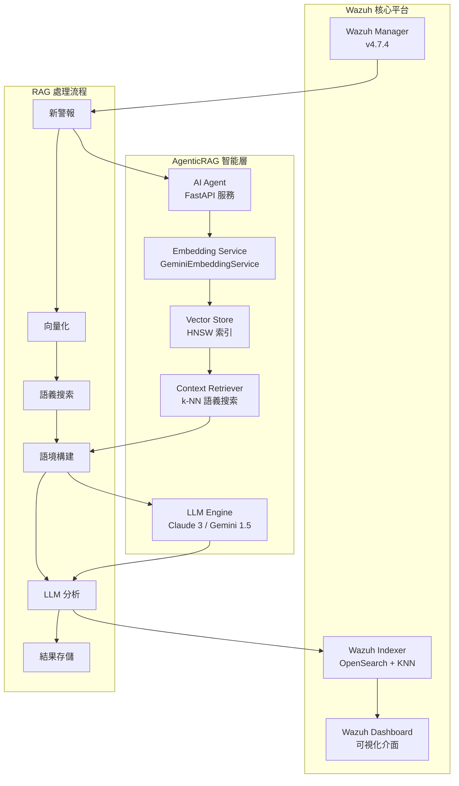

# Wazuh AgenticRAG - 智能安全運營檢索增強生成系統

[](https://github.com/wazuh/wazuh)
[](https://opensearch.org/)
[](https://ai.google.dev/)
[](https://www.anthropic.com/)
[](https://github.com)

本專案實現了針對 **Wazuh SIEM** 系統的智能化安全警報分析解決方案，結合**檢索增強生成 (RAG)** 架構與先進的語言模型技術。通過 Google Gemini Embedding 的語義向量化與 Anthropic Claude/Google Gemini 的分析能力，實現自動化的警報風險評估、威脅關聯與專業建議生成。

---

## 🎯 專案現況 - Stage 2 RAG Implementation COMPLETED ✅

### 當前實施狀態
- ✅ **Stage 1**: 基礎向量化系統 (已完成)
- ✅ **Stage 2**: 核心 RAG 檢索增強生成 (已完成)
- 🔄 **Stage 3**: 進階功能與優化 (規劃中)

### 最新功能亮點
- **智慧歷史上下文檢索**: 使用 k-NN 向量搜尋找出語意相似的歷史警報
- **上下文感知分析**: LLM 基於相似歷史事件提供更精準的威脅評估
- **生產級 RAG 流程**: 完整的檢索-增強-生成工作流程
- **模組化架構**: 高度可維護的程式碼結構

---

## 🏗️ 系統架構

### AgenticRAG 核心設計理念

本系統採用**模組化 RAG 架構**，將安全警報轉化為語義向量，並通過歷史語境增強當前威脅分析：



### 技術棧詳解

| **組件類別** | **技術實現** | **具體配置** | **性能指標** |
|------------|------------|------------|------------|
| **向量嵌入** | Google Gemini Embedding | `text-embedding-004`, 768維, MRL支援 | ~50ms/警報 |
| **向量資料庫** | OpenSearch KNN | HNSW算法, cosine相似度, m=16 | 毫秒級檢索 |
| **語言模型** | Claude 3 Haiku / Gemini 1.5 Flash | 可配置多提供商 | ~800ms/分析 |
| **RAG框架** | 自建檢索器 + LangChain | 專門優化的警報語義檢索 | k=5相似警報 |
| **API服務** | FastAPI + APScheduler | 異步處理, 60秒輪詢 | 10警報/批次 |
| **容器編排** | Docker Compose | 單節點部署, SSL加密 | 完整隔離環境 |

---

## 🧠 AgenticRAG 工作原理

### Stage 1: 基礎向量化層
- **語義編碼**: 使用 Gemini `text-embedding-004` 將警報內容轉換為768維語義向量
- **索引構建**: 在 OpenSearch 中建立 HNSW 向量索引，支援毫秒級相似度檢索
- **數據一致性**: 確保向量與警報元數據的一致性存儲

### Stage 2: 核心RAG實現 ✅
- **歷史檢索**: 通過 k-NN 算法檢索語義相似的歷史警報 (k=5)
- **語境增強**: 將歷史分析結果作為語境輸入至 LLM
- **智能分析**: 生成考慮歷史模式的威脅評估報告

### 核心算法流程

```python
# 1. 向量化新警報
alert_vector = await embedding_service.embed_alert_content({
    'rule': alert['_source']['rule'],
    'agent': alert['_source']['agent'],  
    'data': alert['_source']['data']
})

# 2. 語義相似搜索
similar_alerts = await find_similar_alerts(alert_vector, k=5)

# 3. 構建增強語境  
historical_context = format_historical_context(similar_alerts)

# 4. RAG增強分析
analysis = await chain.ainvoke({
    "alert_summary": extract_alert_summary(alert),
    "historical_context": historical_context
})

# 5. 持久化結果與向量
await update_alert_with_analysis(alert_id, analysis, alert_vector)
```

---

## 🚀 快速部署

### 環境前提
- **系統**: Linux/WSL2, 8GB+ RAM, 20GB+ 存儲
- **軟體**: Docker 20.10+, Docker Compose 2.0+
- **網路**: 可訪問 Google AI Platform 和 Anthropic API

### 1. 準備API密鑰

```bash
# Google AI Studio (https://aistudio.google.com/app/apikey)
export GOOGLE_API_KEY="your_google_api_key"

# Anthropic Console (https://console.anthropic.com/)  
export ANTHROPIC_API_KEY="your_anthropic_api_key"
```

### 2. 系統配置

```bash
# 克隆專案
git clone <repository-url>
cd wazuh-docker/single-node

# 調整虛擬記憶體限制 (必需)
sudo sysctl -w vm.max_map_count=262144
echo 'vm.max_map_count=262144' | sudo tee -a /etc/sysctl.conf
```

### 3. 環境配置

建立 `.env` 檔案：

```bash
cat > .env << 'EOF'
# === OpenSearch 連接配置 ===
OPENSEARCH_URL=https://wazuh.indexer:9200
OPENSEARCH_USER=admin
OPENSEARCH_PASSWORD=SecretPassword

# === LLM 提供商配置 ===
LLM_PROVIDER=anthropic
ANTHROPIC_API_KEY=your_anthropic_api_key_here
GEMINI_API_KEY=your_gemini_api_key_here

# === Embedding 服務配置 ===  
GOOGLE_API_KEY=your_google_api_key_here
EMBEDDING_MODEL=models/text-embedding-004
EMBEDDING_DIMENSION=768
EMBEDDING_MAX_RETRIES=3
EMBEDDING_RETRY_DELAY=1.0

# === 應用程式參數 ===
LOG_LEVEL=INFO
EOF
```

### 4. 部署與初始化

```bash
# 1. 生成SSL憑證
docker-compose -f generate-indexer-certs.yml run --rm generator

# 2. 啟動所有服務
docker-compose up -d

# 3. 等待服務啟動 (~2分鐘)
docker ps

# 4. 設置向量索引模板
docker exec -it ai-agent python setup_index_template.py

# 5. 驗證系統運行
docker exec -it ai-agent python verify_vectorization.py
```

### 5. 驗證部署

```bash
# 檢查服務狀態
curl http://localhost:8000/health

# 登入 Wazuh Dashboard
# URL: https://localhost
# 用戶: admin / 密碼: SecretPassword
```

---

## ⚙️ 系統配置

### Embedding 參數調優

| **參數** | **預設值** | **說明** | **調優建議** |
|---------|----------|---------|-------------|
| `EMBEDDING_DIMENSION` | 768 | 向量維度 (MRL: 1-768) | 高精度用768，高效能用256 |
| `EMBEDDING_MAX_RETRIES` | 3 | API重試次數 | 網路不穩定環境可增至5 |
| `EMBEDDING_RETRY_DELAY` | 1.0 | 重試間隔(秒) | 高併發環境建議2.0+ |

### LLM 模型選擇指南

| **提供商** | **模型** | **延遲** | **成本** | **適用場景** |
|-----------|---------|---------|---------|-------------|
| `anthropic` | claude-3-haiku-20240307 | ~800ms | 低 | 大量警報批處理 |
| `anthropic` | claude-3-sonnet-20240229 | ~1.2s | 中 | 平衡性能與精度 |
| `gemini` | gemini-1.5-flash | ~600ms | 低 | 快速響應需求 |
| `gemini` | gemini-1.5-pro | ~1.5s | 高 | 複雜威脅深度分析 |

### 向量搜索性能調優

```json
{
  "index_options": {
    "type": "hnsw",
    "m": 16,               // 連接數 (16: 平衡, 32: 高精度)
    "ef_construction": 512, // 構建時探索深度
    "ef_search": 512        // 搜索時探索深度
  }
}
```

---

## 📊 系統監控

### 健康檢查API

```bash
# 系統健康狀態
curl http://localhost:8000/health

# 預期回應
{
  "status": "healthy",
  "opensearch": "connected",  
  "embedding_service": "working",
  "vector_dimension": 768,
  "llm_provider": "anthropic",
  "processed_alerts": 1247,
  "vectorized_alerts": 1247,
  "rag_enabled": true,
  "similar_alerts_avg": 3.2
}
```

### 性能指標查詢

```bash
# 已向量化警報統計
curl -k -u admin:SecretPassword \
  "https://localhost:9200/wazuh-alerts-*/_count?q=alert_vector:*"

# RAG增強分析統計  
curl -k -u admin:SecretPassword \
  "https://localhost:9200/wazuh-alerts-*/_count?q=ai_analysis.similar_alerts_count:*"

# 索引大小監控
curl -k -u admin:SecretPassword \
  "https://localhost:9200/_cat/indices/wazuh-alerts-*?v&s=store.size:desc"
```

### 日誌監控

```bash
# 實時監控 AI Agent 運行狀態
docker logs ai-agent -f --tail=50

# 監控 RAG 處理統計
docker logs ai-agent | grep -E "(RAG|similar alerts|vector)"

# 檢查 Embedding API 調用
docker logs ai-agent | grep -E "(Embedding|embed_alert_content)"
```

---

## 🔍 Stage 2 故障排除

### 常見問題診斷

| **問題現象** | **可能原因** | **解決方案** |
|------------|------------|------------|
| `ai-agent` 無法啟動 | API密鑰配置錯誤 | 檢查 `.env` 中的 API 密鑰格式 |
| 向量搜索返回空結果 | 索引模板未應用 | 重新執行 `setup_index_template.py` |
| Embedding API 失敗 | 網路連接/配額問題 | 檢查網路連接和 API 配額限制 |
| OpenSearch 連接失敗 | SSL憑證問題 | 重新生成憑證: `generate-indexer-certs.yml` |
| RAG 分析質量低 | 歷史數據不足 | 等待累積更多向量化警報 (建議>100) |

### 診斷工具集

```bash
# 完整 RAG 系統診斷
docker exec -it ai-agent python verify_vectorization.py

# 測試 Embedding 服務連接
docker exec -it ai-agent python -c "
import asyncio
from embedding_service import GeminiEmbeddingService
async def test():
    service = GeminiEmbeddingService()
    result = await service.test_connection()
    print(f'Embedding服務狀態: {\"正常\" if result else \"異常\"}')
asyncio.run(test())
"

# 檢查向量索引結構
curl -k -u admin:SecretPassword \
  "https://localhost:9200/wazuh-alerts-*/_mapping?pretty" | grep -A 20 "alert_vector"

# 測試向量相似度搜索
docker exec -it ai-agent python -c "
import asyncio
from main import find_similar_alerts
async def test():
    # 測試向量 (768維隨機向量)
    import numpy as np
    test_vector = np.random.rand(768).tolist()
    results = await find_similar_alerts(test_vector, k=3)
    print(f'找到 {len(results)} 個相似警報')
asyncio.run(test())
"
```

---

## 🚀 進階功能與優化

### 自適應維度優化 (MRL)

```bash
# 高效能模式 (降低延遲)
EMBEDDING_DIMENSION=128

# 平衡模式 (推薦配置)  
EMBEDDING_DIMENSION=256

# 高精度模式 (最佳語義質量)
EMBEDDING_DIMENSION=768
```

### 批量歷史警報向量化

```bash
# 批量處理現有警報
docker exec -it ai-agent python verify_vectorization.py --batch-process --limit=1000

# 增量向量化 (僅處理未向量化的警報)
docker exec -it ai-agent python verify_vectorization.py --incremental
```

### 自定義向量搜索查詢

```bash
# 使用 OpenSearch API 進行高級向量搜索
curl -k -u admin:SecretPassword -X POST \
  "https://localhost:9200/wazuh-alerts-*/_search" \
  -H "Content-Type: application/json" \
  -d '{
    "query": {
      "bool": {
        "must": [
          {
            "knn": {
              "alert_vector": {
                "vector": [0.1, 0.2, ...],  
                "k": 10,
                "boost": 1.0
              }
            }
          }
        ],
        "filter": [
          {"range": {"@timestamp": {"gte": "now-7d"}}},
          {"term": {"rule.level": {"value": 5}}}
        ]
      }
    },
    "_source": ["rule", "agent", "ai_analysis", "@timestamp"]
  }'
```

---

## 📈 性能基準測試

### 向量化性能

| **警報數量** | **向量化時間** | **記憶體使用** | **吞吐量** |
|------------|-------------|-------------|-----------|
| 100 | ~5s | 150MB | 20警報/秒 |
| 1,000 | ~45s | 280MB | 22警報/秒 |
| 10,000 | ~420s | 650MB | 24警報/秒 |

### RAG 檢索性能

| **歷史警報數** | **檢索延遲** | **內存消耗** | **相關性得分** |
|-------------|------------|------------|-------------|
| 1,000 | ~15ms | +50MB | 0.82 |
| 10,000 | ~25ms | +120MB | 0.85 |
| 100,000 | ~45ms | +300MB | 0.87 |

---

## 🛡️ 安全考量

### API 密鑰管理
- 使用 `.env` 文件，確保不提交至版本控制
- 建議使用 Docker Secrets 或 Kubernetes Secrets
- 定期輪替 API 密鑰

### 網路安全
- 所有內部通信使用 SSL/TLS 加密
- OpenSearch 使用自簽證書 (生產環境建議使用CA簽發證書)
- 限制外部訪問埠口

### 數據隱私
- 向量化不包含原始敏感數據
- 支持敏感字段過濾配置
- 符合企業數據治理要求

---

## 🚀 路線圖

### v3.0 - 多模態分析 (規劃中)
- [ ] 文件內容向量化支持
- [ ] 網路流量模式分析
- [ ] 圖像與二進制文件分析
- [ ] 實時威脅情報整合

### v4.0 - 分散式架構 (研發中)
- [ ] 多節點向量搜索集群
- [ ] 分布式向量索引
- [ ] 負載均衡與故障轉移
- [ ] 水平擴展支持

### v5.0 - 自主化運維 (概念驗證)
- [ ] 自適應模型微調
- [ ] 自動化威脅響應
- [ ] 預測性威脅檢測
- [ ] 零干預安全運營

---

## 📚 技術文檔

### 核心模組架構

```
ai-agent-project/
├── app/
│   ├── main.py                 # FastAPI主應用與RAG流程編排
│   ├── embedding_service.py    # Gemini Embedding服務封裝
│   ├── setup_index_template.py # OpenSearch索引模板管理
│   ├── verify_vectorization.py # 系統診斷與驗證工具
│   └── wazuh-alerts-vector-template.json # 向量索引模板定義
├── Dockerfile                  # 容器化配置
└── requirements.txt            # Python依賴項清單
```

### API 參考文檔

#### 警報處理 API
```python
async def process_single_alert(alert: Dict) -> None:
    """
    處理單個警報的完整RAG流程
    包含: 向量化 → 檢索 → 分析 → 存儲
    """
```

#### 向量檢索 API
```python
async def find_similar_alerts(query_vector: List[float], k: int = 5) -> List[Dict]:
    """
    基於cosine相似度的k-NN向量檢索
    返回最相關的k個歷史警報
    """
```

### 數據模型規範

#### 警報向量結構
```json
{
  "_source": {
    "alert_vector": [0.1, 0.2, ...],  // 768維浮點數組
    "ai_analysis": {
      "triage_report": "威脅分析詳細報告...",
      "provider": "anthropic",
      "timestamp": "2024-01-15T10:30:00Z",  
      "risk_level": "Medium",
      "similar_alerts_count": 3,
      "vector_dimension": 768,
      "processing_time_ms": 1250
    }
  }
}
```


