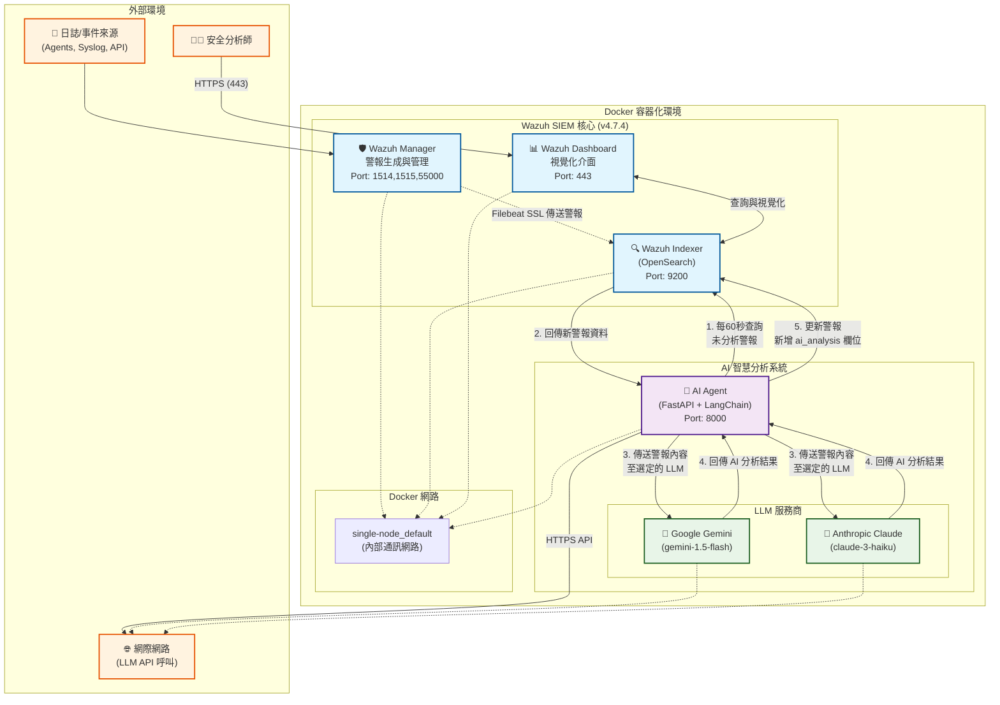

# Wazuh AI Agent - 智慧安全警報分析助手

本專案整合大型語言模型 (LLM)，為 [Wazuh](https://wazuh.com/) SIEM 系統自動分析安全警報，產生事件摘要、風險評估與具體建議，並將分析結果寫回警報，大幅提升安全維運效率。

---

## 專案架構

本專案採用 Docker 容器化部署，將 Wazuh SIEM 與 AI Agent 服務隔離，確保穩定與可擴充性。

### 架構圖


### 詳細工作流程

#### 1. 警報生成與索引
- **資料收集**：Wazuh Manager 從各種來源接收日誌和事件
- **規則匹配**：基於預設和自訂規則產生安全警報
- **資料傳輸**：透過 Filebeat 以 SSL 加密方式將警報傳送至 Wazuh Indexer

#### 2. AI 分析引擎
- **定時掃描**：AI Agent 每 60 秒查詢 `wazuh-alerts-*` 索引中未分析的警報
- **智慧篩選**：僅處理不含 `ai_analysis` 欄位的新警報，避免重複分析
- **動態 LLM 選擇**：根據環境變數 `LLM_PROVIDER` 自動選擇 Gemini 或 Claude
- **結構化分析**：使用 LangChain 框架進行提示工程，產生結構化分析報告

#### 3. 分析結果整合
- **即時更新**：分析完成後立即更新原始警報，新增 `ai_analysis` 欄位
- **元資料記錄**：包含分析提供商、時間戳記等元資料
- **視覺化展示**：安全分析師可在 Dashboard 中直接查看 AI 註解的警報

---

## 技術架構詳解

### 核心技術堆疊
| 類別 | 技術 | 版本 | 說明 |
|------|------|------|------|
| **SIEM 平台** | Wazuh | 4.7.4 | 開源安全資訊與事件管理系統 |
| **搜尋引擎** | OpenSearch | - | 基於 Elasticsearch 的分散式搜尋引擎 |
| **容器化** | Docker Compose | 3.7 | 多容器應用程式編排與管理 |
| **AI 框架** | FastAPI | Latest | 高效能 Python Web 框架 |
| | LangChain | Latest | LLM 應用開發與整合框架 |
| | APScheduler | Latest | Python 任務排程函式庫 |
| **LLM 服務** | Google Gemini | 1.5-flash | 快速、經濟的多模態模型 |
| | Anthropic Claude | 3-haiku | 高速、準確的文本分析模型 |
| **網路通訊** | OpenSearch Client | Async | 非同步 OpenSearch 操作 |
| **安全機制** | SSL/TLS | - | 所有服務間通訊加密 |

### Docker 服務架構
```yaml
# 主要服務組成 (docker-compose.yml + docker-compose.override.yml)
services:
  wazuh.manager:     # 主控台 - 警報生成與代理管理
  wazuh.indexer:     # 資料索引 - OpenSearch 後端
  wazuh.dashboard:   # 前端介面 - 視覺化與查詢
  ai-agent:          # AI 分析 - 自動警報分析
```

### AI Agent 內部架構
```python
# 關鍵元件
├── LLM 選擇器 (get_llm())          # 動態選擇 Gemini/Claude
├── LangChain 分析鏈              # 提示模板 + LLM + 輸出解析
├── OpenSearch 非同步客戶端        # 與 Wazuh Indexer 通訊
├── APScheduler 排程器           # 每 60 秒執行分析任務
└── FastAPI Web 服務            # 健康檢查與狀態監控
```

---

## 快速部署指南

### 1. 系統需求
- **作業系統**：Linux (推薦 Ubuntu 20.04+)
- **記憶體**：最少 8GB RAM (推薦 16GB+)
- **儲存空間**：20GB+ 可用空間
- **網路**：穩定的網際網路連線 (用於 LLM API 呼叫)

### 2. 環境準備
```bash
# 安裝 Docker 和 Docker Compose
curl -fsSL https://get.docker.com -o get-docker.sh
sudo sh get-docker.sh
sudo curl -L "https://github.com/docker/compose/releases/latest/download/docker-compose-$(uname -s)-$(uname -m)" -o /usr/local/bin/docker-compose
sudo chmod +x /usr/local/bin/docker-compose

# 調整系統核心參數 (OpenSearch 必需)
sudo sysctl -w vm.max_map_count=262144
echo 'vm.max_map_count=262144' | sudo tee -a /etc/sysctl.conf
```

### 3. 專案部署
```bash
# 複製專案
git clone <your-repository-url>
cd wazuh-docker/single-node

# 配置 AI Agent 環境變數
cd ai-agent-project
cat > .env << EOF
# LLM 供應商選擇 (gemini 或 anthropic)
LLM_PROVIDER=anthropic

# API 金鑰 (請從官方網站取得)
GEMINI_API_KEY=your_gemini_api_key_here
ANTHROPIC_API_KEY=your_anthropic_api_key_here

# OpenSearch 連線設定 (預設值通常不需修改)
OPENSEARCH_URL=https://wazuh.indexer:9200
OPENSEARCH_USER=admin
OPENSEARCH_PASSWORD=SecretPassword
EOF

# 返回部署目錄
cd ..

# 產生 SSL 憑證
docker-compose -f generate-indexer-certs.yml run --rm generator

# 啟動所有服務
docker-compose up -d
```

### 4. 服務驗證
```bash
# 檢查容器狀態
docker ps

# 檢查服務健康狀態
curl -k https://localhost:9200  # Wazuh Indexer
curl http://localhost:8000      # AI Agent

# 檢查 AI Agent 日誌
docker logs ai-agent
```

### 5. 存取介面
- **Wazuh Dashboard**：https://localhost (admin / SecretPassword)
- **AI Agent API**：http://localhost:8000
- **OpenSearch API**：https://localhost:9200

---

## 進階配置與客製化

### LLM 模型切換
```bash
# 切換至 Google Gemini
echo "LLM_PROVIDER=gemini" >> ai-agent-project/.env
docker-compose restart ai-agent

# 切換至 Anthropic Claude
echo "LLM_PROVIDER=anthropic" >> ai-agent-project/.env
docker-compose restart ai-agent
```

### 自訂分析排程
編輯 `ai-agent-project/app/main.py`：
```python
# 修改分析頻率 (預設 60 秒)
scheduler.add_job(triage_new_alerts, 'interval', seconds=30)  # 改為 30 秒
```

### 自訂提示模板
編輯分析提示以符合組織需求：
```python
prompt_template = ChatPromptTemplate.from_template(
    """您是資深資安分析師。請針對以下 Wazuh 警報進行專業分析...
    
    {alert_summary}
    {context}
    
    請提供：
    1. 事件摘要
    2. 風險等級評估
    3. 建議處置動作
    """
)
```

---

## 常見問題排除

### 服務啟動問題
| 問題症狀 | 可能原因 | 解決方案 |
|----------|----------|----------|
| `ai-agent` 容器無法啟動 | API 金鑰未設定 | 檢查 `.env` 檔案中的 API 金鑰 |
| `wazuh.indexer` 啟動失敗 | `vm.max_map_count` 過低 | 執行 `sudo sysctl -w vm.max_map_count=262144` |
| SSL 憑證錯誤 | 憑證檔案損壞 | 重新執行憑證產生命令 |
| 記憶體不足錯誤 | 系統資源不夠 | 增加 RAM 或調整 Docker 記憶體限制 |

### AI 分析問題
| 問題症狀 | 診斷方法 | 解決方案 |
|----------|----------|----------|
| 警報未被分析 | `docker logs ai-agent` | 檢查 API 金鑰、網路連線 |
| LLM API 呼叫失敗 | 查看 API 使用額度 | 確認 API 金鑰有效且有足夠額度 |
| 分析結果格式異常 | 檢查提示模板 | 調整提示模板或切換 LLM 模型 |

### 診斷指令
```bash
# 即時監控所有容器日誌
docker-compose logs -f

# 檢查特定服務狀態
docker-compose ps
docker inspect ai-agent

# 測試 OpenSearch 連線
curl -k -u admin:SecretPassword https://localhost:9200/_cat/health

# 查看未分析的警報數量
curl -k -u admin:SecretPassword \
  'https://localhost:9200/wazuh-alerts-*/_count?q=NOT%20_exists_:ai_analysis'
```

---

## 擴充開發指南

### 1. 新增 LLM 供應商
在 `get_llm()` 函式中新增支援：
```python
elif LLM_PROVIDER == 'openai':
    from langchain_openai import ChatOpenAI
    return ChatOpenAI(model="gpt-4", openai_api_key=OPENAI_API_KEY)
```

### 2. 客製化分析邏輯
建立專用的分析函式：
```python
async def analyze_specific_rule_type(alert_source):
    """針對特定規則類型的客製化分析"""
    rule_id = alert_source.get('rule', {}).get('id')
    if rule_id == '5710':  # SSH 登入失敗
        # 特殊處理邏輯
        pass
```

### 3. 整合外部威脅情報
```python
async def enrich_with_threat_intel(alert_source):
    """整合外部威脅情報"""
    source_ip = alert_source.get('srcip')
    # 查詢威脅情報資料庫
    threat_info = await query_threat_db(source_ip)
    return threat_info
```

---

## 未來發展規劃

### 短期目標 (1-3 個月)
- **多模型負載平衡**：自動在不同 LLM 間分散請求
- **智慧快取機制**：避免對相似警報重複分析
- **自訂規則引擎**：支援組織特定的分析規則

### 中期目標 (3-6 個月)
- **機器學習增強**：基於歷史分析結果訓練分類模型
- **自動化回應**：整合 SOAR 功能，自動執行處置動作
- **多語言支援**：支援中文、英文等多語言警報分析

### 長期願景 (6-12 個月)
- **聯邦學習**：多組織間共享威脅情報而不洩露敏感資料
- **預測性分析**：基於歷史資料預測潛在安全威脅
- **自適應學習**：根據分析師回饋自動調整分析策略

---

## 授權與貢獻

本專案採用開源授權，歡迎社群貢獻。如有任何問題或建議，請提交 Issue 或 Pull Request。

**維護團隊**：資深 AI 與 Wazuh 工程師  
**技術支援**：透過 GitHub Issues 提供  
**更新頻率**：定期更新以支援最新的 Wazuh 版本和 LLM 技術

