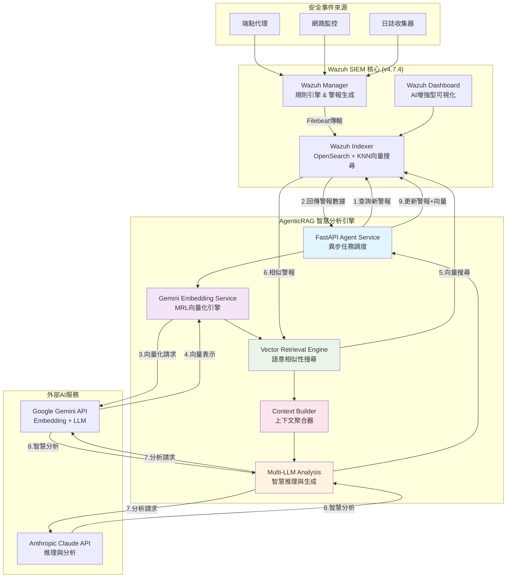

# Wazuh AgenticRAG - 智慧安全警報分析系統

> **一個結合先進向量搜尋技術與大型語言模型的下一代SIEM智慧分析平台**

本專案基於 **AgenticRAG** (Agent-based Retrieval-Augmented Generation) 架構，整合 **Google Gemini Embedding** 與多種大型語言模型，為 [Wazuh](https://wazuh.com/) SIEM 系統提供革命性的智慧化安全警報分析。透過 **Matryoshka Representation Learning (MRL)** 技術與向量語意搜尋，實現自動化事件關聯、風險評估與回應建議，將AI分析結果無縫整合至警報系統中。

---

## 🎯 AgenticRAG 核心架構

### 🧠 智慧語意向量化
- **Google Gemini `text-embedding-004`**：採用最新的多語言嵌入模型，支援超過100種語言
- **Matryoshka 向量技術**：靈活的維度調整能力（1-768維），在效能與精度間取得最佳平衡
- **異步向量處理**：高效率的批次向量化處理，支援大規模警報分析

### 🔍 進階向量檢索系統
- **OpenSearch KNN**：基於 HNSW 算法的高效向量搜尋引擎
- **餘弦相似度計算**：精確的語意相似性比對
- **語意警報關聯**：自動發現歷史相關事件，建構豐富的分析上下文

### 🤖 多模型 LLM 整合
- **Google Gemini系列**：`gemini-1.5-pro`、`gemini-1.5-flash` 
- **Anthropic Claude系列**：`claude-3-opus`、`claude-3-sonnet`、`claude-3-haiku`
- **動態模型選擇**：根據警報複雜度自動選擇最適合的LLM模型

---

## 🏗️ 系統架構圖



---

## 🚀 技術堆疊

| 分層 | 技術組件 | 版本 | 功能說明 |
|------|----------|------|----------|
| **SIEM層** | Wazuh Manager | 4.7.4 | 事件收集、規則引擎、警報生成 |
| | Wazuh Indexer (OpenSearch) | 4.7.4 | 數據索引、KNN向量搜尋 |
| | Wazuh Dashboard | 4.7.4 | AI增強型安全運營中心 |
| **AgenticRAG層** | FastAPI | 0.104.0+ | 高效能API框架與異步處理 |
| | LangChain | 0.1.0+ | LLM應用開發框架 |
| | APScheduler | 3.10.4+ | 定時任務調度器 |
| **AI模型層** | Google Gemini | text-embedding-004 | 多語言向量嵌入 |
| | Anthropic Claude | 3.x | 高級推理與分析 |
| | Google Gemini LLM | 1.5-pro/flash | 快速智慧分析 |
| **向量搜尋** | OpenSearch KNN | 2.4.0+ | HNSW算法、餘弦相似度 |
| **容器化** | Docker | 20.10+ | 微服務容器化部署 |
| | Docker Compose | 2.0+ | 多服務編排 |

---

## 📦 快速部署指南

### 1. 環境準備

**系統需求：**
```bash
# 最低系統需求
- CPU: 4核心以上
- RAM: 8GB以上 (推薦16GB)
- 磁碟: 50GB可用空間
- OS: Linux (建議Ubuntu 20.04+)

# 軟體需求
- Docker Engine 20.10+
- Docker Compose 2.0+
- Git 2.0+
```

**API金鑰申請：**
- 🔑 [Google AI Studio](https://aistudio.google.com/app/apikey) - Gemini API Key
- 🔑 [Anthropic Console](https://console.anthropic.com/) - Claude API Key

### 2. 部署流程

#### Step 1: 複製專案
```bash
git clone https://github.com/your-repo/wazuh-agenticrag.git
cd wazuh-agenticrag/wazuh-docker/single-node
```

#### Step 2: 配置環境變數
```bash
# 進入AI Agent專案目錄
cd ai-agent-project

# 建立環境變數文件
cat > .env << 'EOF'
# ===========================================
# OpenSearch 連接配置
# ===========================================
OPENSEARCH_URL=https://wazuh.indexer:9200
OPENSEARCH_USER=admin
OPENSEARCH_PASSWORD=SecretPassword

# ===========================================
# LLM 提供商選擇 (gemini/anthropic)
# ===========================================
LLM_PROVIDER=gemini

# ===========================================
# Google Gemini API 配置
# ===========================================
GEMINI_API_KEY=your_gemini_api_key_here
GOOGLE_API_KEY=your_google_api_key_here

# ===========================================
# Anthropic Claude API 配置
# ===========================================
ANTHROPIC_API_KEY=your_anthropic_api_key_here

# ===========================================
# Embedding 配置 (MRL技術)
# ===========================================
EMBEDDING_MODEL=models/text-embedding-004
EMBEDDING_DIMENSION=256
EMBEDDING_MAX_RETRIES=3
EMBEDDING_RETRY_DELAY=1.0

# ===========================================
# 應用程式配置
# ===========================================
LOG_LEVEL=INFO
EOF

# 設定API金鑰權限
chmod 600 .env
```

#### Step 3: 系統參數調整
```bash
# 調整虛擬記憶體參數 (Ubuntu/Debian)
sudo sysctl -w vm.max_map_count=262144
echo 'vm.max_map_count=262144' | sudo tee -a /etc/sysctl.conf

# CentOS/RHEL
sudo sysctl -w vm.max_map_count=262144
echo 'vm.max_map_count=262144' >> /etc/sysctl.conf
```

#### Step 4: 生成SSL憑證
```bash
cd ../  # 回到 single-node 目錄
docker-compose -f generate-indexer-certs.yml run --rm generator
```

#### Step 5: 啟動完整系統
```bash
# 啟動所有服務
docker-compose up -d

# 檢視啟動日誌
docker-compose logs -f
```

### 3. 部署驗證

#### 服務狀態檢查
```bash
# 檢查所有容器狀態
docker ps

# 預期輸出應包含：
# - single-node-wazuh.manager-1    (Running)
# - single-node-wazuh.indexer-1   (Running) 
# - single-node-wazuh.dashboard-1 (Running)
# - ai-agent                      (Running)
```

#### 功能測試
```bash
# 1. 測試OpenSearch連線
curl -k -u admin:SecretPassword \
  "https://localhost:9200/_cluster/health?pretty"

# 2. 測試AI Agent服務
curl http://localhost:8000/

# 3. 測試向量搜尋功能
curl -k -u admin:SecretPassword \
  "https://localhost:9200/wazuh-alerts-*/_search" \
  -H 'Content-Type: application/json' \
  -d '{"query": {"exists": {"field": "alert_embedding"}}}'

# 4. 檢查AI Agent日誌
docker logs ai-agent -f | grep "Successfully"
```

#### Dashboard存取
- 🌐 **URL**: https://localhost
- 👤 **使用者**: admin  
- 🔐 **密碼**: SecretPassword

---

## ⚙️ 進階配置

### MRL向量維度優化

根據不同使用場景調整向量維度：

```bash
# 高精度模式（適合複雜威脅分析）
EMBEDDING_DIMENSION=768

# 平衡模式（推薦用於生產環境）
EMBEDDING_DIMENSION=256

# 高效能模式（適合大量警報處理）
EMBEDDING_DIMENSION=128
```

### LLM模型選擇策略

| 使用場景 | LLM模型 | 向量維度 | 特色 |
|----------|---------|----------|------|
| **生產環境** | `gemini-1.5-flash` | 256 | 快速回應，成本效益高 |
| **深度分析** | `claude-3-sonnet` | 512 | 高品質分析，準確度佳 |
| **大規模處理** | `claude-3-haiku` | 128 | 超高速處理，適合批量 |
| **極致精度** | `gemini-1.5-pro` | 768 | 最高分析品質 |

### OpenSearch索引模板配置

系統會自動建立向量搜尋索引：

```json
{
  "index_patterns": ["wazuh-alerts-*"],
  "template": {
    "mappings": {
      "properties": {
        "alert_embedding": {
          "type": "knn_vector",
          "dimension": 256,
          "method": {
            "name": "hnsw",
            "space_type": "cosinesimil",
            "engine": "nmslib",
            "parameters": {
              "ef_construction": 128,
              "m": 24
            }
          }
        },
        "ai_analysis": {
          "type": "object",
          "properties": {
            "summary": {"type": "text"},
            "risk_level": {"type": "keyword"},
            "recommendations": {"type": "text"},
            "confidence": {"type": "float"}
          }
        }
      }
    }
  }
}
```

---

## 🔧 故障排除

### 常見問題診斷

| 問題症狀 | 根本原因 | 解決方案 |
|----------|----------|----------|
| 🔴 容器啟動失敗 | 記憶體不足 | 增加系統記憶體或調整Docker資源限制 |
| 🔴 Indexer無法啟動 | `vm.max_map_count`過低 | 執行 `sudo sysctl -w vm.max_map_count=262144` |
| 🔴 AI Agent連接失敗 | API Key無效 | 檢查並重新設定 `.env` 中的API金鑰 |
| 🔴 向量搜尋無結果 | 索引模板未建立 | 重啟AI Agent服務，確保索引模板建立 |
| 🔴 Embedding服務異常 | 網路連接問題 | 檢查防火牆設定與API配額 |

### 詳細診斷指令

```bash
# === 系統診斷 ===
# 檢查系統資源
free -h
df -h
docker system df

# === 服務診斷 ===
# 檢查所有容器詳細狀態
docker ps -a --format "table {{.Names}}\t{{.Status}}\t{{.Ports}}"

# 檢查特定服務日誌
docker logs wazuh.manager --tail 50
docker logs wazuh.indexer --tail 50  
docker logs ai-agent --tail 50

# === 網路診斷 ===
# 檢查網路連通性
docker network ls
docker exec ai-agent ping -c 3 wazuh.indexer

# === API診斷 ===
# 測試OpenSearch健康度
curl -k -u admin:SecretPassword \
  "https://localhost:9200/_cat/health?v"

# 檢查索引狀態
curl -k -u admin:SecretPassword \
  "https://localhost:9200/_cat/indices/wazuh-alerts-*?v&s=index"

# 測試向量嵌入服務
docker exec ai-agent python -c "
import asyncio
from embedding_service import GeminiEmbeddingService

async def test():
    service = GeminiEmbeddingService()
    result = await service.embed_text('測試文本')
    print(f'向量維度: {len(result)}')

asyncio.run(test())
"

# === 效能監控 ===
# 監控容器資源使用
docker stats --format "table {{.Name}}\t{{.CPUPerc}}\t{{.MemUsage}}\t{{.NetIO}}"

# 檢查AI Agent處理統計
docker logs ai-agent | grep -E "(Successfully|Error|WARNING)" | tail -20
```

---

## 📊 效能監控與調優

### 關鍵性能指標 (KPI)

| 指標類別 | 監控項目 | 目標值 | 監控方法 |
|----------|----------|--------|----------|
| **延遲性能** | 警報分析時間 | < 30秒 | AI Agent日誌 |
| **向量搜尋** | 搜尋回應時間 | < 5秒 | OpenSearch metrics |
| **API調用** | Embedding生成時間 | < 3秒 | 服務日誌分析 |
| **系統負載** | CPU使用率 | < 80% | `docker stats` |
| **記憶體** | 記憶體使用率 | < 85% | 系統監控 |
| **準確性** | AI分析準確度 | > 90% | 人工驗證 |

### 效能調優建議

```bash
# === OpenSearch調優 ===
# 調整JVM堆記憶體
echo "ES_JAVA_OPTS=-Xms4g -Xmx4g" >> config/wazuh_indexer/opensearch.yml

# === AI Agent調優 ===
# 調整並發處理數量
echo "MAX_CONCURRENT_ANALYSIS=5" >> ai-agent-project/.env

# 調整向量搜尋參數
echo "VECTOR_SEARCH_SIZE=20" >> ai-agent-project/.env
echo "SIMILARITY_THRESHOLD=0.7" >> ai-agent-project/.env

# === 系統層調優 ===
# 調整Docker資源限制
docker update --memory=4g --cpus=2 ai-agent
```

---

## 🔮 發展藍圖

### 🎯 第二階段：高級威脅獵捕
- [ ] **威脅情報整合**：外部IOC/TTPs數據源整合
- [ ] **攻擊鏈重建**：MITRE ATT&CK框架自動映射
- [ ] **異常行為檢測**：無監督學習異常檢測
- [ ] **預測性分析**：基於歷史數據的威脅預測

### 🎯 第三階段：自動化回應
- [ ] **SOAR整合**：自動化安全編排與回應
- [ ] **動態防禦**：實時威脅阻斷與隔離
- [ ] **智慧調查**：自動化數位鑑識與證據收集
- [ ] **適應性學習**：基於回饋的模型優化

### 🎯 第四階段：企業級部署
- [ ] **多租戶支援**：企業級多組織架構
- [ ] **高可用性**：分散式部署與容錯機制
- [ ] **合規報告**：自動化法規遵循報告
- [ ] **角色權限**：細粒度存取控制

---

## 🤝 社群與貢獻

### 參與方式

| 貢獻類型 | 說明 | 入門指南 |
|----------|------|----------|
| 🐛 **Bug回報** | 回報問題與錯誤 | [Issues模板](https://github.com/your-repo/issues/new) |
| ✨ **功能建議** | 提出新功能需求 | [Feature Request](https://github.com/your-repo/issues/new) |
| 📝 **文檔改進** | 改善文檔品質 | [文檔指南](docs/CONTRIBUTING.md) |
| 💻 **程式碼貢獻** | 提交程式碼改進 | [開發指南](docs/DEVELOPMENT.md) |

### 開發環境設定

```bash
# 克隆開發分支
git clone -b development https://github.com/your-repo/wazuh-agenticrag.git
cd wazuh-agenticrag

# 設定開發環境
python -m venv venv
source venv/bin/activate  # Linux/Mac
# 或 venv\Scripts\activate  # Windows

# 安裝開發依賴
pip install -r requirements-dev.txt

# 執行測試套件
pytest tests/ -v

# 程式碼品質檢查
flake8 wazuh-docker/single-node/ai-agent-project/app/
black wazuh-docker/single-node/ai-agent-project/app/
```

---

## 📚 學習資源

### 官方文檔
- 📖 [Wazuh官方文檔](https://documentation.wazuh.com/) - SIEM系統完整指南
- 📖 [Google Gemini API](https://ai.google.dev/docs) - Embedding與LLM API文檔
- 📖 [Anthropic Claude](https://docs.anthropic.com/) - Claude模型使用指南
- 📖 [OpenSearch](https://opensearch.org/docs/latest/) - 向量搜尋與KNN配置
- 📖 [LangChain](https://python.langchain.com/) - LLM應用開發框架

### 技術深度文章
- 📄 [AgenticRAG架構設計原理](docs/agenticrag-architecture.md)
- 📄 [Matryoshka向量技術解析](docs/mrl-embedding.md)
- 📄 [SIEM與AI融合最佳實踐](docs/siem-ai-integration.md)
- 📄 [向量搜尋效能調優指南](docs/vector-search-optimization.md)

### 社群資源
- 💬 [Discord社群](https://discord.gg/your-server) - 即時技術討論
- 💬 [GitHub Discussions](https://github.com/your-repo/discussions) - 深度技術交流
- 📺 [YouTube教學頻道](https://youtube.com/your-channel) - 影片教學與案例分享

---

## 📄 授權與版權

### 開源授權
本專案採用 **GNU General Public License v2.0** 授權條款：

- ✅ **商業使用**：允許商業環境使用
- ✅ **修改**：允許修改原始碼
- ✅ **分發**：允許分發軟體
- ✅ **專利授權**：提供專利保護
- ❌ **責任免責**：作者不承擔使用責任
- ❌ **保固免責**：不提供軟體保固

### 第三方授權
- **Wazuh**: GPLv2授權
- **OpenSearch**: Apache License 2.0
- **FastAPI**: MIT授權
- **LangChain**: MIT授權

詳細授權條款請參閱 [LICENSE](LICENSE) 文件。

---

## 📞 技術支援

### 取得協助

| 支援類型 | 聯絡方式 | 回應時間 |
|----------|----------|----------|
| 🆘 **緊急問題** | [GitHub Issues](https://github.com/your-repo/issues) | 24小時內 |
| 💬 **一般諮詢** | [Discussions](https://github.com/your-repo/discussions) | 2-3工作日 |
| 📧 **商業合作** | security@your-domain.com | 1週內 |
| 🐛 **Bug回報** | [Bug模板](https://github.com/your-repo/issues/new) | 48小時內 |

### 版本資訊
- **目前版本**: v2.1.0
- **Wazuh版本**: 4.7.4
- **最後更新**: 2024年1月
- **相容性**: Docker 20.10+, Python 3.11+

---

<div align="center">

### 🌟 如果這個專案對您有幫助，請給我們一個星星！

[](https://github.com/your-repo/wazuh-agenticrag)
[](https://github.com/your-repo/wazuh-agenticrag/fork)

**讓我們一起建構更安全的數位世界** 🛡️

</div>

