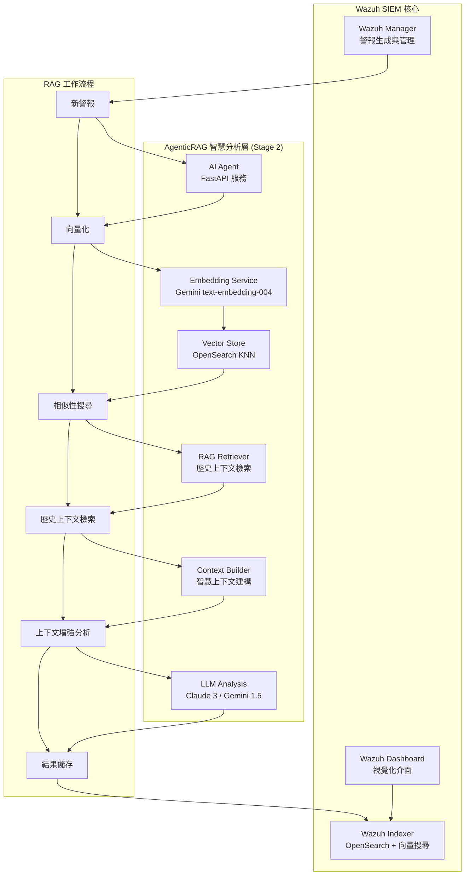

# Wazuh AgenticRAG - 智慧安全警報分析系統

本專案整合 **檢索增強生成 (RAG)** 與 **大型語言模型 (LLM)** 技術，為 [Wazuh](https://wazuh.com/) SIEM 系統提供先進的智慧化安全警報分析。透過 Google Gemini Embedding 的語意向量搜尋與 Anthropic Claude/Google Gemini 的分析能力，實現自動化的警報分流、風險評估與專業建議生成。

## 🎯 專案現況 - Stage 2 RAG Implementation COMPLETED ✅

### 當前實施狀態
- ✅ **Stage 1**: 基礎向量化系統 (已完成)
- ✅ **Stage 2**: 核心 RAG 檢索增強生成 (已完成)
- 🔄 **Stage 3**: 進階功能與優化 (規劃中)

### 最新功能亮點
- **智慧歷史上下文檢索**: 使用 k-NN 向量搜尋找出語意相似的歷史警報
- **上下文感知分析**: LLM 基於相似歷史事件提供更精準的威脅評估
- **生產級 RAG 流程**: 完整的檢索-增強-生成工作流程
- **模組化架構**: 高度可維護的程式碼結構

---

## 🏗️ 核心架構

### AgenticRAG 系統設計

本系統實現了完整的 **檢索增強生成 (Retrieval-Augmented Generation)** 架構，專為安全警報分析優化：



### Stage 2 核心技術組件

| 類別 | 技術組件 | 實現詳情 | Stage 2 增強 |
|------|----------|----------|-------------|
| **RAG 檢索器** | OpenSearch k-NN | HNSW 索引，cosine 相似度 | ✅ 語意相似警報檢索 |
| **向量化引擎** | Google Gemini Embedding | `text-embedding-004` 模型，768 維向量 | ✅ MRL 技術支援 |
| **上下文建構** | Custom Context Builder | 歷史警報格式化與摘要 | ✅ 智慧上下文增強 |
| **LLM 引擎** | Claude 3 / Gemini 1.5 | 可插拔式 LLM 架構 | ✅ 上下文感知分析 |
| **RAG 流程** | LangChain + 自建檢索器 | 完整 RAG 工作流程 | ✅ 端到端整合 |
| **API 框架** | FastAPI | 非同步 RESTful API | ✅ RAG 健康檢查 |

---

## 🧠 Stage 2 RAG 工作流程

### 1. 警報向量化階段
```python
# 使用 Gemini Embedding 將警報內容轉換為語意向量
alert_vector = await embedding_service.embed_alert_content({
    'rule': {'description': 'SSH login attempt', 'level': 5},
    'agent': {'name': 'web-server-01'},
    'data': {'srcip': '192.168.1.100', 'user': 'admin'}
})
```

### 2. 歷史上下文檢索階段 (NEW in Stage 2)
```python
# 使用 k-NN 搜尋找出語意相關的歷史警報
similar_alerts = await find_similar_alerts(alert_vector, k=5)
```

### 3. 上下文增強分析階段 (NEW in Stage 2)
```python
# 結合當前警報與相似歷史警報進行 RAG 分析
context = format_historical_context(similar_alerts)
analysis = await chain.ainvoke({
    "alert_summary": current_alert_summary,
    "historical_context": context
})
```

### 4. 增強結果儲存
```python
# 將 RAG 分析結果與向量一同儲存至 OpenSearch
await update_alert_with_analysis(alert_id, {
    "triage_report": analysis_result,
    "provider": LLM_PROVIDER,
    "similar_alerts_count": len(similar_alerts),
    "timestamp": datetime.utcnow().isoformat()
}, alert_vector)
```

---

## 🚀 快速部署指南

### 系統需求

- **硬體**：8GB+ RAM，20GB+ 磁碟空間
- **軟體**：Docker 20.10+，Docker Compose 2.0+
- **網路**：可存取 Google AI 與 Anthropic API

### 1. 環境準備

#### a. 取得 API 金鑰
```bash
# Google AI Studio (Gemini + Embedding)
# https://aistudio.google.com/app/apikey

# Anthropic Console (Claude)
# https://console.anthropic.com/
```

#### b. 複製專案
```bash
git clone <repository-url>
cd wazuh-docker/single-node
```

#### c. 系統參數調整 (Linux/WSL)
```bash
sudo sysctl -w vm.max_map_count=262144
echo 'vm.max_map_count=262144' | sudo tee -a /etc/sysctl.conf
```

### 2. 配置 AgenticRAG 環境

建立 `.env` 檔案：
```bash
cat > .env << 'EOF'
# === OpenSearch 配置 ===
OPENSEARCH_URL=https://wazuh.indexer:9200
OPENSEARCH_USER=admin
OPENSEARCH_PASSWORD=SecretPassword

# === LLM 配置 ===
LLM_PROVIDER=anthropic
ANTHROPIC_API_KEY=your_anthropic_api_key_here
GEMINI_API_KEY=your_gemini_api_key_here

# === Embedding 配置 ===
GOOGLE_API_KEY=your_google_api_key_here
EMBEDDING_MODEL=models/text-embedding-004
EMBEDDING_DIMENSION=768
EMBEDDING_MAX_RETRIES=3
EMBEDDING_RETRY_DELAY=1.0

# === 應用程式配置 ===
LOG_LEVEL=INFO
EOF
```

### 3. 部署系統

#### a. 生成 SSL 憑證
```bash
docker-compose -f generate-indexer-certs.yml run --rm generator
```

#### b. 啟動所有服務
```bash
docker-compose up -d
```

#### c. 設置向量索引範本
```bash
# 進入 AI Agent 容器
docker exec -it ai-agent python setup_index_template.py
```

### 4. 驗證 RAG 部署

#### a. 檢查服務狀態
```bash
# 檢查所有容器
docker ps

# 檢查 AI Agent RAG 健康狀態
curl http://localhost:8000/health

# 驗證 RAG 向量化流程
docker exec -it ai-agent python verify_vectorization.py
```

#### b. 登入 Wazuh Dashboard
- **URL**：https://localhost
- **帳號**：admin
- **密碼**：SecretPassword

---

## 📊 Stage 2 RAG 功能展示

### 分析品質提升對比

#### Stage 1 (基礎分析)
```
警報：SSH 登入失敗 - server01
分析：檢測到 SSH 登入嘗試失敗，建議監控此 IP。
```

#### Stage 2 (RAG 增強分析)
```
警報：SSH 登入失敗 - server01
RAG 分析：基於相似歷史警報分析，此 IP (192.168.1.100) 在過去 24 小時內
已嘗試登入 3 次失敗。歷史模式顯示這是潛在暴力破解攻擊的早期階段。
建議：1) 立即封鎖此 IP 2) 檢查其他伺服器的相同 IP 活動 3) 強化密碼策略
風險等級：High (基於歷史攻擊模式)
```

### RAG 系統監控指標

| 指標 | 描述 | 查詢方式 |
|------|------|----------|
| 已向量化警報數 | 包含向量的警報總數 | `curl -k -u admin:SecretPassword "https://localhost:9200/wazuh-alerts-*/_count?q=alert_vector:*"` |
| RAG 分析成功率 | 包含歷史上下文的分析 | Docker logs 中的 `RAG-enhanced analysis` |
| 相似警報檢索數 | 每次分析找到的相似警報 | `similar_alerts_count` 欄位 |

---

## 🔧 Stage 2 RAG 配置選項

### 檢索參數調整

```python
# k-NN 檢索參數
SIMILARITY_SEARCH_K = 5  # 檢索的相似警報數量
SIMILARITY_THRESHOLD = 0.7  # 相似度門檻值
CONTEXT_MAX_LENGTH = 2000  # 歷史上下文最大長度
```

### 進階 Embedding 設定

| 參數 | 預設值 | Stage 2 功能 |
|------|--------|-------------|
| `EMBEDDING_MODEL` | models/text-embedding-004 | 支援 MRL 維度調整 |
| `EMBEDDING_DIMENSION` | 768 | 可調整至 128-768 |
| `EMBEDDING_MAX_RETRIES` | 3 | 增強穩定性 |
| `EMBEDDING_RETRY_DELAY` | 1.0 | 智慧重試機制 |

### RAG 提示範本優化

```python
prompt_template = """
你是資深安全分析師。請根據以下歷史相似警報的上下文來分析新的 Wazuh 警報。

**相關歷史警報：**
{historical_context}

**待分析的新警報：**
{alert_summary}

**分析任務：**
1. 簡要總結新事件
2. 基於歷史模式評估風險等級 (Critical, High, Medium, Low)
3. 提供參考歷史案例的上下文感知建議

**你的分流報告：**
"""
```

---

## 🛠️ 進階 RAG 功能

### 向量搜尋優化查詢

```bash
# 執行語意相似搜尋
curl -k -u admin:SecretPassword -X GET \
  "https://localhost:9200/wazuh-alerts-*/_search" \
  -H "Content-Type: application/json" \
  -d '{
    "query": {
      "bool": {
        "must": [
          {
            "knn": {
              "alert_vector": {
                "vector": [0.1, 0.2, ...],
                "k": 5
              }
            }
          },
          {
            "exists": {
              "field": "ai_analysis"
            }
          }
        ]
      }
    },
    "_source": ["rule", "agent", "data", "ai_analysis.triage_report"]
  }'
```

### 批次 RAG 處理

```python
# 批次處理歷史警報以建立向量資料庫
python verify_vectorization.py --batch-process --limit=1000
```

---

## 🔍 Stage 2 故障排除

### RAG 特定問題診斷

| 問題現象 | 可能原因 | 解決方法 |
|----------|----------|----------|
| 無歷史上下文 | 索引範本未正確設置 | 重新執行 `setup_index_template.py` |
| 相似搜尋失敗 | 向量維度不匹配 | 檢查 `EMBEDDING_DIMENSION` 設定 |
| 上下文格式錯誤 | 歷史警報結構問題 | 驗證 `format_historical_context` 函式 |
| RAG 分析緩慢 | k-NN 參數過大 | 調整 `k=5` 為較小值 |

### RAG 診斷工具

```bash
# 完整 RAG 系統診斷
docker exec -it ai-agent python verify_vectorization.py

# 測試向量檢索功能
docker exec -it ai-agent python -c "
import asyncio
from main import find_similar_alerts
async def test():
    # 使用示例向量測試檢索
    test_vector = [0.1] * 768
    results = await find_similar_alerts(test_vector, k=3)
    print(f'檢索到 {len(results)} 個相似警報')
asyncio.run(test())
"

# 檢查 RAG 流程日誌
docker logs ai-agent | grep -E "(RAG|similar_alerts|historical_context)"
```

---

## 🚀 未來發展規劃

### Stage 3 目標 (計劃中)
- [ ] **即時 RAG 查詢**: WebSocket 即時向量搜尋介面
- [ ] **多模態 RAG**: 支援檔案、網路封包等非文字資料檢索
- [ ] **自適應學習**: 根據分析師回饋調整檢索權重
- [ ] **威脅情報整合**: 外部 IOC 源的向量化整合

### Stage 4 目標 (長期)
- [ ] **分散式 RAG**: 多節點向量搜尋叢集
- [ ] **圖 RAG**: 基於攻擊鏈的圖神經網路檢索
- [ ] **時序 RAG**: 時間序列感知的上下文檢索
- [ ] **Agent RAG**: 多 Agent 協作的複合檢索

---

## 📚 技術文檔

### Stage 2 核心模組

- **`main.py`**: RAG 增強的 FastAPI 主應用程式
- **`embedding_service.py`**: Gemini Embedding 服務，支援 MRL
- **`setup_index_template.py`**: 向量索引範本設置工具
- **`verify_vectorization.py`**: RAG 系統驗證與診斷
- **`wazuh-alerts-vector-template.json`**: OpenSearch 向量索引定義

### RAG API 參考

#### 歷史上下文檢索 API
```python
async def find_similar_alerts(query_vector: List[float], k: int = 5) -> List[Dict]:
    """基於向量相似度檢索歷史警報上下文"""
    pass
```

#### 上下文建構 API
```python
def format_historical_context(alerts: List[Dict]) -> str:
    """將檢索的歷史警報格式化為 LLM 上下文"""
    pass
```

### Stage 2 資料模型增強

#### RAG 增強的警報結構
```json
{
  "alert_vector": [0.1, 0.2, ...],  // 768 維向量
  "ai_analysis": {
    "triage_report": "RAG 增強分析報告...",
    "provider": "anthropic",
    "timestamp": "2024-01-15T10:30:00Z",
    "similar_alerts_count": 3,  // NEW: 檢索的相似警報數
    "vector_dimension": 768,
    "processing_time_ms": 1250
  }
}
```

---

## 🤝 社群貢獻

### Stage 2 貢獻重點

1. **RAG 算法優化**: 改進檢索算法和相似度計算
2. **上下文品質**: 優化歷史上下文的格式化和摘要
3. **效能調優**: 向量搜尋和索引效能改進
4. **多語言支援**: 擴展非英語安全警報的 RAG 支援

### 開發環境設置

```bash
# Stage 2 開發模式
docker-compose -f docker-compose.yml -f docker-compose.override.yml up -d

# RAG 功能測試
docker exec -it ai-agent python -m pytest tests/ -v -k "test_rag"

# 程式碼品質檢查
docker exec -it ai-agent python -m black . --check
docker exec -it ai-agent python -m flake8 .
```

---

## 📄 授權與致謝

### 授權條款
本專案採用 **GPL v2** 授權條款，詳見 [LICENSE](wazuh-docker/LICENSE) 文件。

### Stage 2 特別致謝
- **LangChain Community**: 優秀的 RAG 框架支援
- **OpenSearch Team**: 高效能向量搜尋功能
- **Google AI**: Gemini Embedding 模型與 MRL 技術
- **Anthropic**: Claude 模型的優秀上下文理解能力

---

## 📞 支援與聯絡

### 技術支援
- **Stage 2 文檔**: 完整的 RAG 實施指南
- **故障排除**: RAG 特定問題解決方案
- **最佳實踐**: 生產環境 RAG 優化建議

### 社群資源
- **GitHub**: [專案原始碼與 Issues](https://github.com/your-repo)
- **討論區**: RAG 功能討論與經驗分享
- **技術部落格**: AgenticRAG 深度技術文章

---

**Wazuh AgenticRAG Stage 2** - 透過智慧檢索增強生成，讓 AI 具備歷史記憶，提供更精準的安全威脅分析。將您的安全營運提升到上下文感知的智慧化新境界。

