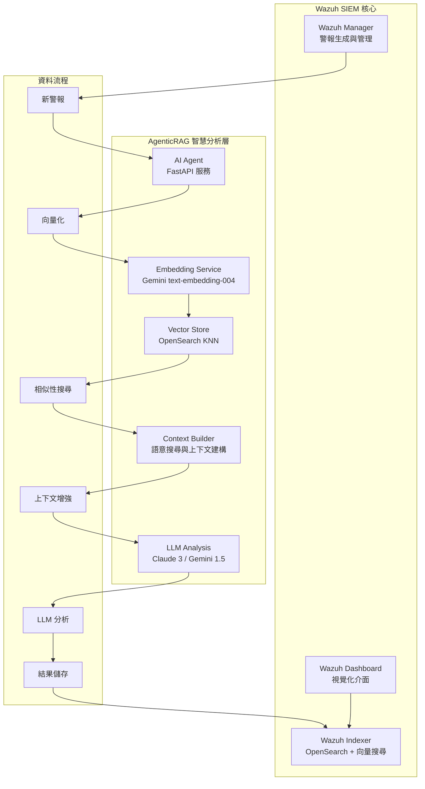

# Wazuh AgenticRAG - 智慧安全警報分析系統

本專案整合 **檢索增強生成 (RAG)** 與 **大型語言模型 (LLM)** 技術，為 [Wazuh](https://wazuh.com/) SIEM 系統提供先進的智慧化安全警報分析。透過 Google Gemini Embedding 的語意向量搜尋與 Anthropic Claude/Google Gemini 的分析能力，實現自動化的警報分流、風險評估與專業建議生成。

---

## 🏗️ 核心架構

### AgenticRAG 系統設計

本系統實現了完整的 **檢索增強生成 (Retrieval-Augmented Generation)** 架構，專為安全警報分析優化：



### 技術特色

| 類別 | 技術組件 | 實現詳情 |
|------|----------|----------|
| **向量化引擎** | Google Gemini Embedding | `text-embedding-004` 模型，768 維向量，支援 MRL 技術 |
| **向量資料庫** | OpenSearch KNN | HNSW 索引，cosine 相似度，高效能近似最近鄰搜尋 |
| **LLM 引擎** | Claude 3 / Gemini 1.5 | 可插拔式 LLM 架構，支援 Anthropic 與 Google 模型 |
| **RAG 架構** | LangChain + 自建檢索器 | 專門的警報語意搜尋與上下文增強系統 |
| **API 框架** | FastAPI | 非同步 RESTful API，支援自動化排程與健康檢查 |
| **容器編排** | Docker Compose | 完整的容器化部署，包含 SSL 憑證與網路配置 |

---

## 🧠 AgenticRAG 工作流程

### 1. 警報向量化階段
```python
# 使用 Gemini Embedding 將警報內容轉換為語意向量
alert_vector = await embedding_service.embed_alert_content({
    'rule': {'description': 'SSH login attempt', 'level': 5},
    'agent': {'name': 'web-server-01'},
    'data': {'srcip': '192.168.1.100', 'user': 'admin'}
})
```

### 2. 語意相似搜尋階段
```python
# 使用向量搜尋找出語意相關的歷史警報
similar_alerts = await find_similar_alerts(alert_vector, k=5)
```

### 3. 上下文增強分析階段
```python
# 結合當前警報與相似歷史警報進行 LLM 分析
analysis = await chain.ainvoke({
    "alert_summary": current_alert_summary,
    "context": similar_alerts_context
})
```

### 4. 結果儲存與向量索引
```python
# 將分析結果與向量一同儲存至 OpenSearch
await update_alert_with_analysis(alert_id, analysis, alert_vector)
```

---

## 🚀 快速部署指南

### 系統需求

- **硬體**：8GB+ RAM，20GB+ 磁碟空間
- **軟體**：Docker 20.10+，Docker Compose 2.0+
- **網路**：可存取 Google AI 與 Anthropic API

### 1. 環境準備

#### a. 取得 API 金鑰
```bash
# Google AI Studio (Gemini + Embedding)
# https://aistudio.google.com/app/apikey

# Anthropic Console (Claude)
# https://console.anthropic.com/
```

#### b. 複製專案
```bash
git clone <repository-url>
cd wazuh-docker/single-node
```

#### c. 系統參數調整 (Linux/WSL)
```bash
sudo sysctl -w vm.max_map_count=262144
echo 'vm.max_map_count=262144' | sudo tee -a /etc/sysctl.conf
```

### 2. 配置 AgenticRAG 環境

建立 `.env` 檔案：
```bash
cat > .env << 'EOF'
# === OpenSearch 配置 ===
OPENSEARCH_URL=https://wazuh.indexer:9200
OPENSEARCH_USER=admin
OPENSEARCH_PASSWORD=SecretPassword

# === LLM 配置 ===
LLM_PROVIDER=anthropic
ANTHROPIC_API_KEY=your_anthropic_api_key_here
GEMINI_API_KEY=your_gemini_api_key_here

# === Embedding 配置 ===
GOOGLE_API_KEY=your_google_api_key_here
EMBEDDING_MODEL=models/text-embedding-004
EMBEDDING_DIMENSION=768
EMBEDDING_MAX_RETRIES=3
EMBEDDING_RETRY_DELAY=1.0

# === 應用程式配置 ===
LOG_LEVEL=INFO
EOF
```

### 3. 部署系統

#### a. 生成 SSL 憑證
```bash
docker-compose -f generate-indexer-certs.yml run --rm generator
```

#### b. 啟動所有服務
```bash
docker-compose up -d
```

#### c. 設置向量索引範本
```bash
# 進入 AI Agent 容器
docker exec -it ai-agent python setup_index_template.py
```

### 4. 驗證部署

#### a. 檢查服務狀態
```bash
# 檢查所有容器
docker ps

# 檢查 AI Agent 健康狀態
curl http://localhost:8000/health

# 驗證向量化流程
docker exec -it ai-agent python verify_vectorization.py
```

#### b. 登入 Wazuh Dashboard
- **URL**：https://localhost
- **帳號**：admin
- **密碼**：SecretPassword

---

## 🔧 AgenticRAG 配置選項

### Embedding 設定

| 參數 | 預設值 | 說明 |
|------|--------|------|
| `EMBEDDING_MODEL` | models/text-embedding-004 | Gemini Embedding 模型 |
| `EMBEDDING_DIMENSION` | 768 | 向量維度 (支援 MRL: 1-768) |
| `EMBEDDING_MAX_RETRIES` | 3 | API 呼叫重試次數 |
| `EMBEDDING_RETRY_DELAY` | 1.0 | 重試間隔 (秒) |

### LLM 模型選擇

| 提供商 | 模型 | 特色 | 適用場景 |
|--------|------|------|----------|
| `anthropic` | claude-3-haiku-20240307 | 快速、經濟 | 大量警報處理 |
| `anthropic` | claude-3-sonnet-20240229 | 平衡效能 | 一般分析工作 |
| `gemini` | gemini-1.5-flash | 多模態、快速 | 混合內容分析 |
| `gemini` | gemini-1.5-pro | 高精度 | 複雜威脅分析 |

### 向量搜尋調優

```json
{
  "knn_settings": {
    "index_options": {
      "type": "hnsw",
      "m": 16,
      "ef_construction": 512
    },
    "similarity": "cosine"
  }
}
```

---

## 📊 系統監控與除錯

### API 端點

| 端點 | 方法 | 功能 |
|------|------|------|
| `/health` | GET | 系統健康檢查 |
| `/` | GET | 基本服務資訊 |

### 健康檢查回應範例
```json
{
  "status": "healthy",
  "opensearch": "connected",
  "embedding_service": "working",
  "vector_dimension": 768,
  "llm_provider": "anthropic",
  "processed_alerts": 1247,
  "vectorized_alerts": 1247
}
```

### 日誌監控
```bash
# 即時監控 AI Agent 日誌
docker logs ai-agent -f

# 檢查向量化統計
docker logs ai-agent | grep "Successfully updated alert"

# 監控 Embedding API 使用
docker logs ai-agent | grep "Embedding"
```

### 效能指標查詢
```bash
# 查詢已向量化警報數量
curl -k -u admin:SecretPassword \
  "https://localhost:9200/wazuh-alerts-*/_count?q=alert_vector:*"

# 檢查索引大小
curl -k -u admin:SecretPassword \
  "https://localhost:9200/_cat/indices/wazuh-alerts-*?v&s=index"
```

---

## 🛠️ 進階功能

### 自訂向量維度 (MRL 支援)

```bash
# 高效能模式 (128 維)
EMBEDDING_DIMENSION=128

# 平衡模式 (256 維)
EMBEDDING_DIMENSION=256

# 高精度模式 (768 維)
EMBEDDING_DIMENSION=768
```

### 向量搜尋查詢範例

```bash
# 使用 OpenSearch API 進行向量搜尋
curl -k -u admin:SecretPassword -X GET \
  "https://localhost:9200/wazuh-alerts-*/_search" \
  -H "Content-Type: application/json" \
  -d '{
    "query": {
      "knn": {
        "alert_vector": {
          "vector": [0.1, 0.2, ...],
          "k": 5
        }
      }
    }
  }'
```

### 批次向量化腳本

```python
# 批次處理歷史警報
python verify_vectorization.py --batch-process --limit=1000
```

---

## 🔍 故障排除

### 常見問題與解決方案

| 問題現象 | 可能原因 | 解決方法 |
|----------|----------|----------|
| `ai-agent` 容器啟動失敗 | API Key 未設定 | 檢查 `.env` 檔案中的 API 金鑰 |
| 向量搜尋無結果 | 索引範本未套用 | 重新執行 `setup_index_template.py` |
| Embedding API 失敗 | 網路連線問題 | 檢查網路設定與 API 配額 |
| OpenSearch 連線失敗 | SSL 憑證問題 | 重新生成憑證並重啟服務 |

### 診斷工具

```bash
# 完整系統診斷
docker exec -it ai-agent python verify_vectorization.py

# 測試 Embedding 服務
docker exec -it ai-agent python -c "
from embedding_service import GeminiEmbeddingService
import asyncio
async def test():
    service = GeminiEmbeddingService()
    result = await service.test_connection()
    print(f'Embedding 服務測試: {result}')
asyncio.run(test())
"

# 檢查向量索引結構
curl -k -u admin:SecretPassword \
  "https://localhost:9200/wazuh-alerts-*/_mapping?pretty"
```

---

## 🚀 未來發展規劃

### 短期目標 (v3.0)
- [ ] **多模態分析**：支援檔案、網路封包等非文字資料
- [ ] **即時向量搜尋**：WebSocket 即時查詢介面
- [ ] **自適應學習**：根據分析師回饋調整模型
- [ ] **威脅情報整合**：外部 IOC 源整合

### 中期目標 (v4.0)
- [ ] **分散式部署**：支援多節點向量搜尋
- [ ] **模型微調**：針對特定環境的模型訓練
- [ ] **自動化回應**：SOAR 平台整合
- [ ] **圖神經網路**：攻擊鏈關聯分析

### 長期願景 (v5.0)
- [ ] **AGI 整合**：多 Agent 協作分析
- [ ] **預測性威脅檢測**：時間序列異常檢測
- [ ] **自動化紅隊模擬**：內建滲透測試能力
- [ ] **零信任架構**：動態威脅建模

---

## 📚 技術文檔

### 核心模組說明

- **`main.py`**：FastAPI 主應用程式，包含排程器與 API 端點
- **`embedding_service.py`**：Gemini Embedding 服務封裝，支援 MRL 與重試機制
- **`setup_index_template.py`**：OpenSearch 索引範本設置工具
- **`verify_vectorization.py`**：系統驗證與診斷工具

### API 參考

#### 警報分析 API
```python
# 內部 API - 自動化觸發
async def analyze_alert(alert_data: Dict) -> Dict:
    """分析單個警報並返回結構化結果"""
    pass
```

#### 向量搜尋 API
```python
# 內部 API - 語意搜尋
async def find_similar_alerts(vector: List[float], k: int = 5) -> List[Dict]:
    """基於向量相似度搜尋歷史警報"""
    pass
```

### 資料模型

#### 警報向量結構
```json
{
  "alert_vector": [0.1, 0.2, ...],  // 768 維浮點數陣列
  "ai_analysis": {
    "triage_report": "詳細分析報告...",
    "provider": "anthropic",
    "timestamp": "2024-01-15T10:30:00Z",
    "risk_level": "Medium",
    "vector_dimension": 768,
    "processing_time_ms": 1250
  }
}
```

---

## 🤝 社群貢獻

### 貢獻指南

1. **Issues**：使用 GitHub Issues 回報問題或提出功能需求
2. **Pull Requests**：遵循程式碼規範，包含測試與文檔
3. **討論**：參與 Discussions 分享使用經驗與最佳實踐

### 開發環境設置

```bash
# 開發模式啟動
docker-compose -f docker-compose.yml -f docker-compose.dev.yml up -d

# 程式碼格式檢查
docker exec -it ai-agent python -m black --check .
docker exec -it ai-agent python -m flake8 .

# 單元測試
docker exec -it ai-agent python -m pytest tests/
```

---

## 📄 授權與致謝

### 授權條款
本專案採用 **GPL v2** 授權條款，詳見 [LICENSE](wazuh-docker/LICENSE) 文件。

### 致謝
- **Wazuh Team**：提供優秀的開源 SIEM 平台
- **Google AI**：Gemini 系列模型與 Embedding 服務
- **Anthropic**：Claude 系列語言模型
- **OpenSearch Project**：高效能搜尋與向量資料庫
- **LangChain Community**：優秀的 LLM 應用開發框架

---

## 📞 支援與聯絡

### 技術支援
- **文檔**：完整的技術文檔與 API 參考
- **範例**：實際部署與使用範例
- **故障排除**：常見問題與解決方案

### 社群資源
- **GitHub**：原始碼、Issues、討論區
- **Docker Hub**：預建容器映像檔
- **技術部落格**：深度技術文章與最佳實踐

---

**Wazuh AgenticRAG** - 讓 AI 驅動您的安全營運，將威脅檢測提升到智慧化新境界。

