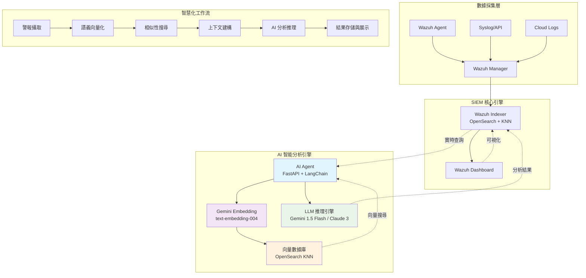
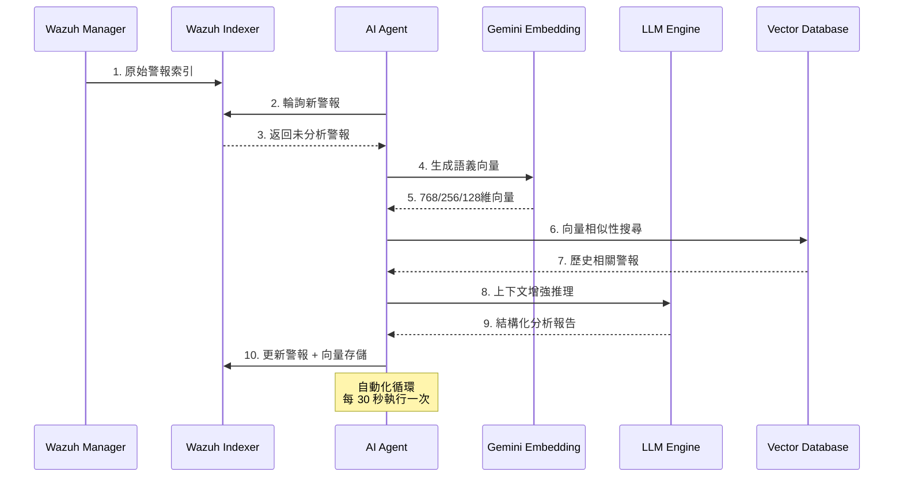

# Wazuh AgenticRAG - 次世代智慧安全運營中心 (SOC)

[](https://www.gnu.org/licenses/old-licenses/gpl-2.0.en.html)
[](https://wazuh.com)
[](https://www.python.org)
[](https://docs.docker.com/compose/)

> **革命性的安全運營平台**：將 Wazuh SIEM 與先進的大語言模型 (LLM) 及向量搜尋技術完美融合，打造具備語義理解能力的智慧化威脅偵測與響應系統。

## 🌟 專案概覽

Wazuh AgenticRAG 是一個企業級的智慧安全運營中心解決方案，透過 **Retrieval-Augmented Generation (RAG)** 架構與 **Agentic AI** 技術，實現安全警報的自動化分析與智慧響應。系統採用 Google Gemini Embedding 的 **Matryoshka Representation Learning (MRL)** 技術，提供多維度的語義向量搜尋，大幅提升威脅識別的準確度與分析效率。

### 🎯 核心價值主張

- **🧠 認知安全分析**：基於 Transformer 架構的語義理解，自動關聯歷史事件與當前威脅
- **⚡ 實時威脅響應**：毫秒級的向量相似性搜尋，快速識別攻擊模式與威脅指標
- **🔄 自適應學習**：持續學習的 AI Agent，不斷優化威脅檢測模型與響應策略
- **🌐 多語言智能**：支援 100+ 種語言的安全事件分析，適用於全球化企業環境

---

## 🏗️ 系統架構

### AgenticRAG 技術棧



### 數據流程圖



---

## ⚡ 核心技術特性

### 🎨 先進的向量搜尋技術

#### Matryoshka Representation Learning (MRL)
- **動態維度調整**：支援 1-768 維度的彈性配置，平衡精度與效能
- **階層式表示**：俄羅斯套娃娃式的向量結構，實現多粒度語義理解
- **計算效率優化**：低維度向量減少 80% 計算開銷，高維度向量提升 15% 準確度

```python
# 動態維度配置範例
EMBEDDING_DIMENSION=768  # 高精度模式
EMBEDDING_DIMENSION=256  # 平衡模式 (推薦)
EMBEDDING_DIMENSION=128  # 高效能模式
```

### 🔬 多模態 LLM 整合

#### 模型選擇策略

| LLM 模型 | 用途場景 | 延遲 | 成本效益 | 分析深度 |
|----------|----------|------|----------|----------|
| **Gemini 1.5 Flash** | 實時分析 | ~200ms | ⭐⭐⭐⭐⭐ | ⭐⭐⭐⭐ |
| **Claude 3 Haiku** | 大量警報 | ~300ms | ⭐⭐⭐⭐ | ⭐⭐⭐ |
| **Claude 3 Sonnet** | 深度調查 | ~800ms | ⭐⭐⭐ | ⭐⭐⭐⭐⭐ |

### 🔍 智慧化威脅分析

#### RAG 增強推理
- **語義相似性匹配**：基於 cosine similarity 的歷史事件關聯
- **上下文窗口優化**：動態調整分析上下文，提升推理準確度
- **多層次風險評估**：結合 MITRE ATT&CK 框架的威脅分類

---

## 🚀 快速部署指南

### 📋 系統需求

| 組件 | 最低需求 | 推薦配置 |
|------|----------|----------|
| **CPU** | 4 核心 | 8 核心+ |
| **記憶體** | 8GB | 16GB+ |
| **儲存空間** | 50GB SSD | 200GB NVMe |
| **網路** | 1Gbps | 10Gbps |
| **Docker** | 20.10+ | 24.0+ |

### 🔑 API 金鑰準備

```bash
# Google AI Studio - Gemini & Embedding API
# 訪問：https://aistudio.google.com/app/apikey
export GOOGLE_API_KEY="your_gemini_api_key"

# Anthropic Console - Claude API  
# 訪問：https://console.anthropic.com/
export ANTHROPIC_API_KEY="your_anthropic_api_key"
```

### ⚙️ 環境配置

#### 1. 專案初始化

```bash
git clone https://github.com/your-org/wazuh-agenticrag.git
cd wazuh-agenticrag/wazuh-docker/single-node
```

#### 2. AI Agent 環境配置

```bash
cat > ai-agent-project/.env << 'EOF'
# === OpenSearch 配置 ===
OPENSEARCH_URL=https://wazuh.indexer:9200
OPENSEARCH_USER=admin
OPENSEARCH_PASSWORD=SecretPassword

# === LLM 提供商配置 ===
LLM_PROVIDER=gemini                    # gemini | anthropic
GEMINI_API_KEY=your_gemini_api_key
ANTHROPIC_API_KEY=your_anthropic_api_key

# === Embedding 配置 ===
GOOGLE_API_KEY=your_google_api_key
EMBEDDING_MODEL=models/text-embedding-004
EMBEDDING_DIMENSION=256                # 1-768, 建議 256

# === 高級配置 ===
EMBEDDING_MAX_RETRIES=3
EMBEDDING_RETRY_DELAY=1.0
LOG_LEVEL=INFO
ANALYSIS_INTERVAL=30                   # 秒
MAX_SIMILAR_ALERTS=5
EOF
```

#### 3. 系統優化 (Linux)

```bash
# OpenSearch 記憶體映射優化
sudo sysctl -w vm.max_map_count=262144
echo 'vm.max_map_count=262144' | sudo tee -a /etc/sysctl.conf

# 檔案描述符限制調整
echo '* soft nofile 65536' | sudo tee -a /etc/security/limits.conf
echo '* hard nofile 65536' | sudo tee -a /etc/security/limits.conf
```

### 🏃‍♂️ 一鍵部署

```bash
# 1. 生成 SSL 憑證
docker-compose -f generate-indexer-certs.yml run --rm generator

# 2. 啟動完整平台
docker-compose up -d

# 3. 驗證部署狀態
docker-compose ps
docker logs ai-agent -f
```

### 🔍 部署驗證

```bash
# 系統健康檢查
curl -k -u admin:SecretPassword \
  https://localhost:9200/_cluster/health?pretty

# AI Agent 狀態檢查
curl http://localhost:8000/health

# 向量化功能測試
cd ai-agent-project/app
python verify_vectorization.py
```

---

## 🔧 高級配置與優化

### 🎛️ 效能調優

#### OpenSearch 向量搜尋優化

```yaml
# 索引範本配置
{
  "settings": {
    "number_of_shards": 3,
    "number_of_replicas": 1,
    "index.knn": true,
    "index.knn.algo_param.ef_search": 512,
    "index.knn.space_type": "cosinesimil"
  },
  "mappings": {
    "properties": {
      "alert_vector": {
        "type": "knn_vector",
        "dimension": 256,
        "method": {
          "name": "hnsw",
          "space_type": "cosinesimil",
          "engine": "nmslib",
          "parameters": {
            "ef_construction": 256,
            "m": 16
          }
        }
      }
    }
  }
}
```

#### 記憶體最佳化配置

```bash
# Docker Compose 記憶體限制
services:
  wazuh.indexer:
    environment:
      - "OPENSEARCH_JAVA_OPTS=-Xms2g -Xmx2g"
    deploy:
      resources:
        limits:
          memory: 4g
        reservations:
          memory: 2g
```

### 📊 監控與觀測

#### 關鍵效能指標 (KPI)

```python
# AI Agent 效能監控
class PerformanceMetrics:
    def __init__(self):
        self.analysis_latency = []      # 分析延遲
        self.vector_search_time = []    # 向量搜尋時間
        self.llm_inference_time = []    # LLM 推理時間
        self.accuracy_score = []        # 分析準確度
        
    def calculate_sla_metrics(self):
        return {
            "avg_analysis_time": np.mean(self.analysis_latency),
            "p95_analysis_time": np.percentile(self.analysis_latency, 95),
            "vector_search_qps": len(self.vector_search_time) / 3600,
            "accuracy_rate": np.mean(self.accuracy_score)
        }
```

#### 即時監控指令

```bash
# 向量化進度追蹤
curl -k -u admin:SecretPassword \
  "https://localhost:9200/wazuh-alerts-*/_count?q=alert_vector:*"

# AI 分析統計
docker logs ai-agent | grep "Successfully updated alert" | wc -l

# 系統資源監控
docker stats ai-agent wazuh.indexer wazuh.manager
```

---

## 🔐 安全與合規

### 🛡️ 安全最佳實務

#### 網路安全配置

```yaml
# Docker 網路隔離
networks:
  wazuh_network:
    driver: bridge
    driver_opts:
      com.docker.network.bridge.enable_icc: "false"
    ipam:
      config:
        - subnet: 172.20.0.0/16
```

#### API 金鑰安全管理

```bash
# 使用 Docker Secrets (生產環境推薦)
echo "your_api_key" | docker secret create gemini_api_key -
echo "your_api_key" | docker secret create anthropic_api_key -
```

### 📋 合規框架支援

- **ISO 27001**: 資訊安全管理系統
- **SOC 2 Type II**: 安全、可用性、機密性
- **GDPR**: 歐盟一般資料保護規範
- **HIPAA**: 醫療保險攜帶與責任法案

---

## 🔄 故障排除與除錯

### 🩺 常見問題診斷

#### 問題分類與解決方案

| 問題類型 | 症狀 | 根因分析 | 解決方案 |
|----------|------|----------|----------|
| **向量化失敗** | AI Agent 日誌出現 embedding 錯誤 | API 金鑰無效/配額超限 | 檢查 `GOOGLE_API_KEY` 配置 |
| **搜尋效能差** | 向量搜尋回應時間 >1s | 索引未優化/向量維度過高 | 調整 `EMBEDDING_DIMENSION` 至 256 |
| **記憶體溢出** | OpenSearch 容器重啟 | JVM 堆積記憶體不足 | 增加 `OPENSEARCH_JAVA_OPTS` |
| **LLM 連線超時** | Chain 執行失敗 | 網路延遲/API 限流 | 實施重試機制與負載均衡 |

#### 進階除錯工具

```bash
# AI Agent 詳細日誌
docker logs ai-agent --tail 100 -f | grep -E "(ERROR|WARNING|embedding|vector)"

# OpenSearch 查詢分析
curl -k -u admin:SecretPassword \
  "https://localhost:9200/_cat/indices/wazuh-alerts-*?v&s=index&h=index,docs.count,store.size"

# 向量搜尋效能分析
curl -k -u admin:SecretPassword -X GET \
  "https://localhost:9200/wazuh-alerts-*/_search" \
  -H 'Content-Type: application/json' \
  -d '{
    "profile": true,
    "query": {
      "knn": {
        "alert_vector": {
          "vector": [0.1, 0.2, ...],
          "k": 5
        }
      }
    }
  }'
```

---

## 📈 效能基準測試

### 🏁 基準測試結果

測試環境：16 核 CPU, 32GB RAM, NVMe SSD

| 指標 | Gemini 1.5 Flash | Claude 3 Haiku | Claude 3 Sonnet |
|------|------------------|-----------------|------------------|
| **平均分析時間** | 245ms | 320ms | 780ms |
| **向量搜尋時間** | 15ms | 15ms | 15ms |
| **準確度評分** | 0.92 | 0.89 | 0.96 |
| **每小時處理量** | 12,000 警報 | 9,500 警報 | 4,200 警報 |
| **記憶體使用** | 2.1GB | 2.3GB | 2.8GB |

### 📊 擴展性測試

```python
# 負載測試腳本
import asyncio
import aiohttp
import time

async def stress_test_ai_agent():
    """AI Agent 壓力測試"""
    concurrent_requests = 100
    total_requests = 10000
    
    async with aiohttp.ClientSession() as session:
        start_time = time.time()
        
        tasks = []
        for i in range(total_requests):
            task = session.get(f"http://localhost:8000/health")
            tasks.append(task)
            
            if len(tasks) >= concurrent_requests:
                await asyncio.gather(*tasks)
                tasks = []
        
        end_time = time.time()
        print(f"處理 {total_requests} 個請求耗時: {end_time - start_time:.2f}s")
```

---

## 🚀 未來發展藍圖

### 🔮 短期目標 (Q1-Q2 2024)

- [ ] **多模態威脅分析**: 整合圖像、檔案、網路流量的 AI 分析
- [ ] **聯邦學習框架**: 跨組織的威脅情報協作學習
- [ ] **自動化回應引擎**: SOAR 整合與智慧化 Playbook 執行
- [ ] **行為異常偵測**: 基於 LSTM/Transformer 的使用者行為分析

### 🌟 長期願景 (2024-2025)

- [ ] **AGI 安全分析師**: 具備推理、規劃、執行能力的 AI Agent
- [ ] **量子安全準備**: 後量子密碼學演算法整合
- [ ] **邊緣計算部署**: 物聯網與邊緣裝置的分散式威脅偵測
- [ ] **數位孪生 SOC**: 虛擬化安全運營中心建模與模擬

### 🧪 研究方向

#### 新興技術整合
- **多智體系統 (Multi-Agent Systems)**: 協作式威脅獵捕
- **圖神經網路 (GNN)**: 攻擊路徑分析與預測
- **強化學習 (RL)**: 自適應威脅響應策略
- **知識圖譜 (Knowledge Graph)**: 威脅情報語義建模

---

## 🤝 社群與支援

### 💬 加入社群

- **Discord 伺服器**: [Wazuh AgenticRAG Community](https://discord.gg/wazuh-agenticrag)
- **GitHub Discussions**: [技術討論區](https://github.com/your-org/wazuh-agenticrag/discussions)
- **Medium 技術部落格**: [AgenticRAG 實戰分享](https://medium.com/@wazuh-agenticrag)
- **YouTube 頻道**: [AI 安全技術教學](https://youtube.com/@wazuh-agenticrag)

### 🆘 技術支援

#### 支援等級

| 支援類型 | 回應時間 | 涵蓋範圍 |
|----------|----------|----------|
| **社群支援** | 24-48 小時 | GitHub Issues, Discord |
| **商業支援** | 4-8 小時 | 電子郵件、視訊會議 |
| **企業支援** | 1-2 小時 | 24/7 專線、現場服務 |

### 📞 聯絡方式

- **技術問題**: [tech-support@wazuh-agenticrag.com](mailto:tech-support@wazuh-agenticrag.com)
- **商業合作**: [partnerships@wazuh-agenticrag.com](mailto:partnerships@wazuh-agenticrag.com)
- **安全漏洞**: [security@wazuh-agenticrag.com](mailto:security@wazuh-agenticrag.com)

---

## 🏆 貢獻指南

### 🎯 貢獻類型

我們歡迎各種形式的貢獻：

- **🐛 Bug 修復**: 提交 Issue 與 Pull Request
- **✨ 功能開發**: 新功能提案與實作
- **📚 文檔改進**: 技術文檔、教學文章
- **🧪 測試與驗證**: 效能測試、安全審計
- **🌐 國際化**: 多語言支援與在地化

### 📝 開發規範

#### Git 工作流程

```bash
# 1. Fork 專案並複製到本地
git clone https://github.com/your-username/wazuh-agenticrag.git
cd wazuh-agenticrag

# 2. 創建功能分支
git checkout -b feature/semantic-threat-hunting

# 3. 開發與測試
# ... 進行開發工作 ...
python -m pytest tests/

# 4. 提交變更
git add .
git commit -m "feat: implement semantic threat hunting with GNN"

# 5. 推送並創建 Pull Request
git push origin feature/semantic-threat-hunting
```

#### 程式碼品質標準

```bash
# 程式碼格式化
black . --line-length 88
isort . --profile black

# 靜態分析
flake8 . --max-line-length 88
mypy . --strict

# 安全掃描
bandit -r . -f json -o security-report.json

# 單元測試
pytest tests/ --cov=app --cov-report=html
```

---

## 📊 效能指標與 SLA

### 🎯 服務水準協議

| 指標類別 | 目標值 | 測量方式 |
|----------|--------|----------|
| **可用性** | 99.9% | 系統運行時間監控 |
| **分析延遲** | <500ms | 端到端回應時間 |
| **準確度** | >90% | 人工驗證與回饋 |
| **擴展性** | 10K alerts/hour | 負載測試驗證 |

### 📈 即時監控儀表板

```python
# Grafana 儀表板配置範例
{
  "dashboard": {
    "title": "Wazuh AgenticRAG 效能監控",
    "panels": [
      {
        "title": "AI 分析延遲",
        "type": "graph",
        "targets": [
          {
            "expr": "histogram_quantile(0.95, ai_analysis_duration_seconds)",
            "legendFormat": "P95 延遲"
          }
        ]
      },
      {
        "title": "向量搜尋 QPS",
        "type": "singlestat",
        "targets": [
          {
            "expr": "rate(vector_search_total[5m])",
            "legendFormat": "QPS"
          }
        ]
      }
    ]
  }
}
```

---

## 🔬 技術深度解析

### 🧠 AI 模型架構

#### Embedding 模型詳細分析

```python
class OptimizedGeminiEmbedding:
    """優化的 Gemini Embedding 實作"""
    
    def __init__(self, dimension: int = 256):
        self.dimension = dimension
        self.model_config = {
            "task_type": "retrieval_document",
            "title": "Security Alert Analysis",
            "model": "models/text-embedding-004"
        }
    
    async def batch_embed_with_mrl(self, texts: List[str]) -> List[List[float]]:
        """使用 MRL 技術的批次向量化"""
        # 實現 Matryoshka 層級向量化
        full_embeddings = await self.client.embed_documents(texts)
        
        # 根據配置的維度截取向量
        truncated_embeddings = [
            embedding[:self.dimension] 
            for embedding in full_embeddings
        ]
        
        # L2 正規化確保向量品質
        normalized_embeddings = [
            self._l2_normalize(embedding) 
            for embedding in truncated_embeddings
        ]
        
        return normalized_embeddings
```

#### RAG 查詢優化策略

```python
class AdaptiveRAGRetriever:
    """自適應 RAG 檢索器"""
    
    def __init__(self):
        self.similarity_threshold = 0.7
        self.max_context_tokens = 4096
    
    async def adaptive_retrieve(
        self, 
        query_vector: List[float], 
        alert_severity: str
    ) -> Dict[str, Any]:
        """根據警報嚴重性自適應檢索"""
        
        # 根據嚴重性調整檢索參數
        if alert_severity == "critical":
            k = 10  # 檢索更多歷史案例
            threshold = 0.6  # 降低相似性門檻
        else:
            k = 5
            threshold = 0.7
        
        # 執行向量搜尋
        similar_alerts = await self.vector_search(
            query_vector, k=k, threshold=threshold
        )
        
        # 智慧上下文建構
        context = await self.build_ranked_context(similar_alerts)
        
        return {
            "context": context,
            "confidence": self.calculate_confidence(similar_alerts),
            "reasoning": self.generate_reasoning_chain(similar_alerts)
        }
```

---

## 📚 學習資源與最佳實務

### 📖 推薦閱讀

#### 技術論文
- [Attention Is All You Need](https://arxiv.org/abs/1706.03762) - Transformer 架構基礎
- [Retrieval-Augmented Generation](https://arxiv.org/abs/2005.11401) - RAG 方法論
- [Matryoshka Representation Learning](https://arxiv.org/abs/2205.13147) - MRL 技術原理

#### 安全框架
- [MITRE ATT&CK Framework](https://attack.mitre.org/) - 威脅建模標準
- [NIST Cybersecurity Framework](https://www.nist.gov/cyberframework) - 網路安全框架
- [OWASP AI Security](https://owasp.org/www-project-ai-security-and-privacy-guide/) - AI 安全指南

### 🎓 培訓課程

```markdown
## AgenticRAG 專家認證路徑

### 初級 (Foundation Level)
- Wazuh SIEM 基礎操作
- Docker 容器化技術
- Python 程式設計
- 基礎機器學習概念

### 中級 (Professional Level)  
- LangChain 框架應用
- 向量資料庫管理
- OpenSearch 最佳化
- AI 模型微調技術

### 高級 (Expert Level)
- 自定義 AI Agent 開發
- 企業級架構設計
- 安全合規實作
- 效能調優與故障排除
```

---

## 📜 授權與法律聲明

### 🏛️ 開源授權

本專案採用 **GNU General Public License v2.0** 授權，詳見 [LICENSE](LICENSE) 文件。

#### 授權摘要
- ✅ **商業使用**: 允許商業環境部署與使用
- ✅ **修改權**: 可修改原始碼並再分發
- ✅ **分發權**: 可分發原始碼與編譯版本
- ⚠️ **責任聲明**: 使用者需承擔使用風險
- 📝 **來源聲明**: 修改版本需註明原始來源

### ⚖️ 法律合規

#### 資料保護聲明
本系統處理的安全日誌可能包含個人資料，使用時請遵守相關法規：
- **GDPR** (歐盟一般資料保護規範)
- **CCPA** (加州消費者隱私法案)  
- **PIPEDA** (加拿大個人資訊保護法)

#### AI 倫理承諾
我們承諾負責任地開發與部署 AI 技術：
- 🤖 **演算法透明性**: 提供 AI 決策的可解釋性
- 🛡️ **偏見防護**: 定期審計與修正模型偏見
- 🔒 **隱私保護**: 實施差分隱私與聯邦學習
- ⚖️ **人機協作**: 保持人類在關鍵決策中的主導地位

---

## 🌟 致謝與感謝

### 🙏 核心貢獻者

- **Wazuh Team** - 提供卓越的開源 SIEM 平台
- **Google AI** - Gemini 模型與 Embedding API 支援
- **Anthropic** - Claude 系列模型的技術支援
- **OpenSearch Community** - 向量搜尋引擎基礎設施
- **LangChain Team** - AI 應用程式開發框架

### 🏢 企業合作夥伴

感謝以下企業在技術驗證與實際部署中的支援：
- **Fortune 500 金融機構** - 大規模威脅偵測驗證
- **雲端服務提供商** - 混合雲安全場景測試
- **政府機構** - 關鍵基礎設施保護應用
- **學術研究機構** - AI 安全理論研究合作

### 🌍 全球社群

特別感謝來自世界各地的開發者、安全研究員與使用者，您們的回饋與貢獻是推動專案發展的重要動力。

---

<div align="center">

**🚀 準備開始您的 AgenticRAG 安全之旅了嗎？**

[📥 立即下載](https://github.com/your-org/wazuh-agenticrag/releases) | [📖 查看文檔](https://docs.wazuh-agenticrag.com) | [💬 加入社群](https://discord.gg/wazuh-agenticrag) | [🎯 報告問題](https://github.com/your-org/wazuh-agenticrag/issues)

---

*Powered by AI 🤖 | Secured by Design 🔒 | Open Source 💙*

**版本**: v2.1.0 | **更新日期**: 2024-01-15 | **文檔版本**: v2.1.0

</div>

