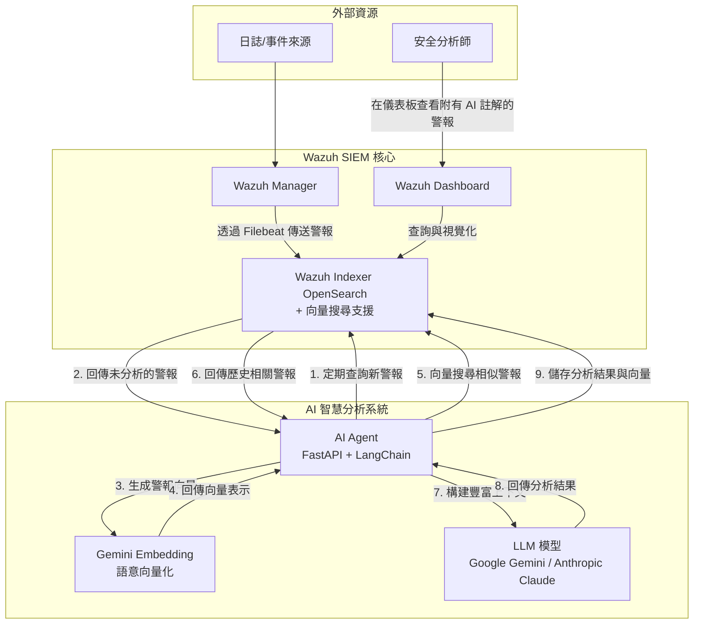

# Wazuh AI Agent - 智慧安全警報分析助手

本專案整合大型語言模型 (LLM) 與 Google Gemini Embedding，為 [Wazuh](https://wazuh.com/) SIEM 系統提供智慧化的安全警報分析。透過先進的語意理解與向量搜尋技術，自動產生事件摘要、風險評估與具體建議，並將分析結果寫回警報，大幅提升安全維運效率。

---

## 🚀 核心特色

### 🧠 智慧語意分析
- **Gemini Embedding 整合**：採用 Google 最新的 `text-embedding-004` 模型，提供卓越的語意理解能力
- **MRL 技術支援**：俄羅斯套娃娃表示法 (Matryoshka Representation Learning)，支援彈性維度調整（1-768 維）
- **多語言支援**：支援超過 100 種語言，適用於多元化的國際環境

### 🎯 進階檢索增強
- **向量語意搜尋**：基於語意相似性檢索歷史警報，提供更豐富的分析上下文
- **RAG 架構**：檢索增強生成 (Retrieval-Augmented Generation) 提升分析準確度
- **智慧上下文建構**：自動關聯相似警報，協助分析師快速理解事件背景

### 🔧 靈活的模型選擇
- **多 LLM 支援**：支援 Google Gemini 與 Anthropic Claude 模型
- **動態模型切換**：透過環境變數輕鬆切換不同的 LLM 提供商
- **成本效益優化**：可依需求選擇不同效能與成本的模型組合

---

## 📊 專案架構

本專案採用 Docker 容器化部署，將 Wazuh SIEM 與 AI Agent 服務隔離，確保穩定與可擴充性。

### 系統架構圖



### 工作流程
1. **警報生成**：Wazuh Manager 監控端點，根據規則產生警報
2. **數據索引**：警報經 Filebeat 傳送至 Wazuh Indexer (OpenSearch)
3. **AI Agent 智慧分析**：
   - 定期查詢未分析警報
   - 使用 Gemini Embedding 將警報內容向量化
   - 透過向量搜尋找出語意相似的歷史警報
   - 構建豐富的上下文資訊
   - 將上下文與當前警報送至 LLM 進行分析
   - 取得結構化分析報告（摘要、風險、建議）
   - 將分析結果與向量表示寫回警報
4. **視覺化**：分析師於 Dashboard 查看含 AI 分析的警報

---

## 🛠️ 技術堆疊

| 類別 | 技術 | 說明 |
|------|------|------|
| **SIEM** | Wazuh 4.7.4 | 開源安全資訊與事件管理系統 |
| **容器化** | Docker, Docker Compose | 打包、部署及管理所有服務 |
| **AI Agent** | FastAPI | Python Web 框架，建構 AI Agent API |
| | LangChain | LLM 應用開發框架，串接 Prompt 與 LLM |
| | Google Gemini / Claude | 可插拔大型語言模型 |
| | Gemini Embedding | Google text-embedding-004 模型，支援 MRL 技術 |
| | OpenSearch Client | 與 Wazuh Indexer 非同步通訊，支援向量搜尋 |
| | APScheduler | Python 排程函式庫，定時觸發分析任務 |
| **向量搜尋** | OpenSearch KNN | 支援 cosine similarity 的向量搜尋 |
| **安全通訊** | SSL/TLS | 服務間通訊皆加密 |

---

## 🚀 快速部署指南

### 1. 前置準備

**系統需求：**
- Docker 20.10+ 與 Docker Compose 2.0+
- Git
- 主機記憶體建議至少 8GB
- 磁碟空間至少 20GB

**API 金鑰準備：**
- [Google AI Studio](https://aistudio.google.com/app/apikey) - 取得 Gemini 與 Embedding API Key
- [Anthropic Console](https://console.anthropic.com/) - 取得 Claude API Key

### 2. 環境設定

#### a. 複製專案
```bash
git clone https://github.com/your-username/wazuh_ai_agent.git
cd wazuh_ai_agent/wazuh-docker/single-node
```

#### b. 設定 AI Agent 環境變數
```bash
cd ai-agent-project
cat > .env << 'EOF'
# OpenSearch 配置
OPENSEARCH_URL=https://wazuh.indexer:9200
OPENSEARCH_USER=admin
OPENSEARCH_PASSWORD=SecretPassword

# LLM 配置
LLM_PROVIDER=gemini
GEMINI_API_KEY=your_gemini_api_key_here
ANTHROPIC_API_KEY=your_anthropic_api_key_here

# Gemini Embedding 配置
GOOGLE_API_KEY=your_google_api_key_here
EMBEDDING_MODEL=models/text-embedding-004
EMBEDDING_DIMENSION=256

# 應用程式配置
LOG_LEVEL=INFO
EOF
```

> ⚠️ **重要**：請將 `your_*_api_key_here` 替換為您的實際 API 金鑰

### 3. 部署 Wazuh 環境

#### a. 調整系統參數 (Linux/WSL)
```bash
sudo sysctl -w vm.max_map_count=262144
echo 'vm.max_map_count=262144' | sudo tee -a /etc/sysctl.conf
```

#### b. 產生 SSL 憑證
```bash
cd ..  # 回到 single-node 目錄
docker-compose -f generate-indexer-certs.yml run --rm generator
```

#### c. 啟動所有服務
```bash
docker-compose up -d
```

### 4. 驗證部署

#### a. 檢查容器狀態
```bash
docker ps
```
預期看到以下容器運行中：
- `single-node-wazuh.manager-1`
- `single-node-wazuh.indexer-1`
- `single-node-wazuh.dashboard-1`
- `ai-agent`

#### b. 驗證服務
```bash
# 檢查 OpenSearch 狀態
curl -k -u admin:SecretPassword https://localhost:9200/_cluster/health

# 檢查 AI Agent 狀態
curl http://localhost:8000/

# 查看 AI Agent 日誌
docker logs ai-agent -f
```

#### c. 登入 Dashboard
- 網址：https://localhost
- 帳號：admin
- 密碼：SecretPassword

---

## 🔧 進階配置

### Embedding 維度調整

利用 MRL 技術，您可以在不重新訓練模型的情況下調整向量維度：

```env
# 高精度模式（預設）
EMBEDDING_DIMENSION=768

# 平衡模式（推薦）
EMBEDDING_DIMENSION=256

# 高效能模式
EMBEDDING_DIMENSION=128
```

### 模型選擇建議

| 使用場景 | LLM 模型 | Embedding 維度 | 特色 |
|----------|----------|----------------|------|
| 生產環境 | gemini-1.5-flash | 256 | 平衡效能與成本 |
| 高精度分析 | claude-3-sonnet | 768 | 最高分析品質 |
| 大量警報處理 | claude-3-haiku | 128 | 快速處理 |

### OpenSearch 索引配置

系統會自動配置支援向量搜尋的索引映射：

```json
{
  "mappings": {
    "properties": {
      "alert_embedding": {
        "type": "knn_vector",
        "dimension": 256,
        "method": {
          "name": "hnsw",
          "space_type": "cosinesimil",
          "engine": "nmslib"
        }
      }
    }
  }
}
```

---

## 🔍 故障排除

### 常見問題

| 問題現象 | 可能原因 | 解決方法 |
|----------|----------|----------|
| 容器啟動失敗 | 記憶體不足、參數錯誤 | 檢查主機資源、重啟 Docker |
| Wazuh Indexer 啟動錯誤 | 未調整 vm.max_map_count | 重新執行 sysctl 指令 |
| AI Agent 無法連接 LLM | API Key 未設定或無效 | 檢查 .env 文件中的 API Key |
| Embedding 服務失敗 | GOOGLE_API_KEY 未設定 | 確認 API Key 並重啟容器 |
| 向量搜尋無結果 | 索引映射未正確配置 | 檢查 OpenSearch 索引設定 |
| Dashboard 無法登入 | 憑證問題或服務未啟動 | 檢查容器狀態和憑證 |

### 診斷指令

```bash
# 查看所有容器狀態
docker ps -a

# 查看特定容器日誌
docker logs <container_name> -f

# 檢查 OpenSearch 健康狀態
curl -k -u admin:SecretPassword https://localhost:9200/_cluster/health?pretty

# 測試向量搜尋功能
curl -k -u admin:SecretPassword -X GET "https://localhost:9200/wazuh-alerts-*/_search" \
  -H 'Content-Type: application/json' \
  -d '{"query": {"exists": {"field": "alert_embedding"}}}'

# 測試 AI Agent API
curl http://localhost:8000/health

# 檢查 Embedding API 連線
docker exec ai-agent python -c "
import os
from langchain_google_genai import GoogleGenerativeAIEmbeddings
client = GoogleGenerativeAIEmbeddings(
    model='models/text-embedding-004',
    google_api_key=os.getenv('GOOGLE_API_KEY')
)
print('Embedding API 連線成功')
"
```

---

## 📊 效能監控

### 關鍵指標

- **分析延遲**：警報產生到完成 AI 分析的時間
- **向量搜尋效能**：語意搜尋的回應時間
- **API 調用成本**：LLM 與 Embedding API 的使用量
- **準確度指標**：AI 分析結果的準確性評估

### 監控指令

```bash
# 查看 AI Agent 處理統計
docker logs ai-agent | grep "Successfully updated alert"

# 檢查向量數據量
curl -k -u admin:SecretPassword "https://localhost:9200/wazuh-alerts-*/_count?q=alert_embedding:*"

# 監控容器資源使用
docker stats ai-agent

# 查看 OpenSearch 索引大小
curl -k -u admin:SecretPassword "https://localhost:9200/_cat/indices/wazuh-alerts-*?v&s=index"
```

---

## 🚀 未來發展方向

### 1. 多模型支援與自動選擇
- 支援更多 LLM 模型（OpenAI GPT-4、Llama 3、Azure OpenAI）
- 根據警報類型自動選擇最適合的模型
- 實現模型負載均衡與容錯機制

### 2. 進階向量搜尋技術
- 整合 Faiss、Pinecone 等向量搜尋引擎
- 建構安全事件知識圖譜
- 支援混合搜尋（向量 + 關鍵字）

### 3. 自動化回應機制
- 整合 SOAR 平台
- 自動化威脅處置流程
- 智慧化警報優先級排序

### 4. 威脅情報整合
- 外部威脅情報源整合
- 攻擊鏈分析
- 預測性威脅分析

---

## 📚 參考資源

### 官方文檔
- [Wazuh 官方文檔](https://documentation.wazuh.com/)
- [Google Gemini API 文檔](https://ai.google.dev/docs)
- [Anthropic Claude API 文檔](https://docs.anthropic.com/)
- [LangChain 文檔](https://python.langchain.com/)
- [OpenSearch 向量搜尋文檔](https://opensearch.org/docs/latest/search-plugins/knn/index/)

### 社群資源
- [Wazuh 社群論壇](https://wazuh.com/community/)
- [GitHub Issues](https://github.com/your-username/wazuh_ai_agent/issues)
- [技術部落格](https://your-blog-url.com)

---

## 🤝 貢獻指南

我們歡迎社群貢獻！請遵循以下指南：

### 回報問題
1. 使用 [GitHub Issues](https://github.com/your-username/wazuh_ai_agent/issues) 回報問題
2. 提供詳細的錯誤資訊和復現步驟
3. 包含系統環境資訊

### 提交程式碼
1. Fork 本專案
2. 創建功能分支：`git checkout -b feature/your-feature`
3. 提交變更：`git commit -m 'Add some feature'`
4. 推送到分支：`git push origin feature/your-feature`
5. 提交 Pull Request

### 開發規範
- 遵循 PEP 8 程式碼風格
- 添加適當的註釋和文檔
- 確保通過所有測試

---

## 📄 版本歷史

### v2.0.0 (2024-01-15)
- ✨ 整合 Google Gemini Embedding 語意搜尋
- 🚀 支援 MRL 技術的彈性維度調整
- 🌐 增強多語言支援能力
- 📊 新增向量搜尋與 RAG 架構
- 🔧 優化 AI Agent 效能與穩定性

### v1.0.0 (2023-12-01)
- 🎯 基礎 LLM 整合（Gemini/Claude）
- 📋 自動警報分析與註解
- 🐳 Docker 容器化部署
- 📊 FastAPI + LangChain 架構

---

## 📜 授權條款

本專案採用 GPLv2 授權條款，詳見 [LICENSE](LICENSE) 文件。

---

