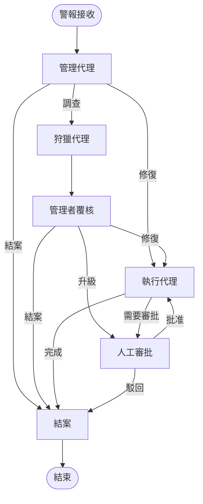

# 使用 LangGraph 的安全代理系統

[](https://langchain.com/)
[](https://github.com/langchain-ai/langgraph)
[](https://github.com/langchain-ai/langserve)
[](https://modelcontextprotocol.io/)
[](https://neo4j.com/)
[](https://www.trychroma.com/)

## 🎯 概述
這是一套以 LangChain 與 LangGraph 為核心的多代理安全協同平台。2025 年重構後，程式碼被整合為可重複使用的套件（`security_agent_system`），並新增專用的執行服務以支援 CLI 操作、LangServe API 與 MCP 整合。

## 🧱 專案結構
```
security-agent-system/
├── apps/                       # CLI、LangServe 與 MCP 進入點
├── security_agent_system/      # 核心套件（agents、core、infrastructure、workflows）
├── tests/                      # 自動化測試套件
├── config/, examples/          # 部署資源與可執行範例
└── docs/                       # 架構說明、操作手冊與報告
```
完整說明請參考 [Directory Structure](docs/reference/DIRECTORY_STRUCTURE.md)。

## 🧠 系統架構


```mermaid
graph TB
    Start([警報接收]) --> Manager[管理代理]
    Manager -->|調查| Hunter[狩獵代理]
    Manager -->|修復| Executor[執行代理]
    Manager -->|結案| Complete[結案]
    Hunter --> Review[管理者覆核]
    Review -->|修復| Executor
    Review -->|升級| Human[人工審批]
    Review -->|結案| Complete
    Executor -->|完成| Complete
    Executor -->|需要審批| Human
    Human -->|批准| Executor
    Human -->|駁回| Complete
    Complete --> End([結束])
```

### 核心能力
- **LangGraph DAG 調度**：每個代理皆以 LCEL 鏈式流程建構。
- **狀態持久化**：透過 SQLite 檢查點支援復原與稽核。
- **GraphRAG 情境擷取**：結合 Neo4j 與 ChromaDB 進行混合式調查。
- **人工介入流程**：支援審批與回滾。
- **模組化執行環境**：CLI、LangServe、MCP 共用單一協調器實作。

## 🚀 執行環境
| 執行環境 | 指令 | 說明 |
| --- | --- | --- |
| CLI | `python security-agent-system/main.py start` | 具備 Click 指令的生產級協同流程。 |
| LangServe | `uvicorn apps.langserve.app:app --host 0.0.0.0 --port 8001` | 以 LangServe 與 FastAPI 提供的 REST API。 |
| MCP | `python -m apps.mcp.server --host 127.0.0.1 --port 8765` | 供 IDE／工具整合使用的 Model Context Protocol 伺服器。 |

## 🤖 代理角色
- **管理代理（Manager Agent）**：分析警報、設定優先順序並建立修復計畫。
- **狩獵代理（Hunter Agent）**：執行圖與向量檢索調查、評估風險。
- **執行代理（Executor Agent）**：驗證、執行並監控修復任務。

## 🚀 快速開始
1. 下載並安裝相依套件：
   ```bash
   git clone https://github.com/your-org/security-agent-system.git
   cd security-agent-system
   pip install -r security-agent-system/requirements.txt
   ```
2. 設定環境變數（`cp .env.example .env`）。
3. 啟動所需服務：`docker-compose up -d`。
4. 啟動任一執行環境（參閱上表）。

## 📖 文件資源
- [平台架構](docs/architecture/PLATFORM_ARCHITECTURE.md)
- [LangGraph 工作流程](docs/architecture/LANGGRAPH_WORKFLOW.md)
- [執行服務總覽](docs/architecture/RUNTIME_SERVICES.md)
- [部署指南](docs/guides/DEPLOYMENT.md)
- [監控指南](docs/guides/MONITORING.md)
- [LangServe 部署](docs/guides/LANGSERVE_DEPLOYMENT.md)
- [MCP 伺服器操作手冊](docs/guides/MCP_SERVER_GUIDE.md)
- [文件目錄](docs/reference/DOCUMENT_CATALOG.md)

## 🧪 測試
```bash
cd security-agent-system
pytest
```
手動觸發測試警報以進行冒煙測試：
```bash
python security-agent-system/main.py test-alert \
    --severity high \
    --type malware \
    "Suspicious process detected on server"
```

## 🔧 組態
重要的 `.env` 變數：
```bash
# LLM 供應商
DEFAULT_LLM_PROVIDER=openai
OPENAI_API_KEY=your-key
ANTHROPIC_API_KEY=your-key
GOOGLE_API_KEY=your-key

# 代理設定
MANAGER_LLM_PROVIDER=openai
HUNTER_LLM_PROVIDER=anthropic
EXECUTOR_LLM_PROVIDER=google

# 基礎設施
NEO4J_URI=bolt://localhost:7687
CHROMADB_PATH=./chroma_db
MESSAGE_BROKER_TYPE=rabbitmq
```

## 📊 監控
Prometheus 指標涵蓋警報吞吐量、代理效能、執行延遲與錯誤率。Grafana 儀表板可於 `http://localhost:3000` 取得。

## 🤝 貢獻指南
1. Fork 此儲存庫。
2. 建立功能分支。
3. 完成修改並新增測試。
4. 執行 `pytest`。
5. 提交 Pull Request。

## 📄 授權
採用 MIT License，詳見 [LICENSE](LICENSE)。

## 🙏 感謝
專案由 LangChain、LangGraph、LangServe、MCP、Neo4j 與 ChromaDB 等生態系提供支持。
