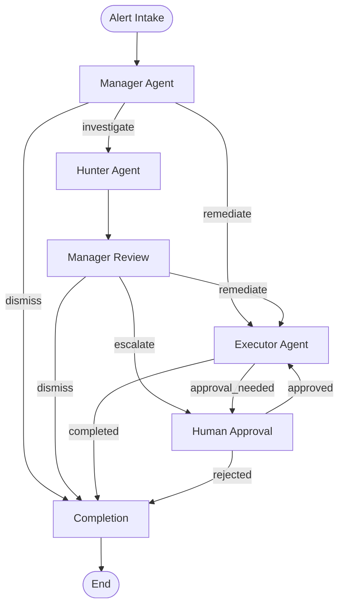

# Security Agent System with LangGraph

[](https://langchain.com/)
[](https://github.com/langchain-ai/langgraph)
[](https://neo4j.com/)
[](https://www.trychroma.com/)
[](https://www.docker.com/)

## 🎯 Overview

A multi-agent security orchestration system built with LangChain's LangGraph framework. The system uses a directed acyclic graph (DAG) to coordinate three specialized AI agents for automated threat detection, investigation, and remediation.

## 🏗️ Architecture


```mermaid
graph TB
    Start([Alert Intake]) --> Manager[Manager Agent]
    Manager -->|investigate| Hunter[Hunter Agent]
    Manager -->|remediate| Executor[Executor Agent]
    Manager -->|dismiss| Complete[Completion]
    Hunter --> Review[Manager Review]
    Review -->|remediate| Executor
    Review -->|escalate| Human[Human Approval]
    Review -->|dismiss| Complete
    Executor -->|completed| Complete
    Executor -->|approval_needed| Human
    Human -->|approved| Executor
    Human -->|rejected| Complete
    Complete --> End([End])
```

## ✨ Key Features

- **LangGraph DAG Orchestration**: State-based workflow management with conditional routing
- **LCEL Integration**: LangChain Expression Language for composable AI chains
- **Multi-Agent Collaboration**: Three specialized agents working in concert
- **State Persistence**: Checkpointing for failure recovery and human-in-the-loop
- **Parallel Processing**: Efficient batch alert processing
- **Human Approval Workflow**: Built-in support for high-risk action approval
- **GraphRAG**: Neo4j for threat relationship mapping
- **Vector Search**: ChromaDB for similarity-based threat hunting

## 🤖 Agent Roles

### Manager Agent
- Analyzes security alerts and determines response strategy
- Creates remediation plans
- Reviews investigation results
- Routes workflow based on threat severity

### Hunter Agent
- Performs deep threat investigation
- Queries graph and vector databases
- Identifies attack patterns
- Provides risk assessment and recommendations

### Executor Agent
- Plans and executes remediation actions
- Validates execution results
- Handles rollback procedures
- Sends notifications

## 🚀 Quick Start

### Prerequisites

- Python 3.10+
- Docker and Docker Compose
- Neo4j 5.x
- Message broker (RabbitMQ or Kafka)

### Installation

1. Clone the repository:
```bash
git clone https://github.com/your-org/security-agent-system.git
cd security-agent-system
```

2. Install dependencies:
```bash
pip install -r security-agent-system/requirements.txt
```

3. Configure environment:
```bash
cp .env.example .env
# Edit .env with your API keys and settings
```

4. Start infrastructure:
```bash
docker-compose up -d
```

5. Run the system:
```bash
python security-agent-system/main.py start
```

## 📖 Documentation

- [LangGraph Architecture](docs/LANGGRAPH_ARCHITECTURE.md) - Detailed system design
- [Deployment Guide](docs/DEPLOYMENT.md) - Production deployment instructions
- [API Documentation](docs/API.md) - REST API reference
- [Configuration Guide](docs/CONFIGURATION.md) - System configuration options

## 🧪 Testing

### Run a test alert:
```bash
python main.py test-alert \
    --severity high \
    --type malware \
    "Suspicious process detected on server"
```

### Check system status:
```bash
python main.py status
```

### Visualize the graph:
```bash
python main.py visualize --output graph.png
```

## 🔧 Configuration

Key configuration options in `.env`:

```bash
# LLM Providers
DEFAULT_LLM_PROVIDER=openai
OPENAI_API_KEY=your-key
ANTHROPIC_API_KEY=your-key
GOOGLE_API_KEY=your-key

# Agent Settings
MANAGER_LLM_PROVIDER=openai
HUNTER_LLM_PROVIDER=anthropic
EXECUTOR_LLM_PROVIDER=google

# Infrastructure
NEO4J_URI=bolt://localhost:7687
CHROMADB_PATH=./chroma_db
MESSAGE_BROKER_TYPE=rabbitmq
```

## 📊 Monitoring

The system exposes Prometheus metrics:

- Alert processing metrics
- Agent performance metrics
- Workflow execution times
- Error rates and types

Access Grafana dashboards at `http://localhost:3000`

## 🤝 Contributing

1. Fork the repository
2. Create a feature branch
3. Make your changes
4. Run tests: `pytest tests/`
5. Submit a pull request

## 📄 License

This project is licensed under the MIT License - see the [LICENSE](LICENSE) file for details.

## 🙏 Acknowledgments

Built with:
- [LangChain](https://langchain.com/) - LLM application framework
- [LangGraph](https://github.com/langchain-ai/langgraph) - Multi-agent orchestration
- [Neo4j](https://neo4j.com/) - Graph database
- [ChromaDB](https://www.trychroma.com/) - Vector database

## 📞 Support

- Documentation: [docs/](docs/)
- Issues: [GitHub Issues](https://github.com/your-org/security-agent-system/issues)
- Discussions: [GitHub Discussions](https://github.com/your-org/security-agent-system/discussions)


