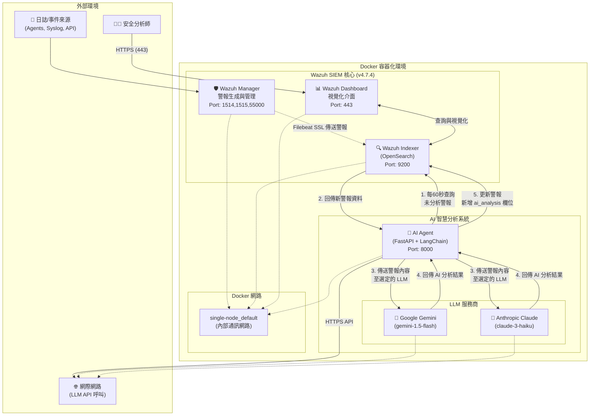

# Wazuh AI Agent — 智慧安全警報分析助手

**Wazuh SIEM alert triage with LLM agents — auto-summarize, risk-rate, and annotate security alerts back into OpenSearch (FastAPI + LangChain).**

  [](LICENSE)

本專案整合 LLM，為 [Wazuh](https://wazuh.com/) SIEM 系統自動分析安全警報：產生事件摘要、風險評估與處置建議，並將結果寫回警報，降低人工 triage 負擔。

> **Note**：本專案規劃未來與 `aiops-rag-system`、`mcp-ai-agent` 整併為統一的 **Agentic Ops** OSS demo，詳見下方 [Related Projects](#related-projects--相關專案)。

---

## 架構


```mermaid
flowchart TD
    subgraph Docker["Docker 容器化環境"]
        subgraph WazuhCore["Wazuh SIEM 核心 (v4.7.4)"]
            WM["🛡️ Wazuh Manager<br/>警報生成與管理<br/>Port: 1514,1515,55000"]
            WI["🔍 Wazuh Indexer<br/>(OpenSearch)<br/>Port: 9200"]
            WD["📊 Wazuh Dashboard<br/>視覺化介面<br/>Port: 443"]
        end
        
        subgraph AISystem["AI 智慧分析系統"]
            AA["🤖 AI Agent<br/>(FastAPI + LangChain)<br/>Port: 8000"]
            
            subgraph LLMProviders["LLM 服務商"]
                GM["🧠 Google Gemini<br/>(gemini-1.5-flash)"]
                CL["🧠 Anthropic Claude<br/>(claude-3-haiku)"]
            end
        end
        
        subgraph Networks["Docker 網路"]
            DN["single-node_default<br/>(內部通訊網路)"]
        end
    end
    
    subgraph External["外部環境"]
        DataSources["📡 日誌/事件來源<br/>(Agents, Syslog, API)"]
        Analyst["👨‍💻 安全分析師"]
        Internet["🌐 網際網路<br/>(LLM API 呼叫)"]
    end
    
    %% 資料流向
    DataSources --> WM
    WM -.->|"Filebeat SSL 傳送警報"| WI
    WD <-->|"查詢與視覺化"| WI
    
    %% AI Agent 工作流程
    AA -->|"1. 每60秒查詢<br/>未分析警報"| WI
    WI -->|"2. 回傳新警報資料"| AA
    AA -->|"3. 傳送警報內容<br/>至選定的 LLM"| GM
    AA -->|"3. 傳送警報內容<br/>至選定的 LLM"| CL
    GM -->|"4. 回傳 AI 分析結果"| AA
    CL -->|"4. 回傳 AI 分析結果"| AA
    AA -->|"5. 更新警報<br/>新增 ai_analysis 欄位"| WI
    
    %% 網路連線
    WM -.-> DN
    WI -.-> DN
    WD -.-> DN
    AA -.-> DN
    
    %% 外部存取
    Analyst -->|"HTTPS (443)"| WD
    AA -->|"HTTPS API"| Internet
    GM -.-> Internet
    CL -.-> Internet
```

### Dashboard 整合

每筆警報 triage 後會寫回 OpenSearch 的 `ai_analysis` 欄位（事件摘要、風險等級、處置建議、LLM provider、時間戳），可直接在 Wazuh Dashboard 中與原始警報並列查看。

<!-- TODO: dashboard screenshot of the ai_analysis field pending live environment -->

---

## Quick Start

**需求**：Linux、8GB+ RAM、20GB+ 硬碟空間、可連外網際網路（LLM API 呼叫）

```bash
# 1. Clone
git clone https://github.com/trionnemesis/wazuh_ai_agent.git
cd wazuh_ai_agent/wazuh-docker/single-node

# 2. 調整系統核心參數 (OpenSearch 必需，僅需一次)
sudo sysctl -w vm.max_map_count=262144

# 3. 設定 AI Agent 環境變數
cat > ai-agent-project/.env << EOF
LLM_PROVIDER=anthropic
GEMINI_API_KEY=your_gemini_api_key_here
ANTHROPIC_API_KEY=your_anthropic_api_key_here
OPENSEARCH_URL=https://wazuh.indexer:9200
OPENSEARCH_USER=admin
OPENSEARCH_PASSWORD=SecretPassword
EOF

# 4. 產生 SSL 憑證並啟動所有服務
docker-compose -f generate-indexer-certs.yml run --rm generator
docker-compose up -d
```

- Wazuh Dashboard: https://localhost (`admin` / `SecretPassword`)
- AI Agent API: http://localhost:8000

## 設定

| 變數 | 說明 | 預設值 |
|---|---|---|
| `LLM_PROVIDER` | `gemini` 或 `anthropic` | `anthropic` |
| `GEMINI_API_KEY` | Google Gemini API 金鑰 | - |
| `ANTHROPIC_API_KEY` | Anthropic API 金鑰 | - |
| `OPENSEARCH_URL` | Wazuh Indexer 連線位址 | `https://wazuh.indexer:9200` |
| `OPENSEARCH_USER` / `OPENSEARCH_PASSWORD` | OpenSearch 帳號密碼 | `admin` / `SecretPassword` |

## Documentation

更多細節請見 `docs/`：

- [詳細工作流程與技術架構](docs/workflow.md)
- [進階配置與客製化](docs/configuration.md)
- [常見問題排除](docs/troubleshooting.md)
- [擴充開發指南](docs/extending.md)

## Related Projects / 相關專案

本專案規劃未來與下列兩個 repo 整併為統一的 **Agentic Ops** OSS demo：

- [aiops-rag-system](https://github.com/trionnemesis/aiops-rag-system) — 基於 LangChain LCEL + LangGraph 的智慧維運報告 RAG 系統
- [mcp-ai-agent](https://github.com/trionnemesis/mcp-ai-agent) — 基於 Google Gemini SDK 與 MCP (Model Context Protocol) 的智能 Linux 系統管理助手

## License

AI Agent 整合程式碼與本文件採用 [MIT License](LICENSE)（trionnemesis）。`wazuh-docker/` 目錄為上游 [Wazuh Docker](https://github.com/wazuh/wazuh-docker) 專案的 vendored 副本，保留其原始 GPLv2 授權，詳見 `wazuh-docker/LICENSE`。

歡迎透過 Issue / PR 提出問題或建議。
