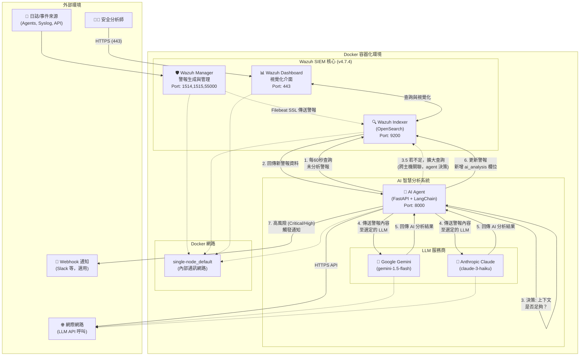

# Wazuh AI Agent — 智慧安全警報分析助手

**Wazuh SIEM alert triage with LLM agents — auto-summarize, risk-rate, and annotate security alerts back into OpenSearch (FastAPI + LangChain).**

  [](LICENSE)

本專案整合 LLM，為 [Wazuh](https://wazuh.com/) SIEM 系統自動分析安全警報：產生事件摘要、風險評估與處置建議，並將結果寫回警報，降低人工 triage 負擔。

**初階 Agent 能力**：
- **RAG 上下文檢索**：用 `sentence-transformers` 在本機對同主機近期警報做語意相似度排序，取最相關的當作分析上下文（無需額外的向量資料庫服務）。
- **決策迴圈**：LLM 會先判斷現有上下文是否足夠，不夠時才主動觸發「擴大查詢」（依來源 IP / 規則跨主機關聯），才進行最終 triage——是從單次呼叫跨到 agentic 迴圈的第一步。
- **高風險自動通知**：風險等級為 Critical/High 時，自動 POST 到可設定的 webhook（例如 Slack Incoming Webhook）。

> **Note**：本專案規劃未來與 `aiops-rag-system`、`mcp-ai-agent` 整併為統一的 **Agentic Ops** OSS demo，詳見下方 [Related Projects](#related-projects--相關專案)。

---

## 架構


```mermaid
flowchart TD
    subgraph Docker["Docker 容器化環境"]
        subgraph WazuhCore["Wazuh SIEM 核心 (v4.7.4)"]
            WM["🛡️ Wazuh Manager<br/>警報生成與管理<br/>Port: 1514,1515,55000"]
            WI["🔍 Wazuh Indexer<br/>(OpenSearch)<br/>Port: 9200"]
            WD["📊 Wazuh Dashboard<br/>視覺化介面<br/>Port: 443"]
        end
        
        subgraph AISystem["AI 智慧分析系統"]
            AA["🤖 AI Agent<br/>(FastAPI + LangChain)<br/>Port: 8000"]
            
            subgraph LLMProviders["LLM 服務商"]
                GM["🧠 Google Gemini<br/>(gemini-1.5-flash)"]
                CL["🧠 Anthropic Claude<br/>(claude-3-haiku)"]
            end
        end
        
        subgraph Networks["Docker 網路"]
            DN["single-node_default<br/>(內部通訊網路)"]
        end
    end
    
    subgraph External["外部環境"]
        DataSources["📡 日誌/事件來源<br/>(Agents, Syslog, API)"]
        Analyst["👨‍💻 安全分析師"]
        Internet["🌐 網際網路<br/>(LLM API 呼叫)"]
        Webhook["🔔 Webhook 通知<br/>(Slack 等，選用)"]
    end
    
    %% 資料流向
    DataSources --> WM
    WM -.->|"Filebeat SSL 傳送警報"| WI
    WD <-->|"查詢與視覺化"| WI
    
    %% AI Agent 工作流程
    AA -->|"1. 每60秒查詢<br/>未分析警報"| WI
    WI -->|"2. 回傳新警報資料"| AA
    AA -->|"2.5 RAG: 本機 embedding<br/>排序同主機近期警報"| AA
    AA -->|"3. 決策: 上下文<br/>是否足夠？"| AA
    AA -.->|"3.5 若不足，擴大查詢<br/>(跨主機關聯，agent 決策)"| WI
    AA -->|"4. 傳送警報內容<br/>至選定的 LLM"| GM
    AA -->|"4. 傳送警報內容<br/>至選定的 LLM"| CL
    GM -->|"5. 回傳 AI 分析結果"| AA
    CL -->|"5. 回傳 AI 分析結果"| AA
    AA -->|"6. 更新警報<br/>新增 ai_analysis 欄位"| WI
    AA -->|"7. 高風險 (Critical/High)<br/>觸發通知"| Webhook
    
    %% 網路連線
    WM -.-> DN
    WI -.-> DN
    WD -.-> DN
    AA -.-> DN
    
    %% 外部存取
    Analyst -->|"HTTPS (443)"| WD
    AA -->|"HTTPS API"| Internet
    GM -.-> Internet
    CL -.-> Internet
```

### Dashboard 整合

每筆警報 triage 後會寫回 OpenSearch 的 `ai_analysis` 欄位（事件摘要、`risk_level`、處置建議、LLM provider、是否使用過擴大查詢 `used_broadened_context`、時間戳），可直接在 Wazuh Dashboard 中與原始警報並列查看。

<!-- TODO: dashboard screenshot of the ai_analysis field pending live environment -->

---

## Quick Start

**需求**：Linux、Docker Engine 與 Compose plugin、8GB+ RAM、20GB+ 硬碟空間、可連外網際網路（LLM API 呼叫）

此入口是完整 demo/lab，不適用於直接接入既有 Wazuh；獨立部署見 [#68](https://github.com/trionnemesis/wazuh_ai_agent/issues/68)。Compose 會建立專案預設網路（此目錄預設為 `single-node_default`），無須預先建立 external network。

```bash
# 1. Clone
git clone https://github.com/trionnemesis/wazuh_ai_agent.git
cd wazuh_ai_agent/wazuh-docker/single-node

# 2. 調整系統核心參數 (OpenSearch 必需，僅需一次)
sudo sysctl -w vm.max_map_count=262144

# 3. 設定 AI Agent 環境變數
cat > ai-agent-project/.env << 'EOF'
LLM_PROVIDER=anthropic
GEMINI_API_KEY=your_gemini_api_key_here
ANTHROPIC_API_KEY=your_anthropic_api_key_here
OPENSEARCH_URL=https://wazuh.indexer:9200
OPENSEARCH_USER=admin
OPENSEARCH_PASSWORD=SecretPassword
# 選用：Critical/High 風險警報自動通知 (Slack Incoming Webhook 等)
AI_AGENT_WEBHOOK_URL=
EOF

# 4. 驗證設定、產生 SSL 憑證並啟動完整 lab
docker compose config --quiet
docker compose -f generate-indexer-certs.yml run --rm generator
docker compose up -d
```

- Wazuh Dashboard: https://localhost (`admin` / `SecretPassword`)
- AI Agent API: http://127.0.0.1:8000（僅主機 loopback；服務啟動成功後可存取）

**驗證界線**：Compose 路徑、網路、port 與 Wazuh 設定保留由[離線回歸測試](tests/test_compose_config.py)驗證；live Wazuh／LLM triage 尚未驗證。現行硬編碼模型、TLS 與帳號設定仍待 [#68](https://github.com/trionnemesis/wazuh_ai_agent/issues/68) 處理；範例帳密僅限隔離 lab。

## 設定

| 變數 | 說明 | 預設值 |
|---|---|---|
| `LLM_PROVIDER` | `gemini` 或 `anthropic` | `anthropic` |
| `GEMINI_API_KEY` | Google Gemini API 金鑰 | - |
| `ANTHROPIC_API_KEY` | Anthropic API 金鑰 | - |
| `OPENSEARCH_URL` | Wazuh Indexer 連線位址 | `https://wazuh.indexer:9200` |
| `OPENSEARCH_USER` / `OPENSEARCH_PASSWORD` | OpenSearch 帳號密碼 | `admin` / `SecretPassword` |
| `AI_AGENT_WEBHOOK_URL` | 高風險 (Critical/High) 警報通知 webhook（留空則不通知） | - |
| `EMBEDDING_MODEL` | RAG 上下文排序用的 sentence-transformers 模型 | `all-MiniLM-L6-v2` |

> 更多進階調校參數（上下文查詢時間窗、top-k 數量等）請見 [進階配置](docs/configuration.md)。

## Documentation

更多細節請見 `docs/`：

- [詳細工作流程與技術架構](docs/workflow.md)
- [進階配置與客製化](docs/configuration.md)
- [常見問題排除](docs/troubleshooting.md)
- [擴充開發指南](docs/extending.md)

## Related Projects / 相關專案

本專案規劃未來與下列兩個 repo 整併為統一的 **Agentic Ops** OSS demo：

- [aiops-rag-system](https://github.com/trionnemesis/aiops-rag-system) — 基於 LangChain LCEL + LangGraph 的智慧維運報告 RAG 系統
- [mcp-ai-agent](https://github.com/trionnemesis/mcp-ai-agent) — 基於 Google Gemini SDK 與 MCP (Model Context Protocol) 的智能 Linux 系統管理助手

## License

AI Agent 整合程式碼與本文件採用 [MIT License](LICENSE)（trionnemesis）。`wazuh-docker/` 目錄為上游 [Wazuh Docker](https://github.com/wazuh/wazuh-docker) 專案的 vendored 副本，保留其原始 GPLv2 授權，詳見 `wazuh-docker/LICENSE`。

歡迎透過 Issue / PR 提出問題或建議。
