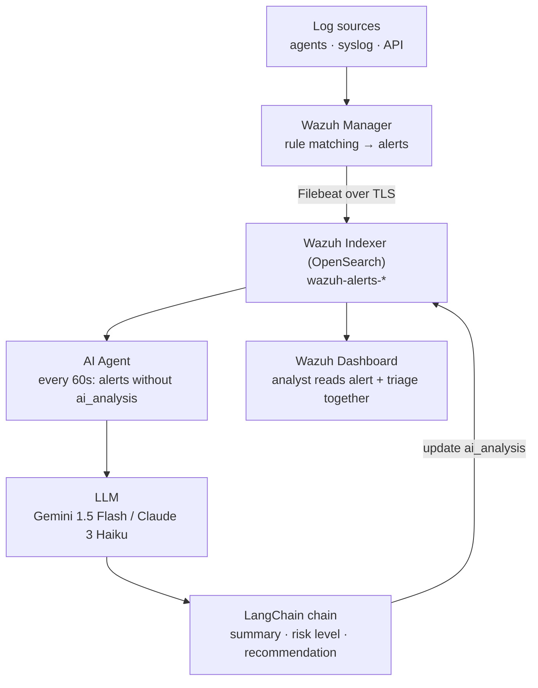
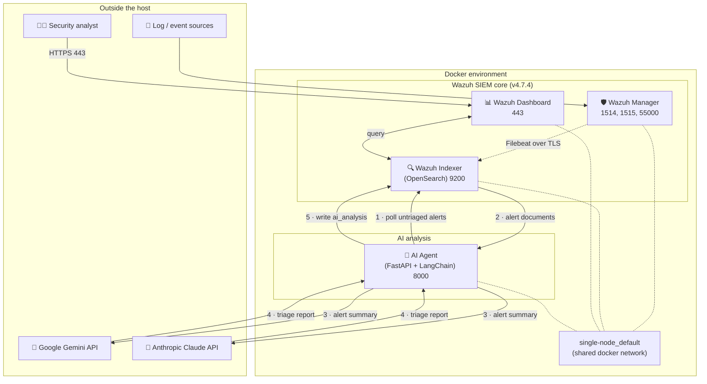

# Wazuh AI Agent

[](https://wazuh.com/)
[](https://www.python.org/)
[](LICENSE)
[](https://www.langchain.com/)
[](https://github.com/trionnemesis/wazuh_ai_agent/stargazers)

> Wazuh AI Agent puts an LLM in the alert-triage loop of a [Wazuh](https://wazuh.com/) SIEM. It polls the Wazuh Indexer for alerts nobody has looked at, asks Gemini or Claude to summarise the event, rate the risk and recommend an action, and writes the answer back onto the alert document — so the analyst reads the triage note next to the raw alert in the Wazuh Dashboard. The repo also ships **AgentSec**, a purple-team harness for testing whether that agent — or any agent — can be attacked without anyone noticing.

**繁體中文說明請見 [README.zh-TW.md](README.zh-TW.md)** ・ 🐛 [Issues](https://github.com/trionnemesis/wazuh_ai_agent/issues) ・ 📖 [Docs](docs/) ・ 🟣 [AgentSec](agentsec/README.md)

Jump to: [Why](#why) ・ [What it does](#what-it-does) ・ [How it works](#how-it-works) ・ [Quick start](#quick-start) ・ [Purple-team harness](#purple-team-harness) ・ [Configuration](#configuration) ・ [Contributing](#contributing)

---

## Why

A Wazuh deployment of any size produces more alerts than anyone reads. Two things make that worse:

1. **A rule ID is not an answer.** `sshd: Attempt to login using a non-existent user` tells you what fired, not whether it matters on *this* host at *this* hour, or what to do next. Reconstructing that context is manual work, repeated per alert, mostly to conclude "nothing".
2. **Putting an LLM in the loop adds a new attack surface.** Alert content is attacker-influenced text going into a model that has tool access. Prompt injection, tool misuse and cross-tenant leakage become live risks — and there is no standard way to prove your detections would catch any of them.

This repo covers both halves. The **AI agent** annotates alerts in place so triage starts from a summary and a risk rating instead of a raw rule hit. **AgentSec** answers the second question the way a purple team would: not just *did the attack get through*, but *if it had, would anyone have seen it*.

Once the stack is up, an analyst opening any alert in the Dashboard sees something like:

> 💬 "Multiple failed SSH authentications from 203.0.113.44 against `web-prod-02`, followed by a successful login for `deploy`. **Risk: High.** Recommend confirming whether the deploy key was rotated recently and blocking the source IP pending review."

## What it does

| Capability | Description |
|------------|-------------|
| **Automatic alert triage** | Polls `wazuh-alerts-*` every 60 s for alerts with no `ai_analysis` field, up to 10 per cycle |
| **Structured triage note** | Event summary, risk level (Critical → Informational) and a recommended next step |
| **Pluggable LLM** | `LLM_PROVIDER` switches between Google Gemini and Anthropic Claude — no code change |
| **Writes back in place** | Results land on the original alert document, so they show up wherever the alert does |
| **One-command stack** | Vendored `wazuh-docker` single-node compose (manager + indexer + dashboard) plus the agent container |
| **Purple-team harness** | [AgentSec](#purple-team-harness): Attack–Detection Contracts, deterministic verdicts, MCP gateway |

**What gets written back**

The agent adds one field to the alert document — nothing else about the alert is modified:

```json
"ai_analysis": {
  "triage_report": "1. Summary ...\n2. Risk level: High ...\n3. Recommendation ...",
  "provider": "anthropic",
  "timestamp": "2026-07-29T10:14:02.123+0000"
}
```

The absence of that field is also the work queue: an alert without `ai_analysis` has not been triaged, which is why the agent never analyses the same alert twice.

| Component | Role | Port |
|------|------|------|
| `wazuh.manager` | Log ingestion, rule matching, alert generation | 1514, 1515, 55000 |
| `wazuh.indexer` | OpenSearch backend holding `wazuh-alerts-*` | 9200 |
| `wazuh.dashboard` | Analyst UI | 443 |
| `ai-agent` | FastAPI + LangChain triage loop | 8000 |

## How it works


```mermaid
flowchart TD
    A["Log sources<br/>agents · syslog · API"] --> B["Wazuh Manager<br/>rule matching → alerts"]
    B -->|"Filebeat over TLS"| C["Wazuh Indexer (OpenSearch)<br/>wazuh-alerts-*"]
    C --> D["AI Agent<br/>every 60s: alerts without ai_analysis"]
    D --> E["LLM<br/>Gemini 1.5 Flash / Claude 3 Haiku"]
    E --> F["LangChain chain<br/>summary · risk level · recommendation"]
    F -->|"update ai_analysis"| C
    C --> G["Wazuh Dashboard<br/>analyst reads alert + triage together"]
```

The agent is deliberately a *reader and annotator*: it queries the indexer, calls one LLM, and updates one field. It never talks to the manager, never touches agent configuration, and has no ability to act on a host.

<details>
<summary>Full deployment topology (containers, networks, external calls)</summary>


```mermaid
flowchart TD
    subgraph Docker["Docker environment"]
        subgraph WazuhCore["Wazuh SIEM core (v4.7.4)"]
            WM["🛡️ Wazuh Manager<br/>1514, 1515, 55000"]
            WI["🔍 Wazuh Indexer<br/>(OpenSearch) 9200"]
            WD["📊 Wazuh Dashboard<br/>443"]
        end

        subgraph AISystem["AI analysis"]
            AA["🤖 AI Agent<br/>(FastAPI + LangChain) 8000"]
        end

        DN["single-node_default<br/>(shared docker network)"]
    end

    subgraph External["Outside the host"]
        DataSources["📡 Log / event sources"]
        Analyst["👨‍💻 Security analyst"]
        GM["🧠 Google Gemini API"]
        CL["🧠 Anthropic Claude API"]
    end

    DataSources --> WM
    WM -.->|"Filebeat over TLS"| WI
    WD <-->|"query"| WI

    AA -->|"1 · poll untriaged alerts"| WI
    WI -->|"2 · alert documents"| AA
    AA -->|"3 · alert summary"| GM
    AA -->|"3 · alert summary"| CL
    GM -->|"4 · triage report"| AA
    CL -->|"4 · triage report"| AA
    AA -->|"5 · write ai_analysis"| WI

    WM -.- DN
    WI -.- DN
    WD -.- DN
    AA -.- DN

    Analyst -->|"HTTPS 443"| WD
```

</details>

## Quick start

Requires Linux, Docker + Docker Compose, 8 GB+ RAM, 20 GB+ disk, and outbound internet access for the LLM API.

### 1. Clone and set the kernel parameter

OpenSearch will not start without this. It is needed once per host.

```bash
git clone https://github.com/trionnemesis/wazuh_ai_agent.git
cd wazuh_ai_agent/wazuh-docker/single-node

sudo sysctl -w vm.max_map_count=262144
```

### 2. Configure the agent

```bash
cat > ai-agent-project/.env << 'EOF'
LLM_PROVIDER=anthropic
ANTHROPIC_API_KEY=your_anthropic_api_key_here
GEMINI_API_KEY=your_gemini_api_key_here
OPENSEARCH_URL=https://wazuh.indexer:9200
OPENSEARCH_USER=admin
OPENSEARCH_PASSWORD=SecretPassword
EOF
```

Only the key for the provider you select is required. `.env` is not committed — keep it that way.

### 3. Generate certificates and start

```bash
docker-compose -f generate-indexer-certs.yml run --rm generator
docker-compose up -d
```

- Wazuh Dashboard — https://localhost (`admin` / `SecretPassword`, **change this**)
- AI Agent — http://localhost:8000 returns the scheduler status

### 4. Verify triage is running

```bash
# the agent logs one line per alert it processes
docker-compose logs -f ai-agent

# how many alerts are still untriaged
curl -k -u admin:SecretPassword \
  'https://localhost:9200/wazuh-alerts-*/_count?q=NOT%20_exists_:ai_analysis'
```

The first alerts appear once something generates them — the manager's own container logs are usually enough to get the queue moving.

## Purple-team harness

`agentsec/` is a self-contained harness for the second problem: an AI agent with tools is a system that can be attacked, and most AI-security tooling only asks *did the attack get through?* AgentSec makes the more expensive question first-class — **if it had, would anyone have noticed?**

A scenario declares an **Attack–Detection Contract** over four axes, and a deterministic evaluator — no language model in the decision path — judges every run against it:

| Axis | Question |
|---|---|
| **Prevention** | Did the agent refuse to do the bad thing? |
| **Detection** | If it did — or tried — did the blue side see it, in time? |
| **Evidence** | Could an investigator reconstruct the incident afterwards? |
| **Response** | Did the documented or automated reaction actually happen? |

Verdicts are ordered, and `detection_gap` deliberately outranks `prevention_gap` — you can ship a fix for a control you can watch failing; you cannot fix what you never learn about:

```
error > detection_gap > prevention_gap > evidence_gap > response_gap > secure
```

It runs offline against a recorded fixture corpus — no agent, no Wazuh, no network:

```bash
cd agentsec
pip install -e '.[dev]'

agentsec validate                              # lint the bundled scenarios
agentsec preview --target demo-agent-fixture   # what would run, and why
agentsec run --target demo-agent-fixture --profile nightly --html
```

Exit codes are the contract: `0` clean, `1` a blocking finding, `2` the harness could not tell you anything — conflating `1` and `2` is how a CI job becomes noise people learn to skip. The Wazuh evidence collector reads either a JSON fixture or a live `wazuh-alerts-*` query, so the same contract that passes in CI can be pointed at the stack above.

📖 [`agentsec/README.md`](agentsec/README.md) ・ [architecture](agentsec/docs/architecture.md) ・ [the contract format](agentsec/docs/attack-detection-contract.md) ・ [ADRs](agentsec/docs/adr/)

## Configuration

**AI agent** — `wazuh-docker/single-node/ai-agent-project/.env`

| Variable | Description | Default |
|------|------|--------|
| `LLM_PROVIDER` | `anthropic` or `gemini` | `anthropic` |
| `ANTHROPIC_API_KEY` | Required when `LLM_PROVIDER=anthropic` | — |
| `GEMINI_API_KEY` | Required when `LLM_PROVIDER=gemini` | — |
| `OPENSEARCH_URL` | Wazuh Indexer endpoint | `https://wazuh.indexer:9200` |
| `OPENSEARCH_USER` | Indexer username | `admin` |
| `OPENSEARCH_PASSWORD` | Indexer password | `SecretPassword` |

Models are pinned in `app/main.py` (`gemini-1.5-flash`, `claude-3-haiku-20240307`), as is the 60-second interval and the 10-alert batch size.

**AgentSec** — `agentsec/.env` (see [`agentsec/.env.example`](agentsec/.env.example))

| Variable | Description | Default |
|------|------|--------|
| `AGENTSEC_WORKSPACE` | Root holding `scenarios/`, `policy/`, `results/` | `.` |
| `AGENTSEC_ACTOR` | Recorded on every audit row | `local` |
| `AGENTSEC_DB` | SQLite results file | workspace-relative |
| `AGENTSEC_MCP_READ_ONLY` | Refuses every non-read-only MCP tool at the dispatcher | unset |
| `AGENTSEC_ALLOW_EXTERNAL_HOSTS` | Hosts exempt from the private-address check | unset |

Credential *values* never appear in a scenario, a target definition or a tool argument — `policy/targets.yaml` records only variable names.

More detail lives in `docs/` (繁體中文):

- [Workflow and technical architecture](docs/workflow.md)
- [Advanced configuration](docs/configuration.md)
- [Troubleshooting](docs/troubleshooting.md)
- [Extending the agent](docs/extending.md)

## Architecture

```
wazuh-docker/                       vendored upstream Wazuh Docker stack (GPLv2)
└── single-node/
    ├── docker-compose.yml          manager + indexer + dashboard
    ├── docker-compose.override.yml the ai-agent service
    └── ai-agent-project/
        ├── app/main.py             LLM selection, LangChain chain, scheduler, FastAPI
        ├── requirements.txt
        └── Dockerfile

agentsec/                           purple-team harness (MIT, standalone package)
├── schemas/                        JSON Schema for scenario, target, evidence
├── scenarios/                      the scenario catalogue (four worked examples)
├── policy/                         target allowlist, run profiles, approval ledger
├── fixtures/                       recorded corpus so everything runs offline
├── src/agentsec/
│   ├── models/                     typed contracts crossing every layer boundary
│   ├── scenario/                   loader, validator, catalogue + coverage
│   ├── policy/                     allowlist, profiles, approvals, the policy guard
│   ├── execution/                  red executors (replay, promptfoo) and adapters
│   ├── evidence/                   collectors: OTel, Wazuh, tool audit, DB state diff
│   ├── evaluation/                 the four axes and the verdict resolver
│   ├── reporting/                  normaliser → JUnit / HTML / JSON
│   ├── store/                      SQLite results, findings, audit log
│   ├── service/                    HarnessService — the internal API
│   └── mcp/                        gateway: tool contract, resources, prompts, server
└── docs/                           architecture, deployment, roadmap, ADRs

docs/                               operator guides (繁體中文)
```

## Development

The AI agent is a single module; iterate on it by rebuilding just that service:

```bash
cd wazuh-docker/single-node
docker-compose up -d --build ai-agent
docker-compose logs -f ai-agent
```

AgentSec is an ordinary Python package with a full offline test suite:

```bash
cd agentsec
pip install -e '.[dev]'

make check        # ruff + mypy + pytest — everything CI runs
make demo         # the full offline pipeline (exits 1 by design)
make report       # regenerate HTML/JSON/JUnit from stored runs
```

## Security notes

Stated plainly, because a security tool that hides its own caveats is not one:

- **Alert content leaves your network.** Rule descriptions and hostnames are sent to a third-party LLM API. Review that against your data-handling policy before pointing this at production alerts, and prefer a self-hosted model if it does not clear.
- **The bundled credentials are demo credentials.** `admin` / `SecretPassword` comes from upstream `wazuh-docker`. Change it before the stack is reachable by anything but you.
- **The agent's indexer client does not verify certificates** (`verify_certs=False` in `app/main.py`) because the single-node stack uses self-signed certs on an internal Docker network. If you move the indexer off that network, fix this first.
- **The agent is read-plus-annotate only.** It has no shell, no host access and no manager API access — the blast radius of a prompt injection through alert text is a wrong triage note, not an action.
- **AgentSec's MCP surface is narrow by construction**, and a unit test fails the build if that stops being true: no generic `execute_shell`/`query_database` capability, no free-text URL/SQL/path arguments, `production` absent from the environment enum, and approval tokens that only the CLI can mint. See [`agentsec/SECURITY.md`](agentsec/SECURITY.md).

## Contributing

All forms of participation are welcome — you don't have to write code:

- 🐛 **Bug or wrong behaviour** → [open an issue](https://github.com/trionnemesis/wazuh_ai_agent/issues)
- 💡 **Feature idea** (new LLM provider, richer alert context, RAG over historical incidents) → open an issue describing the use case
- 🟣 **Scenario contributions** → new Attack–Detection Contracts under `agentsec/scenarios/` are the highest-leverage contribution here; see [`agentsec/CONTRIBUTING.md`](agentsec/CONTRIBUTING.md)
- 🔧 **Code** → fork and open a PR; run `make check` inside `agentsec/` first

If this project is useful to you, a ⭐ is the easiest way to help others find it.

## License

[MIT](LICENSE) for the AI agent integration code, `agentsec/`, and this documentation (trionnemesis).

`wazuh-docker/` is a vendored copy of the upstream [Wazuh Docker](https://github.com/wazuh/wazuh-docker) project and keeps its original GPLv2 licence — see [`wazuh-docker/LICENSE`](wazuh-docker/LICENSE).

## Related projects

Planned to merge with the following into a single **Agentic Ops** OSS demo:

- [aiops-rag-system](https://github.com/trionnemesis/aiops-rag-system) — RAG system for intelligent ops reporting, built on LangChain LCEL + LangGraph
- [mcp-ai-agent](https://github.com/trionnemesis/mcp-ai-agent) — Linux system-administration assistant over the Google Gemini SDK and MCP

---

*Built on [Wazuh](https://wazuh.com/) — open source SIEM and XDR.*
