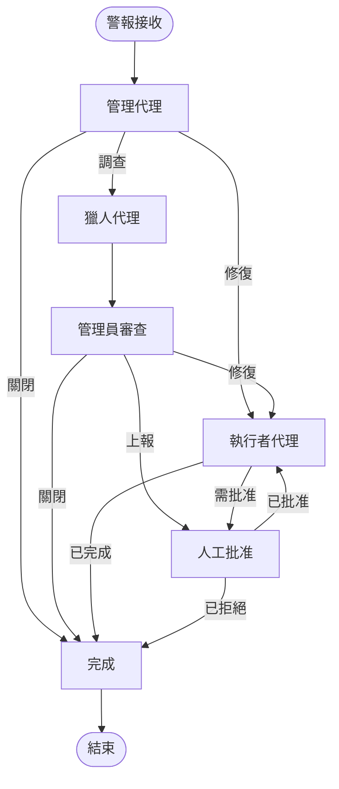

# 使用 LangGraph 的安全代理系統

[](https://langchain.com/)
[](https://github.com/langchain-ai/langgraph)
[](https://github.com/langchain-ai/langserve)
[](https://modelcontextprotocol.io/)
[](https://neo4j.com/)
[](https://www.trychroma.com/)

## 🎯 總覽
一個由 LangChain 和 LangGraph 驅動的多代理安全協調平台。2025 年的重構將程式碼庫整合為一個可重複使用的套件 (`security_agent_system`)，並為 CLI 操作、LangServe API 和 MCP 整合引入了專用的執行服務。

## 🧱 專案佈局
```
security-agent-system/
├── apps/                       # CLI、LangServe 和 MCP 進入點
├── security_agent_system/      # 核心套件（代理、核心、基礎設施、工作流程）
├── tests/                      # 自動化測試套件
├── config/, examples/          # 部署資產和可執行的範例
└── docs/                       # 架構、指南、操作和報告
```
完整的結構分解請參閱 [目錄結構](docs/reference/DIRECTORY_STRUCTURE.md)。

## 🧠 架構



### 關鍵能力
- **LangGraph 有向無環圖 (DAG) 協調**，每個代理使用 LCEL 鏈。
- **狀態持久化**，透過 SQLite 檢查點支援恢復和審計。
- **GraphRAG 上下文**，使用 Neo4j 加上 ChromaDB 進行混合式調查。
- **人在環 (Human-in-the-loop) 工作流程**，支援批准和回滾。
- **模組化執行環境** (CLI、LangServe、MCP)，重複使用單一的協調器實作。

## 🚀 執行環境
| 執行環境 | 指令 | 描述 |
| --- | --- | --- |
| CLI | `python security-agent-system/main.py start` | 具有 Click 指令的生產級協調。 |
| LangServe | `uvicorn apps.langserve.app:app --host 0.0.0.0 --port 8001` | 由 LangServe 和 FastAPI 驅動的 REST API。 |
| MCP | `python -m apps.mcp.server --host 127.0.0.1 --port 8765` | 用於 IDE/工具整合的模型上下文協定 (Model Context Protocol) 伺服器。 |

## 🤖 代理角色
- **管理代理** – 分析警報、設定優先級並建立修復計畫。
- **獵人代理** – 執行圖形/向量調查和風險評分。
- **執行者代理** – 驗證、執行和監控修復任務。

## 🚀 快速入門
1. 複製並安裝依賴項：
   ```bash
   git clone https://github.com/your-org/security-agent-system.git
   cd security-agent-system
   pip install -r security-agent-system/requirements.txt
   ```
2. 設定環境變數 (`cp .env.example .env`)。
3. 啟動支援服務：`docker-compose up -d`。
4. 啟動您偏好的執行環境（請參閱上表）。

## 📖 文件
- [平台架構](docs/architecture/PLATFORM_ARCHITECTURE.md)
- [LangGraph 工作流程](docs/architecture/LANGGRAPH_WORKFLOW.md)
- [執行服務總覽](docs/architecture/RUNTIME_SERVICES.md)
- [部署指南](docs/guides/DEPLOYMENT.md)
- [監控指南](docs/guides/MONITORING.md)
- [LangServe 部署](docs/guides/LANGSERVE_DEPLOYMENT.md)
- [MCP 伺服器操作](docs/guides/MCP_SERVER_GUIDE.md)
- [文件目錄](docs/reference/DOCUMENT_CATALOG.md)

## 🧪 測試
```bash
cd security-agent-system
pytest
```
觸發手動警報以進行煙霧測試：
```bash
python security-agent-system/main.py test-alert \
    --severity high \
    --type malware \
    "在伺服器上偵測到可疑進程"
```

## 🔧 設定
重要的 `.env` 變數：
```bash
# LLM 供應商
DEFAULT_LLM_PROVIDER=openai
OPENAI_API_KEY=your-key
ANTHROPIC_API_KEY=your-key
GOOGLE_API_KEY=your-key

# 代理設定
MANAGER_LLM_PROVIDER=openai
HUNTER_LLM_PROVIDER=anthropic
EXECUTOR_LLM_PROVIDER=google

# 基礎設施
NEO4J_URI=bolt://localhost:7687
CHROMADB_PATH=./chroma_db
MESSAGE_BROKER_TYPE=rabbitmq
```

## 📊 監控
Prometheus 指標涵蓋警報吞吐量、代理性能、執行延遲和錯誤率。Grafana 儀表板可在 `http://localhost:3000` 上取得。

## 🤝 貢獻
1. Fork 該儲存庫。
2. 建立一個功能分支。
3. 進行更改並新增測試。
4. 執行 `pytest`。
5. 提交拉取請求。

## 📄 授權
MIT 授權 – 請參閱 [LICENSE](LICENSE)。

## 🙏 致謝
使用 LangChain、LangGraph、LangServe、MCP、Neo4j 和 ChromaDB 建構。