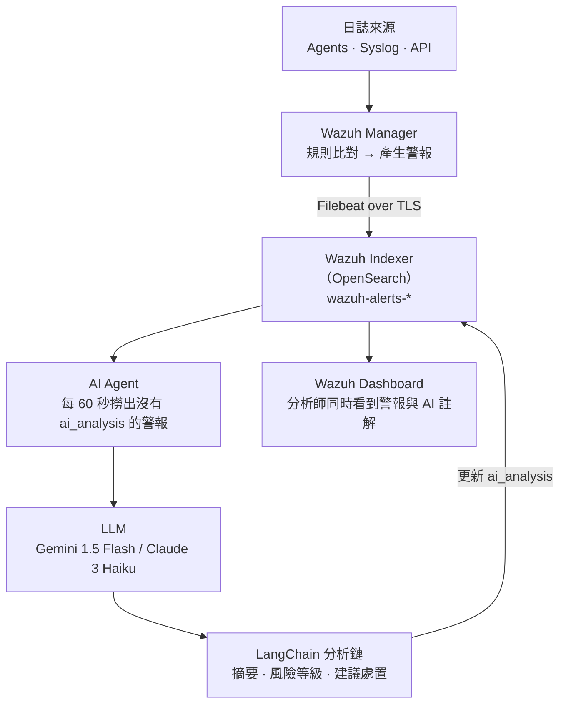
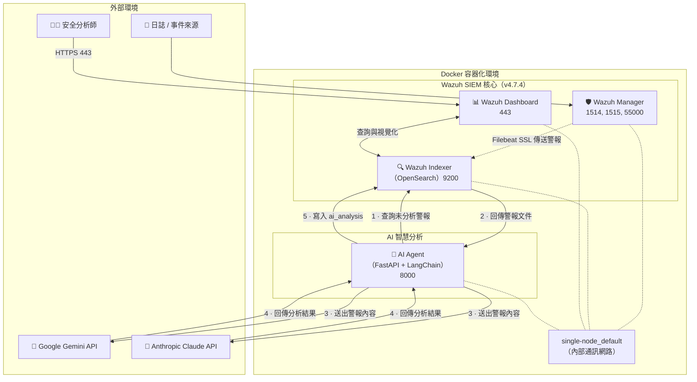

# Wazuh AI Agent

[](https://wazuh.com/)
[](https://www.python.org/)
[](LICENSE)
[](https://www.langchain.com/)
[](https://github.com/trionnemesis/wazuh_ai_agent/stargazers)

> **讓 LLM 幫你把 SIEM 警報看過一遍。** Wazuh AI Agent 把 LLM 放進 [Wazuh](https://wazuh.com/) 的警報 triage 流程：定時撈出還沒有人看過的警報，交給 Gemini 或 Claude 產生事件摘要、風險等級與建議處置，再把結果寫回警報文件本身 — 分析師在 Wazuh Dashboard 上就能看到警報與 AI 註解並列。本專案同時內含 **AgentSec**：一套紫隊測試框架，用來驗證這種 AI Agent（或任何 Agent）被攻擊時，藍隊到底看不看得見。

**English: [README.md](README.md)** ・ 🐛 [回報問題](https://github.com/trionnemesis/wazuh_ai_agent/issues) ・ 📖 [文件](docs/) ・ 🟣 [AgentSec](agentsec/README.md)

快速跳轉：[為什麼](#為什麼需要這個專案) ・ [功能概覽](#功能概覽) ・ [運作方式](#運作方式) ・ [快速開始](#快速開始) ・ [紫隊測試框架](#紫隊測試框架) ・ [設定](#設定) ・ [貢獻](#貢獻與社群)

---

## 為什麼需要這個專案

只要 Wazuh 佈署有一定規模，產生的警報量一定超過人看得完的速度。有兩件事讓情況更糟：

1. **規則編號不等於答案。** `sshd: Attempt to login using a non-existent user` 只告訴你什麼規則被觸發，沒告訴你在「這台主機、這個時間點」它到底重不重要、下一步該做什麼。補上這段脈絡是純手工，而且每一筆都要重來一次，結論多半還是「沒事」。
2. **把 LLM 放進流程等於多開一個攻擊面。** 警報內容是攻擊者可以影響的文字，而它會被送進一個握有工具權限的模型。提示詞注入、工具濫用、跨租戶資料外洩都變成真實風險 — 而且業界並沒有一套標準方法可以證明「你的偵測規則抓得到這些事」。

這個 repo 兩件事都處理。**AI Agent** 直接在警報上加註，讓 triage 從摘要與風險評級開始，而不是從一行原始規則描述開始。**AgentSec** 則用紫隊的方式回答第二個問題：重點不只是「攻擊有沒有成功」，而是「就算成功了，有沒有人看得見」。

服務跑起來之後，分析師在 Dashboard 上打開任何一筆警報，看到的會是這樣的內容：

> 💬「來自 203.0.113.44 對 `web-prod-02` 的多次 SSH 認證失敗，隨後 `deploy` 帳號登入成功。**風險：高。** 建議確認 deploy 金鑰近期是否輪替過，並在調查期間先封鎖來源 IP。」

## 功能概覽

| 能力 | 說明 |
|------|------|
| **自動警報 triage** | 每 60 秒掃描 `wazuh-alerts-*`，撈出沒有 `ai_analysis` 欄位的警報，每輪最多 10 筆 |
| **結構化 triage 報告** | 事件摘要、風險等級（Critical → Informational）、建議的下一步動作 |
| **LLM 可抽換** | 用 `LLM_PROVIDER` 在 Google Gemini 與 Anthropic Claude 之間切換，不用改程式 |
| **就地寫回** | 結果寫在原始警報文件上，警報出現在哪裡、分析就跟到哪裡 |
| **一鍵起服務** | 內含 `wazuh-docker` single-node compose（manager + indexer + dashboard）加上 agent 容器 |
| **紫隊測試框架** | [AgentSec](#紫隊測試框架)：Attack–Detection Contract、決定性判定、MCP Gateway |

**寫回去的內容長什麼樣**

Agent 只會在警報文件上新增一個欄位，警報本身的其他內容完全不動：

```json
"ai_analysis": {
  "triage_report": "1. 事件摘要 ...\n2. 風險等級：高 ...\n3. 建議處置 ...",
  "provider": "anthropic",
  "timestamp": "2026-07-29T10:14:02.123+0000"
}
```

這個欄位「不存在」本身就是工作佇列：沒有 `ai_analysis` 的警報代表還沒被 triage 過，所以同一筆警報永遠不會被重複分析。

| 元件 | 角色 | Port |
|------|------|------|
| `wazuh.manager` | 日誌接收、規則比對、警報產生 | 1514, 1515, 55000 |
| `wazuh.indexer` | 存放 `wazuh-alerts-*` 的 OpenSearch 後端 | 9200 |
| `wazuh.dashboard` | 分析師介面 | 443 |
| `ai-agent` | FastAPI + LangChain triage 迴圈 | 8000 |

## 運作方式



Agent 的定位刻意只有「讀取 + 加註」：它查詢 indexer、呼叫一次 LLM、更新一個欄位。它不會跟 manager 溝通、不會動 agent 設定，也沒有任何在主機上執行動作的能力。

<details>
<summary>完整佈署拓樸（容器、網路、外部呼叫）</summary>



</details>

## 快速開始

需要 Linux、Docker + Docker Compose、8GB 以上記憶體、20GB 以上硬碟空間，以及可連外的網路（呼叫 LLM API 用）。

### 1. Clone 並調整核心參數

OpenSearch 沒有這個參數不會啟動，同一台主機只需要設定一次。

```bash
git clone https://github.com/trionnemesis/wazuh_ai_agent.git
cd wazuh_ai_agent/wazuh-docker/single-node

sudo sysctl -w vm.max_map_count=262144
```

### 2. 設定 Agent

```bash
cat > ai-agent-project/.env << 'EOF'
LLM_PROVIDER=anthropic
ANTHROPIC_API_KEY=your_anthropic_api_key_here
GEMINI_API_KEY=your_gemini_api_key_here
OPENSEARCH_URL=https://wazuh.indexer:9200
OPENSEARCH_USER=admin
OPENSEARCH_PASSWORD=SecretPassword
EOF
```

只需要填你選用的那家供應商的金鑰。`.env` 不會被 commit，請維持這個狀態。

### 3. 產生憑證並啟動

```bash
docker-compose -f generate-indexer-certs.yml run --rm generator
docker-compose up -d
```

- Wazuh Dashboard — https://localhost（`admin` / `SecretPassword`，**請務必修改**）
- AI Agent — http://localhost:8000 會回傳排程器狀態

### 4. 確認 triage 有在跑

```bash
# Agent 每處理一筆警報就會寫一行 log
docker-compose logs -f ai-agent

# 還有多少警報沒被分析
curl -k -u admin:SecretPassword \
  'https://localhost:9200/wazuh-alerts-*/_count?q=NOT%20_exists_:ai_analysis'
```

要有東西觸發警報才會看到第一批結果 — 通常光是 manager 容器自己的日誌就足以讓佇列動起來。

## 紫隊測試框架

`agentsec/` 是一套獨立的框架，處理的是第二個問題：一個握有工具權限的 AI Agent 就是一個會被攻擊的系統，而現在多數 AI 安全工具只問「攻擊有沒有被擋下來？」。AgentSec 把那個更貴的問題擺到第一位 — **萬一沒擋下來，有沒有人會發現？**

一份場景會宣告一份涵蓋四個軸線的 **Attack–Detection Contract**，每次執行都由一個決定性的評估器判定 — 判定路徑上完全沒有語言模型：

| 軸線 | 要回答的問題 |
|---|---|
| **Prevention（預防）** | Agent 有沒有拒絕做那件壞事？ |
| **Detection（偵測）** | 如果它做了 — 或試圖做 — 藍隊有沒有及時看見？ |
| **Evidence（證據）** | 事後調查人員能不能重建整起事件？ |
| **Response（應變）** | 文件上寫的或自動化的反應，實際上有沒有發生？ |

判定結果有明確的優先序，而 `detection_gap` 刻意排在 `prevention_gap` 之上 — 一個你看得到它失效的控制項，你有辦法修；你從來不知道發生過的事，你修不了：

```
error > detection_gap > prevention_gap > evidence_gap > response_gap > secure
```

整套流程可以完全離線跑，不需要真的 Agent、不需要 Wazuh、不需要網路：

```bash
cd agentsec
pip install -e '.[dev]'

agentsec validate                              # 檢查內建場景
agentsec preview --target demo-agent-fixture   # 會跑什麼、為什麼跑
agentsec run --target demo-agent-fixture --profile nightly --html
```

Exit code 本身就是契約：`0` 代表乾淨、`1` 代表有阻擋性的發現、`2` 代表框架根本沒辦法告訴你任何事。把 `1` 和 `2` 混為一談，是讓 CI 檢查淪為「大家學會跳過的雜訊」的第一步。Wazuh 證據收集器可以讀 JSON fixture，也可以直接查詢線上的 `wazuh-alerts-*`，所以同一份契約在 CI 通過之後，可以直接指向上面那套 stack。

📖 [`agentsec/README.md`](agentsec/README.md) ・ [架構說明](agentsec/docs/architecture.md) ・ [契約格式](agentsec/docs/attack-detection-contract.md) ・ [ADR](agentsec/docs/adr/)

## 設定

**AI Agent** — `wazuh-docker/single-node/ai-agent-project/.env`

| 變數 | 說明 | 預設值 |
|------|------|--------|
| `LLM_PROVIDER` | `anthropic` 或 `gemini` | `anthropic` |
| `ANTHROPIC_API_KEY` | `LLM_PROVIDER=anthropic` 時必填 | — |
| `GEMINI_API_KEY` | `LLM_PROVIDER=gemini` 時必填 | — |
| `OPENSEARCH_URL` | Wazuh Indexer 連線位址 | `https://wazuh.indexer:9200` |
| `OPENSEARCH_USER` | Indexer 帳號 | `admin` |
| `OPENSEARCH_PASSWORD` | Indexer 密碼 | `SecretPassword` |

模型版本寫死在 `app/main.py`（`gemini-1.5-flash`、`claude-3-haiku-20240307`），60 秒的執行間隔與每輪 10 筆的批次大小也在同一個檔案。

**AgentSec** — `agentsec/.env`（參考 [`agentsec/.env.example`](agentsec/.env.example)）

| 變數 | 說明 | 預設值 |
|------|------|--------|
| `AGENTSEC_WORKSPACE` | 存放 `scenarios/`、`policy/`、`results/` 的根目錄 | `.` |
| `AGENTSEC_ACTOR` | 寫進每一筆稽核紀錄的操作者 | `local` |
| `AGENTSEC_DB` | SQLite 結果檔位置 | 相對於 workspace |
| `AGENTSEC_MCP_READ_ONLY` | 在 dispatcher 層拒絕所有非唯讀的 MCP 工具 | 未設定 |
| `AGENTSEC_ALLOW_EXTERNAL_HOSTS` | 豁免私有位址檢查的主機清單 | 未設定 |

憑證的「值」不會出現在任何場景、目標定義或工具參數裡 — `policy/targets.yaml` 只記錄變數名稱。

更多細節請見 `docs/`：

- [詳細工作流程與技術架構](docs/workflow.md)
- [進階配置與客製化](docs/configuration.md)
- [常見問題排除](docs/troubleshooting.md)
- [擴充開發指南](docs/extending.md)

## 專案架構

```
wazuh-docker/                       上游 Wazuh Docker stack 的 vendored 副本（GPLv2）
└── single-node/
    ├── docker-compose.yml          manager + indexer + dashboard
    ├── docker-compose.override.yml ai-agent 服務定義
    └── ai-agent-project/
        ├── app/main.py             LLM 選擇、LangChain 分析鏈、排程器、FastAPI
        ├── requirements.txt
        └── Dockerfile

agentsec/                           紫隊測試框架（MIT，可獨立安裝的套件）
├── schemas/                        scenario / target / evidence 的 JSON Schema
├── scenarios/                      場景目錄（四個完整範例）
├── policy/                         目標白名單、執行 profile、核准帳本
├── fixtures/                       錄製好的語料，讓整條流程可離線執行
├── src/agentsec/
│   ├── models/                     跨越每一層邊界的型別契約
│   ├── scenario/                   載入器、驗證器、場景目錄與覆蓋率
│   ├── policy/                     白名單、profile、核准、唯一的政策守門員
│   ├── execution/                  紅隊執行器（replay、promptfoo）與目標 adapter
│   ├── evidence/                   收集器：OTel、Wazuh、工具稽核、DB 狀態差異
│   ├── evaluation/                 四個軸線與判定解析器
│   ├── reporting/                  正規化 → JUnit / HTML / JSON
│   ├── store/                      SQLite 執行結果、發現、稽核紀錄
│   ├── service/                    HarnessService — 內部 API
│   └── mcp/                        Gateway：工具契約、resources、prompts、server
└── docs/                           架構、佈署、roadmap、ADR

docs/                               維運指南（繁體中文）
```

## 開發

AI Agent 只有單一模組，改完之後重新 build 該服務即可：

```bash
cd wazuh-docker/single-node
docker-compose up -d --build ai-agent
docker-compose logs -f ai-agent
```

AgentSec 是標準的 Python 套件，附完整的離線測試：

```bash
cd agentsec
pip install -e '.[dev]'

make check        # ruff + mypy + pytest，跟 CI 跑的完全一樣
make demo         # 完整離線流程（設計上就會以 1 結束）
make report       # 從既有執行結果重新產生 HTML/JSON/JUnit 報告
```

## 安全注意事項

這裡講清楚 — 一個會隱瞞自身風險的安全工具不算安全工具：

- **警報內容會離開你的網路。** 規則描述與主機名稱會被送到第三方 LLM API。在把它指向正式環境的警報之前，請先確認符合貴組織的資料處理政策；如果過不了，請改用自架模型。
- **內建的帳密是示範用帳密。** `admin` / `SecretPassword` 來自上游的 `wazuh-docker`。在這套服務被你以外的任何人碰得到之前，請先改掉。
- **Agent 連 indexer 時不驗證憑證**（`app/main.py` 裡的 `verify_certs=False`），因為 single-node stack 在內部 Docker 網路上使用自簽憑證。如果你把 indexer 搬離那個網路，請先修掉這一點。
- **Agent 只能讀取與加註。** 它沒有 shell、沒有主機存取權、也沒有 manager API 權限 — 透過警報文字做提示詞注入，最大的後果是一則錯誤的 triage 註解，不是一個被執行的動作。
- **AgentSec 的 MCP 介面在設計上就是窄的**，而且有單元測試會在它不再窄的時候讓 build 失敗：沒有 `execute_shell`／`query_database` 這類泛用能力、工具參數不接受自由文字的 URL/SQL/path、環境列舉中根本沒有 `production`、核准 token 只能由 CLI 簽發。詳見 [`agentsec/SECURITY.md`](agentsec/SECURITY.md)。

## 貢獻與社群

歡迎任何形式的參與 — 不一定要寫程式：

- 🐛 **發現 bug 或行為不如預期** → [開一個 Issue](https://github.com/trionnemesis/wazuh_ai_agent/issues)
- 💡 **想要新功能**（新的 LLM 供應商、更豐富的警報脈絡、對歷史事件做 RAG）→ 開 Issue 描述你的使用情境
- 🟣 **貢獻場景** → 在 `agentsec/scenarios/` 底下新增 Attack–Detection Contract 是這個專案 CP 值最高的貢獻；請見 [`agentsec/CONTRIBUTING.md`](agentsec/CONTRIBUTING.md)
- 🔧 **想改 code** → fork 後開 PR，記得先在 `agentsec/` 裡跑過 `make check`

如果這個專案對你有幫助，請給一顆 ⭐ — 這是讓更多人看見它最簡單的方式。

## License

AI Agent 整合程式碼、`agentsec/` 與本文件採用 [MIT License](LICENSE)（trionnemesis）。

`wazuh-docker/` 目錄為上游 [Wazuh Docker](https://github.com/wazuh/wazuh-docker) 專案的 vendored 副本，保留其原始 GPLv2 授權，詳見 [`wazuh-docker/LICENSE`](wazuh-docker/LICENSE)。

## Related projects

本專案規劃未來與下列兩個 repo 整併為統一的 **Agentic Ops** OSS demo：

- [aiops-rag-system](https://github.com/trionnemesis/aiops-rag-system) — 基於 LangChain LCEL + LangGraph 的智慧維運報告 RAG 系統
- [mcp-ai-agent](https://github.com/trionnemesis/mcp-ai-agent) — 基於 Google Gemini SDK 與 MCP（Model Context Protocol）的智慧 Linux 系統管理助手

---

*基於 [Wazuh](https://wazuh.com/) 打造 — 開源 SIEM 與 XDR 平台。*
