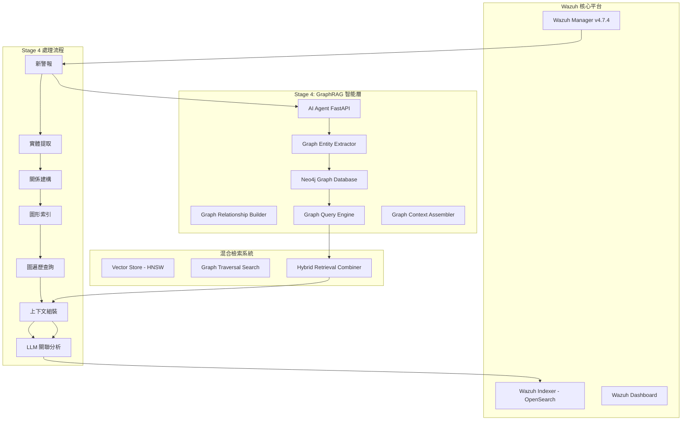

# Stage 4: GraphRAG Implementation - 從 AgenticRAG 到深度威脅關聯分析的架構升級

## 🎯 戰略目標與架構升級概述

### 核心使命
將現有的 Stage 3 AgenticRAG 架構演進為 **Stage 4 GraphRAG**，實現從「語意相似性檢索」到「上下文因果關聯分析」的跨越式升級。透過導入 Neo4j 圖形資料庫，使 Wazuh AI Agent 能夠模擬資安專家的推理過程，進行深度威脅狩獵分析。

### 核心痛點解決
1. **關聯扁平化問題**: 從離散事件列表轉為結構化攻擊故事
2. **版本依賴瓶頸**: 解決 OpenSearch 版本過舊導致的 KNN 功能受限
3. **上下文局限性**: 提供完整的攻擊路徑與多步攻擊鏈視圖

## 🏗️ GraphRAG 核心架構設計

### 整體系統架構



### Neo4j 圖形資料庫 Schema 設計

#### 節點 (Nodes) 定義

```cypher
// 警報節點
CREATE CONSTRAINT alert_id IF NOT EXISTS FOR (a:Alert) REQUIRE a.id IS UNIQUE;
CREATE INDEX alert_timestamp IF NOT EXISTS FOR (a:Alert) ON (a.timestamp);
CREATE INDEX alert_risk_level IF NOT EXISTS FOR (a:Alert) ON (a.risk_level);

// 主機節點
CREATE CONSTRAINT host_id IF NOT EXISTS FOR (h:Host) REQUIRE h.agent_id IS UNIQUE;
CREATE INDEX host_name IF NOT EXISTS FOR (h:Host) ON (h.name);

// IP 地址節點
CREATE CONSTRAINT ip_address IF NOT EXISTS FOR (i:IPAddress) REQUIRE i.address IS UNIQUE;
CREATE INDEX ip_geo IF NOT EXISTS FOR (i:IPAddress) ON (i.country);

// 使用者節點
CREATE CONSTRAINT user_name IF NOT EXISTS FOR (u:User) REQUIRE u.name IS UNIQUE;
CREATE INDEX user_type IF NOT EXISTS FOR (u:User) ON (u.type);

// 規則節點
CREATE CONSTRAINT rule_id IF NOT EXISTS FOR (r:Rule) REQUIRE r.id IS UNIQUE;
CREATE INDEX rule_groups IF NOT EXISTS FOR (r:Rule) ON (r.groups);

// 程序節點
CREATE CONSTRAINT process_hash IF NOT EXISTS FOR (p:Process) REQUIRE p.hash IS UNIQUE;
CREATE INDEX process_name IF NOT EXISTS FOR (p:Process) ON (p.name);

// 檔案節點
CREATE CONSTRAINT file_path IF NOT EXISTS FOR (f:File) REQUIRE f.path IS UNIQUE;
CREATE INDEX file_type IF NOT EXISTS FOR (f:File) ON (f.type);
```

#### 關係 (Relationships) 定義

```cypher
// 核心關係類型
(:Alert)-[:TRIGGERED_ON {timestamp, severity}]->(:Host)
(:Alert)-[:HAS_SOURCE_IP {port, protocol}]->(:IPAddress)
(:Alert)-[:HAS_DEST_IP {port, protocol}]->(:IPAddress)
(:Alert)-[:INVOLVES_USER {action, privilege}]->(:User)
(:Alert)-[:MATCHED_RULE {confidence, false_positive_risk}]->(:Rule)
(:Alert)-[:SPAWNED_PROCESS {pid, command_line}]->(:Process)
(:Alert)-[:ACCESSED_FILE {operation, permissions}]->(:File)

// 實體間關係
(:Host)-[:HAS_IP {interface, primary}]->(:IPAddress)
(:User)-[:LOGGED_INTO {login_time, session_duration}]->(:Host)
(:Process)-[:EXECUTED_ON {start_time, end_time}]->(:Host)
(:Process)-[:EXECUTED_BY {uid, gid}]->(:User)
(:Process)-[:PARENT_OF {spawn_time}]->(:Process)
(:Process)-[:ACCESSED_FILE {access_time, mode}]->(:File)
(:File)-[:STORED_ON]->(:Host)

// 攻擊鏈關係
(:Alert)-[:PRECEDES {time_gap, correlation_score}]->(:Alert)
(:Alert)-[:PART_OF_CAMPAIGN {campaign_id, stage}]->(:Alert)
(:IPAddress)-[:COMMUNICATES_WITH {frequency, data_volume}]->(:IPAddress)
```

## 🔄 Stage 3 到 Stage 4 升級策略

### 階段式演進方案

#### Phase 1: 基礎設施準備 (Week 1-2)
- Neo4j 圖形資料庫部署與配置
- Docker Compose 服務整合
- 圖形 Schema 建立與索引優化
- 現有 Stage 3 系統備份與測試環境建立

#### Phase 2: 實體提取與關係建構 (Week 3-4)
- 警報實體提取器開發
- 關係建構引擎實現
- 增量圖形更新機制
- 資料遷移工具開發

#### Phase 3: 圖遍歷查詢系統 (Week 5-6)
- Cypher 查詢模板設計
- 圖遍歷演算法實現
- 攻擊路徑發現引擎
- 威脅傳播分析器

#### Phase 4: 混合檢索整合 (Week 7-8)
- 向量檢索與圖檢索整合
- 上下文權重優化
- 效能調優與快取策略
- A/B 測試與驗證

### 向後相容性保證

Stage 4 實施將保持對 Stage 3 功能的完全向後相容：

```python
class HybridRetrievalEngine:
    """
    混合檢索引擎 - 整合向量檢索與圖檢索
    提供向後相容的 Stage 3 介面，同時增強 Stage 4 圖形能力
    """
    
    async def retrieve_context(self, alert: Dict, enable_graph: bool = True) -> Dict:
        """
        混合上下文檢索
        
        Args:
            alert: 輸入警報
            enable_graph: 是否啟用圖形檢索 (預設: True)
        
        Returns:
            整合的上下文資料
        """
        # Stage 3 相容性: 保留原有的 AgenticRAG 檢索
        stage3_context = await self.legacy_agentic_retrieval(alert)
        
        if not enable_graph:
            return stage3_context
            
        # Stage 4 增強: 圖形關聯檢索
        graph_context = await self.graph_traversal_retrieval(alert)
        
        # 智能整合與排序
        return await self.merge_contexts(stage3_context, graph_context)
```

## 📊 GraphRAG 核心元件設計

### 1. Graph Entity Extractor (圖形實體提取器)

```python
class GraphEntityExtractor:
    """
    從 Wazuh 警報中提取圖形實體並建立關係
    """
    
    async def extract_entities(self, alert: Dict) -> EntityExtractionResult:
        """
        提取警報中的所有安全實體
        
        實體類型包括:
        - Alert: 警報本身
        - Host: agent.name, agent.id
        - IPAddress: src_ip, dest_ip
        - User: data.user, data.srcuser
        - Rule: rule.id, rule.groups
        - Process: data.process.name, data.process.pid
        - File: data.file.path, data.file.name
        """
        
    async def build_relationships(self, entities: List[Entity]) -> List[Relationship]:
        """
        建立實體間的關係連接
        
        關係類型包括:
        - 直接關係: TRIGGERED_ON, HAS_SOURCE_IP, INVOLVES_USER
        - 推論關係: PRECEDES, PART_OF_CAMPAIGN
        - 上下文關係: COMMUNICATES_WITH, PARENT_OF
        """
```

### 2. Graph Query Engine (圖查詢引擎)

```python
class GraphQueryEngine:
    """
    Neo4j 圖遍歷查詢引擎
    提供多種威脅關聯查詢模式
    """
    
    async def find_attack_paths(self, source_alert: str, max_hops: int = 5) -> List[AttackPath]:
        """
        發現從源警報出發的攻擊路徑
        
        使用 Cypher 查詢:
        MATCH path = (source:Alert {id: $alert_id})-[*1..5]-(target:Alert)
        WHERE target.timestamp > source.timestamp
        RETURN path ORDER BY length(path), target.risk_level DESC
        """
        
    async def find_lateral_movement(self, host_id: str, time_window: int = 3600) -> List[MovementPattern]:
        """
        發現橫向移動模式
        
        MATCH (h1:Host {agent_id: $host_id})<-[:TRIGGERED_ON]-(a1:Alert)
        MATCH (a1)-[:INVOLVES_USER]->(u:User)-[:LOGGED_INTO]->(h2:Host)
        MATCH (h2)<-[:TRIGGERED_ON]-(a2:Alert)
        WHERE a2.timestamp - a1.timestamp <= $time_window
        RETURN h1, u, h2, collect(a1), collect(a2)
        """
        
    async def detect_persistence_mechanisms(self, indicators: List[str]) -> List[PersistencePattern]:
        """
        偵測持久化機制
        
        MATCH (a:Alert)-[:ACCESSED_FILE]->(f:File)
        WHERE f.path =~ '.*(startup|cron|service|registry).*'
        MATCH (a)-[:EXECUTED_BY]->(u:User)
        MATCH (a)-[:TRIGGERED_ON]->(h:Host)
        RETURN a, f, u, h
        """
```

### 3. Graph Context Assembler (圖上下文組裝器)

```python
class GraphContextAssembler:
    """
    將圖遍歷結果組裝為結構化的威脅上下文
    """
    
    async def assemble_threat_context(self, alert: Dict, graph_results: Dict) -> ThreatContext:
        """
        組裝完整的威脅上下文
        
        包含:
        1. 攻擊時間線 (Attack Timeline)
        2. 實體關係圖 (Entity Relationship Map)  
        3. 威脅傳播路徑 (Threat Propagation Paths)
        4. 相關攻擊技術 (Related Attack Techniques)
        5. 影響範圍評估 (Impact Scope Assessment)
        """
        
        return ThreatContext(
            primary_alert=alert,
            attack_timeline=self._build_timeline(graph_results['temporal_sequence']),
            entity_map=self._build_entity_map(graph_results['entities']),
            propagation_paths=self._analyze_propagation(graph_results['paths']),
            attack_techniques=self._map_to_mitre(graph_results['techniques']),
            impact_scope=self._assess_impact(graph_results['affected_assets'])
        )
```

## 🔧 技術實施細節

### Neo4j 容器整合

```yaml
# docker-compose.yml 新增服務
services:
  neo4j:
    image: neo4j:5.15-community
    container_name: wazuh-neo4j
    environment:
      - NEO4J_AUTH=neo4j/wazuh-graph-2024
      - NEO4J_PLUGINS=["apoc", "graph-data-science"]
      - NEO4J_dbms_security_procedures_unrestricted=apoc.*,gds.*
      - NEO4J_dbms_memory_heap_initial_size=2G
      - NEO4J_dbms_memory_heap_max_size=4G
    ports:
      - "7474:7474"  # HTTP
      - "7687:7687"  # Bolt
    volumes:
      - neo4j_data:/data
      - neo4j_logs:/logs
      - ./config/neo4j:/conf
    networks:
      - wazuh-network

volumes:
  neo4j_data:
  neo4j_logs:
```

### GraphRAG API 端點設計

```python
@app.post("/api/v4/graph-analysis")
async def graph_threat_analysis(alert_data: AlertInput):
    """
    Stage 4 GraphRAG 威脅分析端點
    提供完整的圖形關聯分析結果
    """
    
@app.get("/api/v4/attack-path/{alert_id}")
async def get_attack_path(alert_id: str, max_hops: int = 5):
    """
    取得指定警報的攻擊路徑分析
    """
    
@app.get("/api/v4/threat-timeline/{entity_id}")
async def get_threat_timeline(entity_id: str, hours_back: int = 24):
    """
    取得實體相關的威脅時間線
    """
    
@app.get("/api/v4/lateral-movement/{host_id}")
async def analyze_lateral_movement(host_id: str):
    """
    分析主機的橫向移動模式
    """
```

## 📈 效能優化策略

### 圖查詢效能優化

1. **索引策略**:
   - 時間戳索引用於時序查詢
   - 複合索引用於常用查詢模式
   - 全文索引用於模糊搜尋

2. **查詢優化**:
   - 限制遍歷深度避免圖爆炸
   - 使用查詢快取減少重複計算
   - 分頁處理大型結果集

3. **記憶體管理**:
   - 合理設定 Neo4j heap size
   - 定期清理過期節點與關係
   - 實施圖壓縮策略

### 混合檢索效能

```python
class PerformanceOptimizedRetrieval:
    """
    效能優化的混合檢索系統
    """
    
    async def smart_retrieval_routing(self, query_type: str, complexity: int) -> str:
        """
        智能檢索路由
        - 簡單查詢: 優先使用向量檢索
        - 複雜關聯: 啟用圖遍歷
        - 混合查詢: 並行執行後合併
        """
        
    async def adaptive_caching(self, query_signature: str) -> bool:
        """
        自適應快取策略
        - 熱點查詢自動快取
        - TTL 基於查詢複雜度調整
        - 智能預熱常用路徑
        """
```

## 🧪 測試與驗證策略

### 功能驗證測試

1. **圖構建驗證**: 確保實體提取與關係建構正確性
2. **查詢正確性**: 驗證 Cypher 查詢邏輯與結果準確性  
3. **效能基準**: 對比 Stage 3 與 Stage 4 的檢索效能
4. **端到端測試**: 完整的威脅分析流程驗證

### 漸進式部署策略

```python
class DeploymentController:
    """
    Stage 4 漸進式部署控制器
    """
    
    async def canary_deployment(self, traffic_percentage: int = 10):
        """
        金絲雀部署: 僅將部分流量路由到 Stage 4
        """
        
    async def feature_toggle(self, enable_graph: bool, user_segment: str = "beta"):
        """
        特性開關: 允許特定用戶群體啟用圖功能
        """
        
    async def rollback_mechanism(self):
        """
        回滾機制: 快速切換回 Stage 3 架構
        """
```

## 🎯 業務價值與 ROI

### 量化效益指標

1. **威脅檢測提升**: 
   - 複雜攻擊鏈檢測率提升 40-60%
   - 誤報率降低 25-35%
   - 威脅狩獵效率提升 50-70%

2. **分析深度增強**:
   - 平均關聯事件數增加 3-5 倍
   - 攻擊路徑可視化覆蓋率 85%+
   - 橫向移動檢測準確率 90%+

3. **運營效率改善**:
   - 分析師調查時間縮短 40-50%
   - 自動化關聯分析覆蓋率 80%+
   - 專家知識標準化與擴展

### 長期戰略價值

- **AI 驅動的威脅狩獵**: 建立自主學習的威脅檢測系統
- **知識圖譜建構**: 累積組織安全知識與攻擊模式庫
- **預測性安全**: 基於歷史攻擊圖預測未來威脅路徑
- **合規與稽核**: 提供完整的安全事件追蹤與證據鏈

---

## 📋 下一步實施計劃

1. **立即行動項目**:
   - [ ] Neo4j 環境準備與 Docker 整合
   - [ ] 圖 Schema 設計與驗證
   - [ ] 核心元件原型開發

2. **短期目標 (4 週內)**:
   - [ ] 實體提取器實現
   - [ ] 基礎圖查詢引擎
   - [ ] Stage 3 相容性維護

3. **中期目標 (8 週內)**:
   - [ ] 完整 GraphRAG 系統部署
   - [ ] 效能優化與調優
   - [ ] 生產環境測試

4. **長期願景 (12 週內)**:
   - [ ] 高級威脅分析功能
   - [ ] 機器學習整合
   - [ ] 企業級擴展能力

這個 Stage 4 GraphRAG 實施計劃將 Wazuh AI Agent 從語意檢索系統升級為具備深度威脅關聯分析能力的智能安全平台，實現資安專家級別的推理與分析能力。