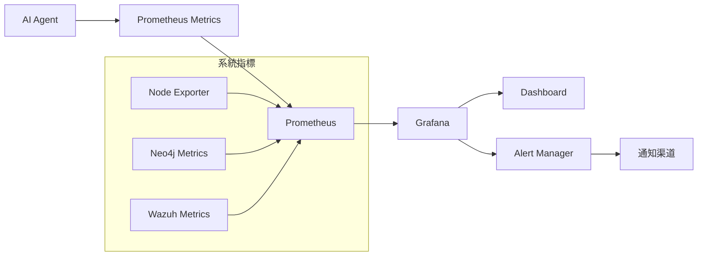

# Wazuh GraphRAG 監控系統指南

**版本**: v4.7.4 + GraphRAG Stage 4  
**最後更新**: 2024年12月  
**文件類型**: 監控與運維指南  

---

## 📋 目錄

1. [監控架構概述](#監控架構概述)
2. [監控指標詳解](#監控指標詳解)
3. [部署監控系統](#部署監控系統)
4. [Grafana 儀表板](#grafana-儀表板)
5. [告警配置](#告警配置)
6. [效能調優](#效能調優)
7. [故障排除](#故障排除)

---

## 監控架構概述

### 監控架構圖



### 監控組件

| **組件** | **版本** | **功能** | **端口** |
|---------|---------|---------|---------|
| **Prometheus** | v2.48.0 | 指標收集與儲存 | 9090 |
| **Grafana** | 10.2.2 | 視覺化儀表板 | 3000 |
| **Node Exporter** | v1.7.0 | 系統指標收集 | 9100 |
| **AI Agent** | 自定義 | 應用指標暴露 | 8000 |

---

## 監控指標詳解

### 1. 延遲指標 (Latency)

#### 警報處理延遲
```promql
# 處理單個警報的總耗時
alert_processing_duration_seconds

# P50/P95/P99 延遲
histogram_quantile(0.50, rate(alert_processing_duration_seconds_bucket[5m]))
histogram_quantile(0.95, rate(alert_processing_duration_seconds_bucket[5m]))
histogram_quantile(0.99, rate(alert_processing_duration_seconds_bucket[5m]))
```

#### API 呼叫延遲
```promql
# 各階段 API 呼叫的耗時
api_call_duration_seconds{stage="embedding"}
api_call_duration_seconds{stage="llm_analysis"}
api_call_duration_seconds{stage="neo4j_query"}
```

#### 檢索延遲
```promql
# 資料檢索階段的耗時
retrieval_duration_seconds{type="vector"}
retrieval_duration_seconds{type="graph"}
```

### 2. 吞吐量指標 (Throughput)

#### 警報處理量
```promql
# 已成功處理的警報總數
alerts_processed_total

# 處理速率
rate(alerts_processed_total[5m])

# 新警報發現速率
rate(new_alerts_found_total[5m])
```

#### 隊列狀態
```promql
# 待處理的警報數量
pending_alerts_gauge

# 隊列積壓趨勢
increase(pending_alerts_gauge[1h])
```

### 3. Token 使用指標

#### LLM Token 消耗
```promql
# LLM 分析使用的總輸入 Token 數
llm_input_tokens_total

# LLM 分析產生的總輸出 Token 數
llm_output_tokens_total

# Token 使用趨勢
increase(llm_input_tokens_total[1h])
increase(llm_output_tokens_total[1h])
```

#### Embedding Token 消耗
```promql
# Embedding 使用的總輸入 Token 數
embedding_input_tokens_total

# Token 使用趨勢
increase(embedding_input_tokens_total[1h])
```

### 4. 錯誤率指標 (Error Rate)

#### 處理錯誤
```promql
# 處理失敗的警報總數
alert_processing_errors_total

# 錯誤率計算
rate(alert_processing_errors_total[5m]) / rate(alerts_processed_total[5m])
```

#### API 錯誤
```promql
# API 呼叫失敗計數
api_errors_total{stage="embedding"}
api_errors_total{stage="llm_analysis"}
api_errors_total{stage="neo4j_query"}

# 各階段錯誤率
rate(api_errors_total{stage="embedding"}[5m]) / rate(api_calls_total{stage="embedding"}[5m])
```

#### GraphRAG 降級
```promql
# 從圖形檢索降級到傳統檢索的次數
graph_retrieval_fallback_total

# 降級率
rate(graph_retrieval_fallback_total[5m]) / rate(graph_retrieval_attempts_total[5m])
```

### 5. 系統資源指標

#### CPU 使用率
```promql
# 系統 CPU 使用率
100 - (avg by (instance) (irate(node_cpu_seconds_total{mode="idle"}[5m])) * 100)

# 容器 CPU 使用率
rate(container_cpu_usage_seconds_total{name="wazuh-ai-agent"}[5m])
```

#### 記憶體使用率
```promql
# 系統記憶體使用率
(node_memory_MemTotal_bytes - node_memory_MemAvailable_bytes) / node_memory_MemTotal_bytes * 100

# 容器記憶體使用率
container_memory_usage_bytes{name="wazuh-ai-agent"} / container_spec_memory_limit_bytes{name="wazuh-ai-agent"} * 100
```

#### 磁碟 I/O
```promql
# 磁碟讀取速率
rate(node_disk_read_bytes_total[5m])

# 磁碟寫入速率
rate(node_disk_written_bytes_total[5m])
```

---

## 部署監控系統

### 1. 使用 Docker Compose 部署

```bash
# 在 ai-agent-project 目錄中
cd wazuh-docker/single-node/ai-agent-project

# 啟動監控服務
docker-compose -f config/docker-compose.monitoring.yml up -d
```

### 2. 手動部署步驟

#### 安裝依賴

確保 AI Agent 的 `requirements.txt` 包含 `prometheus-client`：

```bash
pip install prometheus-client
```

#### 啟動監控服務

```bash
# 啟動 Prometheus 和 Grafana
docker-compose -f docker-compose.monitoring.yml up -d
```

#### 驗證服務狀態

```bash
# 檢查所有服務是否正常運行
docker-compose -f docker-compose.monitoring.yml ps

# 驗證各服務端點
curl http://localhost:8000/metrics  # AI Agent 指標
curl http://localhost:9090/-/healthy  # Prometheus
curl http://localhost:3000/api/health  # Grafana
```

### 3. 監控配置檔案

#### Prometheus 配置

```yaml
# config/prometheus.yml
global:
  scrape_interval: 15s
  evaluation_interval: 15s

scrape_configs:
  - job_name: 'ai-agent'
    static_configs:
      - targets: ['ai-agent:8000']
    scrape_interval: 10s
    metrics_path: '/metrics'
    
  - job_name: 'node-exporter'
    static_configs:
      - targets: ['node-exporter:9100']
      
  - job_name: 'neo4j'
    static_configs:
      - targets: ['neo4j:2004']
    scrape_interval: 30s
```

#### Grafana 配置

```yaml
# grafana/provisioning/datasources/prometheus.yml
apiVersion: 1

datasources:
  - name: Prometheus
    type: prometheus
    access: proxy
    url: http://prometheus:9090
    isDefault: true
    editable: true
```

### 4. 預設登入資訊

#### Grafana
- **使用者名稱**: admin
- **密碼**: wazuh-grafana-2024

---

## Grafana 儀表板

### 1. 自動配置

儀表板會在 Grafana 啟動時自動配置，包含以下關鍵視圖：

#### Alert Processing Rate
- 顯示警報處理速率和新警報發現速率
- 用於監控系統吞吐量

#### Pending Alerts Queue
- 顯示當前待處理的警報數量
- 用於監控系統負載和積壓情況

#### Alert Processing Latency
- P50/P95/P99 延遲圖表
- 用於監控處理效能和識別效能瓶頸

#### API Call Duration by Stage
- 各階段（embedding、LLM 分析、Neo4j）的 API 呼叫耗時
- 用於識別最慢的處理階段

#### Token Usage Rate
- LLM 和 Embedding 的 Token 消耗趨勢
- 用於監控和預測 API 成本

#### Error Rate
- 錯誤率儀表盤，按階段分類
- 用於監控系統可靠性

#### Graph Retrieval Fallback Rate
- 從圖形檢索降級到傳統檢索的頻率
- 用於監控 GraphRAG 系統的健康狀況

### 2. 手動導入儀表板

如果自動配置失敗，可以手動導入：

1. 登入 Grafana (http://localhost:3000)
2. 點擊左側選單的 "Dashboards"
3. 選擇 "Browse" 
4. 查找 "Wazuh AI Agent - GraphRAG Monitoring Dashboard"

### 3. 自定義儀表板

#### 創建新的儀表板

```bash
# 複製現有儀表板作為模板
cp grafana/dashboards/ai-agent-monitoring.json grafana/dashboards/custom-dashboard.json

# 編輯自定義儀表板
nano grafana/dashboards/custom-dashboard.json
```

#### 添加新的圖表

在 Grafana UI 中：
1. 點擊 "Add panel"
2. 選擇 "Add a new panel"
3. 配置 PromQL 查詢
4. 設定圖表類型和顯示選項

---

## 告警配置

### 1. 建議的告警規則

#### 高錯誤率告警
```yaml
# 錯誤率超過 5%
- alert: HighErrorRate
  expr: rate(alert_processing_errors_total[5m]) / rate(alerts_processed_total[5m]) > 0.05
  for: 2m
  labels:
    severity: warning
  annotations:
    summary: "High error rate detected"
    description: "Error rate is {{ $value | humanizePercentage }}"
```

#### 高延遲告警
```yaml
# P95 處理時間超過 10 秒
- alert: HighLatency
  expr: histogram_quantile(0.95, rate(alert_processing_duration_seconds_bucket[5m])) > 10
  for: 2m
  labels:
    severity: warning
  annotations:
    summary: "High processing latency detected"
    description: "P95 latency is {{ $value }}s"
```

#### 隊列積壓告警
```yaml
# 待處理警報超過 50 個
- alert: QueueBacklog
  expr: pending_alerts_gauge > 50
  for: 1m
  labels:
    severity: warning
  annotations:
    summary: "Alert queue backlog detected"
    description: "{{ $value }} alerts pending"
```

#### 服務不可用告警
```yaml
# 超過 1 分鐘沒有新指標
- alert: ServiceDown
  expr: up{job="ai-agent"} == 0
  for: 1m
  labels:
    severity: critical
  annotations:
    summary: "AI Agent service is down"
    description: "Service has been down for more than 1 minute"
```

### 2. 配置告警通知

#### Email 通知
```yaml
# alertmanager.yml
global:
  smtp_smarthost: 'smtp.gmail.com:587'
  smtp_from: 'alertmanager@yourcompany.com'
  smtp_auth_username: 'your-email@gmail.com'
  smtp_auth_password: 'your-app-password'

route:
  group_by: ['alertname']
  group_wait: 10s
  group_interval: 10s
  repeat_interval: 1h
  receiver: 'team-email'

receivers:
- name: 'team-email'
  email_configs:
  - to: 'team@yourcompany.com'
```

#### Slack 通知
```yaml
receivers:
- name: 'team-slack'
  slack_configs:
  - api_url: 'https://hooks.slack.com/services/YOUR/SLACK/WEBHOOK'
    channel: '#alerts'
    title: '{{ template "slack.title" . }}'
    text: '{{ template "slack.text" . }}'
```

### 3. 告警測試

```bash
# 測試告警規則
curl -X POST http://localhost:9090/api/v1/rules/reload

# 檢查告警狀態
curl http://localhost:9090/api/v1/alerts

# 測試通知
curl -X POST http://localhost:9093/api/v1/alerts \
  -H "Content-Type: application/json" \
  -d '[{"labels":{"alertname":"test"}}]'
```

---

## 效能調優

### 1. Prometheus 效能調優

#### 儲存配置
```yaml
# prometheus.yml
global:
  scrape_interval: 15s
  evaluation_interval: 15s

storage:
  tsdb:
    retention.time: 30d
    retention.size: 10GB
    path: /prometheus
    wal:
      retention.period: 2h
```

#### 記憶體配置
```bash
# 調整 Prometheus 記憶體限制
docker run -d \
  --name prometheus \
  -p 9090:9090 \
  --memory=2g \
  prom/prometheus
```

### 2. Grafana 效能調優

#### 快取配置
```ini
# grafana.ini
[server]
http_port = 3000

[database]
type = sqlite3
path = /var/lib/grafana/grafana.db

[session]
provider = file
provider_config = sessions

[security]
admin_user = admin
admin_password = wazuh-grafana-2024

[users]
allow_sign_up = false

[server]
root_url = http://localhost:3000/

[security]
cookie_secure = false
```

### 3. 指標收集優化

#### 自定義指標
```python
# 在 AI Agent 中添加自定義指標
from prometheus_client import Counter, Histogram, Gauge

# 自定義計數器
custom_alert_counter = Counter('custom_alerts_total', 'Custom alert counter')

# 自定義直方圖
custom_processing_time = Histogram('custom_processing_seconds', 'Custom processing time')

# 自定義儀表
custom_queue_size = Gauge('custom_queue_size', 'Custom queue size')
```

#### 指標過濾
```yaml
# prometheus.yml
scrape_configs:
  - job_name: 'ai-agent'
    static_configs:
      - targets: ['ai-agent:8000']
    metric_relabel_configs:
      - source_labels: [__name__]
        regex: '.*_total'
        action: keep
```

### 4. 資料保留策略

#### 短期儲存
```yaml
# 保留 7 天的詳細資料
storage:
  tsdb:
    retention.time: 7d
```

#### 長期儲存
```yaml
# 使用遠端儲存
remote_write:
  - url: "http://remote-storage:9201/write"
    remote_timeout: 30s
    write_relabel_configs:
      - source_labels: [__name__]
        regex: '.*'
        action: keep
```

---

## 故障排除

### 1. 常見問題

#### 指標端點無法訪問
**症狀**: 無法從 Prometheus 抓取 AI Agent 指標

**解決方案**:
```bash
# 檢查 AI Agent 是否正在運行
# 參考 docs/DEPLOYMENT.md 中的服務管理命令

# 確認 /metrics 端點返回 200 狀態
curl -f http://localhost:8000/metrics

# 檢查網路連接
# 參考 docs/DEPLOYMENT.md 中的網路診斷命令
```

#### Prometheus 無法抓取指標
**症狀**: Prometheus 目標顯示為 "DOWN"

**解決方案**:
```bash
# 檢查網路連接
docker network ls
docker network inspect single-node_default

# 驗證服務發現配置
curl http://localhost:9090/api/v1/targets

# 檢查 Prometheus 日誌
# 參考 docs/DEPLOYMENT.md 中的日誌查看命令
```

#### Grafana 無法連接 Prometheus
**症狀**: Grafana 顯示 "Data source not found"

**解決方案**:
```bash
# 確認 Prometheus 服務正在運行
# 參考 docs/DEPLOYMENT.md 中的服務狀態檢查命令

# 檢查數據源配置
curl http://localhost:3000/api/datasources

# 重新配置數據源
curl -X POST http://localhost:3000/api/datasources \
  -H "Content-Type: application/json" \
  -d '{"name":"Prometheus","type":"prometheus","url":"http://prometheus:9090","access":"proxy"}'
```

### 2. 日誌檢查

```bash
# 檢查各服務日誌
# 參考 docs/DEPLOYMENT.md 中的日誌查看命令
```

### 3. 效能問題診斷

#### 高記憶體使用
```bash
# 檢查容器記憶體使用
docker stats

# 檢查 Prometheus 記憶體使用
curl http://localhost:9090/api/v1/status/runtimeinfo

# 檢查 Grafana 記憶體使用
curl http://localhost:3000/api/admin/stats
```

#### 高 CPU 使用
```bash
# 檢查系統 CPU 使用
# 參考 docs/DEPLOYMENT.md 中的容器管理命令

# 檢查 Prometheus 查詢效能
curl http://localhost:9090/api/v1/query?query=up

# 檢查 Grafana 查詢效能
curl http://localhost:3000/api/admin/stats
```

### 4. 資料問題診斷

#### 指標缺失
```bash
# 檢查指標是否存在
curl "http://localhost:9090/api/v1/series?match[]=alert_processing_duration_seconds"

# 檢查指標標籤
curl "http://localhost:9090/api/v1/label/__name__/values"

# 檢查時間範圍
curl "http://localhost:9090/api/v1/query?query=alert_processing_duration_seconds[1h]"
```

#### 資料不一致
```bash
# 檢查資料時間戳
curl "http://localhost:9090/api/v1/query?query=time()"

# 檢查資料完整性
curl "http://localhost:9090/api/v1/query?query=count(alert_processing_duration_seconds)"

# 檢查資料延遲
curl "http://localhost:9090/api/v1/query?query=alert_processing_duration_seconds"
```

---

## 維護和更新

### 1. 定期任務

#### 資料清理
```bash
# 清理舊的指標數據（Prometheus 預設保留 30 天）
# 在 prometheus.yml 中調整 retention.time

# 清理 Grafana 快取
# 參考 docs/DEPLOYMENT.md 中的容器管理命令
```

#### 備份配置
```bash
# 備份 Prometheus 配置
cp config/prometheus.yml ./backup/prometheus.yml.$(date +%Y%m%d)

# 備份 Grafana 儀表板配置
cp grafana/dashboards/*.json ./backup/grafana-dashboards/

# 備份 Grafana 數據源配置
cp grafana/provisioning/datasources/*.yml ./backup/grafana-datasources/
```

### 2. 版本更新

#### Prometheus 更新
```bash
# 更新 Prometheus 版本
# 參考 docs/DEPLOYMENT.md 中的服務更新命令
```

#### Grafana 更新
```bash
# 更新 Grafana 版本
# 參考 docs/DEPLOYMENT.md 中的服務更新命令
```

### 3. 效能監控

#### 定期檢查
```bash
# 每日效能檢查腳本
#!/bin/bash
echo "=== Daily Performance Check ==="
echo "Date: $(date)"

# 檢查服務狀態
# 參考 docs/DEPLOYMENT.md 中的服務狀態檢查命令

# 檢查記憶體使用
docker stats --no-stream

# 檢查磁碟使用
df -h

# 檢查網路連接
curl -f http://localhost:8000/health
curl -f http://localhost:9090/-/healthy
curl -f http://localhost:3000/api/health
```

#### 效能報告
```bash
# 生成效能報告
curl "http://localhost:9090/api/v1/query?query=rate(alerts_processed_total[24h])" | jq
curl "http://localhost:9090/api/v1/query?query=histogram_quantile(0.95, rate(alert_processing_duration_seconds_bucket[24h]))" | jq
curl "http://localhost:9090/api/v1/query?query=rate(alert_processing_errors_total[24h])" | jq
```

---

## 總結

本監控系統指南提供了 Wazuh GraphRAG 系統的完整監控解決方案，包括：

1. **完整的監控架構**: Prometheus + Grafana + Node Exporter
2. **詳細的指標定義**: 延遲、吞吐量、錯誤率、Token 使用等
3. **自動化部署**: Docker Compose 一鍵部署
4. **豐富的儀表板**: 預配置的 Grafana 儀表板
5. **智能告警**: 基於 PromQL 的告警規則
6. **效能調優**: 系統和應用層面的優化建議
7. **故障排除**: 常見問題的診斷和解決方案

通過實施本監控系統，您可以：
- 即時監控系統效能和健康狀態
- 快速識別和解決效能瓶頸
- 預測和預防系統故障
- 優化資源使用和成本控制

建議定期檢查監控系統的效能，並根據實際使用情況調整配置參數。 