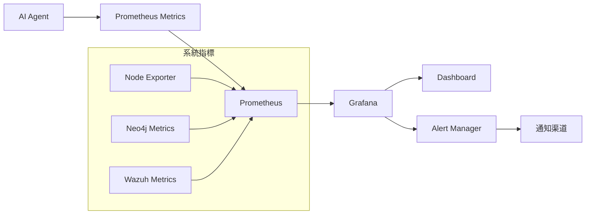

# Wazuh GraphRAG 監控系統指南

**版本**: v4.7.4 + GraphRAG Stage 4  
**最後更新**: 2024年12月  
**文件類型**: 監控與運維指南  

---

## 📋 目錄

1. [監控架構概述](#監控架構概述)
2. [監控指標詳解](#監控指標詳解)
3. [部署監控系統](#部署監控系統)
4. [Grafana 儀表板](#grafana-儀表板)
5. [告警配置](#告警配置)
6. [效能調優](#效能調優)
7. [故障排除](#故障排除)

---

## 監控架構概述

### 監控架構圖



### 監控組件

| **組件** | **版本** | **功能** | **端口** |
|---------|---------|---------|---------|
| **Prometheus** | v2.48.0 | 指標收集與儲存 | 9090 |
| **Grafana** | 10.2.2 | 視覺化儀表板 | 3000 |
| **Node Exporter** | v1.7.0 | 系統指標收集 | 9100 |
| **AI Agent** | 自定義 | 應用指標暴露 | 8000 |

---

## 監控指標詳解

### 1. 延遲指標 (Latency)

#### 警報處理延遲
```promql
# 處理單個警報的總耗時
alert_processing_duration_seconds

# P50/P95/P99 延遲
histogram_quantile(0.50, rate(alert_processing_duration_seconds_bucket[5m]))
histogram_quantile(0.95, rate(alert_processing_duration_seconds_bucket[5m]))
histogram_quantile(0.99, rate(alert_processing_duration_seconds_bucket[5m]))
```

#### API 呼叫延遲
```promql
# 各階段 API 呼叫的耗時
api_call_duration_seconds{stage="embedding"}
api_call_duration_seconds{stage="llm_analysis"}
api_call_duration_seconds{stage="neo4j_query"}
```

#### 檢索延遲
```promql
# 資料檢索階段的耗時
retrieval_duration_seconds{type="vector"}
retrieval_duration_seconds{type="graph"}
```

### 2. 吞吐量指標 (Throughput)

#### 警報處理量
```promql
# 已成功處理的警報總數
alerts_processed_total

# 處理速率
rate(alerts_processed_total[5m])

# 新警報發現速率
rate(new_alerts_found_total[5m])
```

#### 隊列狀態
```promql
# 待處理的警報數量
pending_alerts_gauge

# 隊列積壓趨勢
increase(pending_alerts_gauge[1h])
```

### 3. Token 使用指標

#### LLM Token 消耗
```promql
# LLM 分析使用的總輸入 Token 數
llm_input_tokens_total

# LLM 分析產生的總輸出 Token 數
llm_output_tokens_total

# Token 使用趨勢
increase(llm_input_tokens_total[1h])
increase(llm_output_tokens_total[1h])
```

#### Embedding Token 消耗
```promql
# Embedding 使用的總輸入 Token 數
embedding_input_tokens_total

# Token 使用趨勢
increase(embedding_input_tokens_total[1h])
```

### 4. 錯誤率指標 (Error Rate)

#### 處理錯誤
```promql
# 處理失敗的警報總數
alert_processing_errors_total

# 錯誤率計算
rate(alert_processing_errors_total[5m]) / rate(alerts_processed_total[5m])
```

#### API 錯誤
```promql
# API 呼叫失敗計數
api_errors_total{stage="embedding"}
api_errors_total{stage="llm_analysis"}
api_errors_total{stage="neo4j_query"}

# 各階段錯誤率
rate(api_errors_total{stage="embedding"}[5m]) / rate(api_calls_total{stage="embedding"}[5m])
```

#### GraphRAG 降級
```promql
# 從圖形檢索降級到傳統檢索的次數
graph_retrieval_fallback_total

# 降級率
rate(graph_retrieval_fallback_total[5m]) / rate(graph_retrieval_attempts_total[5m])
```

### 5. 系統資源指標

#### CPU 使用率
```promql
# 系統 CPU 使用率
100 - (avg by (instance) (irate(node_cpu_seconds_total{mode="idle"}[5m])) * 100)

# 容器 CPU 使用率
rate(container_cpu_usage_seconds_total{name="wazuh-ai-agent"}[5m])
```

#### 記憶體使用率
```promql
# 系統記憶體使用率
(node_memory_MemTotal_bytes - node_memory_MemAvailable_bytes) / node_memory_MemTotal_bytes * 100

# 容器記憶體使用率
container_memory_usage_bytes{name="wazuh-ai-agent"} / container_spec_memory_limit_bytes{name="wazuh-ai-agent"} * 100
```

#### 磁碟 I/O
```promql
# 磁碟讀取速率
rate(node_disk_read_bytes_total[5m])

# 磁碟寫入速率
rate(node_disk_written_bytes_total[5m])
```

---

## 部署監控系統

### 1. 使用 Docker Compose 部署

```bash
# 在 ai-agent-project 目錄中
cd wazuh-docker/single-node/ai-agent-project

# 啟動監控服務
docker-compose -f config/docker-compose.monitoring.yml up -d
```

### 2. 驗證服務狀態

```bash
# 檢查所有服務狀態
docker-compose -f config/docker-compose.monitoring.yml ps

# 預期輸出
# Name                    Command               State                    Ports
# ---------------------------------------------------------------------------------------
# prometheus             /bin/prometheus --config.file=/etc/prometheus/prometheus.yml   Up   0.0.0.0:9090->9090/tcp
# grafana                /run.sh                          Up             0.0.0.0:3000->3000/tcp
# node-exporter          /bin/node_exporter              Up             0.0.0.0:9100->9100/tcp
```

### 3. 訪問服務

| 服務 | URL | 預設認證 |
|------|-----|----------|
| **Prometheus UI** | http://localhost:9090 | - |
| **Grafana Dashboard** | http://localhost:3000 | admin / wazuh-grafana-2024 |
| **Node Exporter** | http://localhost:9100 | - |

### 4. Prometheus 配置

編輯 `config/prometheus.yml`：

```yaml
global:
  scrape_interval: 15s
  evaluation_interval: 15s

rule_files:
  # - "first_rules.yml"
  # - "second_rules.yml"

scrape_configs:
  - job_name: 'ai-agent'
    static_configs:
      - targets: ['ai-agent:8000']
    scrape_interval: 10s
    metrics_path: '/metrics'

  - job_name: 'node-exporter'
    static_configs:
      - targets: ['node-exporter:9100']

  - job_name: 'neo4j'
    static_configs:
      - targets: ['neo4j:2004']
    scrape_interval: 30s

  - job_name: 'prometheus'
    static_configs:
      - targets: ['localhost:9090']
```

---

## Grafana 儀表板

### 1. 預設儀表板

系統預設包含以下儀表板：

- **AI Agent 監控儀表板** - 核心應用指標
- **系統資源監控** - CPU、記憶體、磁碟使用率
- **Neo4j 效能監控** - 圖形資料庫指標
- **Wazuh 整合概覽** - SIEM 系統狀態

### 2. 關鍵視圖說明

#### Alert Processing Rate
- 顯示警報處理速率和新警報發現速率
- 用於監控系統吞吐量
- 可識別處理瓶頸和效能問題

#### Pending Alerts Queue
- 顯示當前待處理的警報數量
- 用於監控系統負載和積壓情況
- 幫助預測系統容量需求

#### Alert Processing Latency
- P50/P95/P99 延遲圖表
- 用於監控處理效能和識別效能瓶頸
- 幫助優化系統配置

#### API Call Duration by Stage
- 各階段（embedding、LLM 分析、Neo4j）的 API 呼叫耗時
- 用於識別最慢的處理階段
- 幫助優化特定組件

#### Token Usage Rate
- LLM 和 Embedding 的 Token 消耗趨勢
- 用於監控和預測 API 成本
- 幫助優化 Token 使用效率

#### Error Rate
- 錯誤率儀表盤，按階段分類
- 用於監控系統可靠性
- 幫助快速識別問題

#### Graph Retrieval Fallback Rate
- 從圖形檢索降級到傳統檢索的頻率
- 用於監控 GraphRAG 系統的健康狀況
- 幫助調優圖形檢索參數

### 3. 自定義儀表板

#### 創建新儀表板

1. 登入 Grafana
2. 點擊 "Create" → "Dashboard"
3. 添加新的面板
4. 配置 PromQL 查詢
5. 設定視覺化類型

#### 常用查詢範例

```promql
# 警報處理速率
rate(alerts_processed_total[5m])

# P95 處理延遲
histogram_quantile(0.95, rate(alert_processing_duration_seconds_bucket[5m]))

# 錯誤率
rate(alert_processing_errors_total[5m]) / rate(alerts_processed_total[5m])

# Token 使用趨勢
increase(llm_input_tokens_total[1h])

# 系統資源使用率
100 - (avg by (instance) (irate(node_cpu_seconds_total{mode="idle"}[5m])) * 100)
```

---

## 告警配置

### 1. 建議的告警規則

#### 高錯誤率告警
```yaml
groups:
  - name: ai-agent-alerts
    rules:
      - alert: HighErrorRate
        expr: rate(alert_processing_errors_total[5m]) / rate(alerts_processed_total[5m]) > 0.05
        for: 2m
        labels:
          severity: warning
        annotations:
          summary: "AI Agent 錯誤率過高"
          description: "錯誤率超過 5%，持續 2 分鐘"
```

#### 高延遲告警
```yaml
      - alert: HighLatency
        expr: histogram_quantile(0.95, rate(alert_processing_duration_seconds_bucket[5m])) > 10
        for: 2m
        labels:
          severity: warning
        annotations:
          summary: "AI Agent 處理延遲過高"
          description: "P95 處理時間超過 10 秒"
```

#### 隊列積壓告警
```yaml
      - alert: QueueBacklog
        expr: pending_alerts_gauge > 50
        for: 1m
        labels:
          severity: warning
        annotations:
          summary: "警報隊列積壓"
          description: "待處理警報超過 50 個"
```

#### 服務不可用告警
```yaml
      - alert: ServiceDown
        expr: up{job="ai-agent"} == 0
        for: 1m
        labels:
          severity: critical
        annotations:
          summary: "AI Agent 服務不可用"
          description: "AI Agent 服務已停止運行"
```

### 2. 配置告警通知

#### Slack 通知
```yaml
receivers:
  - name: 'slack-notifications'
    slack_configs:
      - api_url: 'https://hooks.slack.com/services/YOUR/SLACK/WEBHOOK'
        channel: '#wazuh-alerts'
        title: '{{ template "slack.title" . }}'
        text: '{{ template "slack.text" . }}'
```

#### Email 通知
```yaml
receivers:
  - name: 'email-notifications'
    email_configs:
      - to: 'admin@company.com'
        from: 'alertmanager@company.com'
        smarthost: 'smtp.company.com:587'
        auth_username: 'alertmanager@company.com'
        auth_password: 'password'
```

### 3. 告警路由配置

```yaml
route:
  group_by: ['alertname']
  group_wait: 10s
  group_interval: 10s
  repeat_interval: 1h
  receiver: 'slack-notifications'
  routes:
    - match:
        severity: critical
      receiver: 'email-notifications'
```

---

## 效能調優

### 1. 監控系統調優

#### Prometheus 配置優化
```yaml
global:
  scrape_interval: 15s
  evaluation_interval: 15s
  external_labels:
    monitor: 'wazuh-graphrag'

storage:
  tsdb:
    retention.time: 30d
    retention.size: 10GB

scrape_configs:
  - job_name: 'ai-agent'
    scrape_interval: 10s
    scrape_timeout: 5s
    static_configs:
      - targets: ['ai-agent:8000']
```

#### Grafana 配置優化
```ini
[server]
http_port = 3000
root_url = http://localhost:3000/

[database]
type = sqlite3
path = /var/lib/grafana/grafana.db

[session]
provider = file
provider_config = sessions

[security]
admin_user = admin
admin_password = wazuh-grafana-2024
```

### 2. 應用層調優

#### AI Agent 效能調優
```python
# 在 ai-agent-project/app/utils/config.py 中調整

# 批次處理大小
BATCH_SIZE = 50

# 並行處理數量
MAX_WORKERS = 4

# 快取配置
CACHE_TTL = 3600  # 1 小時

# 重試配置
MAX_RETRIES = 3
RETRY_DELAY = 1  # 秒
```

#### 資料庫調優
```yaml
# Neo4j 配置優化
neo4j:
  environment:
    - NEO4J_dbms_memory_heap_initial__size=2G
    - NEO4J_dbms_memory_heap_max__size=4G
    - NEO4J_dbms_memory_pagecache_size=1G
    - NEO4J_dbms_connector_bolt_enabled=true
    - NEO4J_dbms_connector_bolt_listen__address=0.0.0.0:7687
```

### 3. 系統層調優

#### 作業系統調優
```bash
# 增加檔案描述符限制
echo '* soft nofile 65536' >> /etc/security/limits.conf
echo '* hard nofile 65536' >> /etc/security/limits.conf

# 調整 TCP 參數
echo 'net.core.somaxconn = 65535' >> /etc/sysctl.conf
echo 'net.ipv4.tcp_max_syn_backlog = 65535' >> /etc/sysctl.conf
sysctl -p
```

#### Docker 調優
```yaml
# docker-compose.main.yml 中增加資源限制
services:
  ai-agent:
    deploy:
      resources:
        limits:
          memory: 2G
          cpus: '1.0'
        reservations:
          memory: 1G
          cpus: '0.5'
```

---

## 故障排除

### 1. 常見問題

#### 指標端點無法訪問
```bash
# 檢查 AI Agent 是否正在運行
docker ps | grep ai-agent

# 檢查指標端點
curl http://localhost:8000/metrics

# 檢查防火牆設定
sudo ufw status
```

#### Prometheus 無法抓取指標
```bash
# 檢查網路連接
docker exec prometheus ping ai-agent

# 檢查服務發現
curl http://localhost:9090/api/v1/targets

# 檢查 Prometheus 配置
docker exec prometheus cat /etc/prometheus/prometheus.yml
```

#### Grafana 無法連接 Prometheus
```bash
# 檢查 Prometheus 服務狀態
curl http://localhost:9090/api/v1/status/targets

# 檢查 Grafana 資料源配置
# 在 Grafana UI 中檢查 Data Sources 設定

# 檢查網路連接
docker exec grafana ping prometheus
```

### 2. 日誌分析

#### 關鍵日誌位置
```bash
# Prometheus 日誌
docker logs prometheus

# Grafana 日誌
docker logs grafana

# AI Agent 日誌
docker logs wazuh-ai-agent

# Node Exporter 日誌
docker logs node-exporter
```

#### 日誌級別調整
```python
# AI Agent 日誌級別
LOG_LEVEL = "DEBUG"  # 或 "INFO", "WARNING", "ERROR"

# Prometheus 日誌級別
# 在 prometheus.yml 中設定
global:
  log_level: info
```

### 3. 效能診斷

#### 系統資源診斷
```bash
# 檢查 CPU 使用率
docker stats

# 檢查記憶體使用率
free -h

# 檢查磁碟使用率
df -h

# 檢查網路連接
netstat -tulpn
```

#### 應用效能診斷
```bash
# 檢查 AI Agent 效能指標
curl http://localhost:8000/metrics | grep alert_processing

# 檢查 Neo4j 效能
curl -u neo4j:wazuh-graph-2024 http://localhost:7474/db/data/

# 檢查 Prometheus 查詢效能
curl http://localhost:9090/api/v1/query?query=up
```

### 4. 備份與恢復

#### 監控資料備份
```bash
# 備份 Prometheus 資料
docker cp prometheus:/prometheus ./backup/prometheus-data

# 備份 Grafana 配置
docker cp grafana:/var/lib/grafana ./backup/grafana-data

# 備份告警規則
cp config/prometheus.yml ./backup/
```

#### 監控資料恢復
```bash
# 恢復 Prometheus 資料
docker cp ./backup/prometheus-data prometheus:/prometheus

# 恢復 Grafana 配置
docker cp ./backup/grafana-data grafana:/var/lib/grafana

# 重啟服務
docker-compose -f config/docker-compose.monitoring.yml restart
```

---

## 總結

本監控指南涵蓋了 Wazuh GraphRAG 系統的完整監控解決方案，包括：

1. **完整的監控架構**：從指標收集到視覺化的完整流程
2. **詳細的指標說明**：涵蓋延遲、吞吐量、錯誤率等關鍵指標
3. **實用的告警配置**：幫助快速識別和響應問題
4. **效能調優指南**：提升系統整體效能
5. **故障排除方法**：解決常見問題的實用技巧

通過實施這些監控措施，您可以：

- **即時掌握系統狀態**：通過儀表板快速了解系統運行狀況
- **快速識別問題**：通過告警機制及時發現和處理問題
- **優化系統效能**：通過效能指標持續改進系統配置
- **提升運維效率**：通過自動化監控減少手動檢查工作

建議定期檢查和更新監控配置，以確保監控系統的有效性和準確性。 