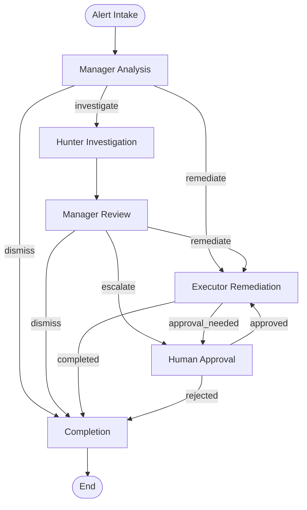

# LangGraph Architecture Documentation

## Overview

The Security Agent System has been refactored to use LangChain's LangGraph for multi-agent orchestration. The refactor consolidates domain modules under the `security_agent_system` package and exposes runtime entrypoints through `apps/cli`, `apps/langserve`, and `apps/mcp`. This document describes the architecture, its components, and how they work together.

## Table of Contents

1. [Architecture Overview](#architecture-overview)
2. [Core Components](#core-components)
3. [Agent Nodes](#agent-nodes)
4. [State Management](#state-management)
5. [Workflow Execution](#workflow-execution)
6. [LCEL Integration](#lcel-integration)
7. [Human-in-the-Loop](#human-in-the-loop)
8. [Error Handling](#error-handling)
9. [Configuration](#configuration)
10. [Usage Examples](#usage-examples)

## Architecture Overview

The LangGraph implementation provides a directed acyclic graph (DAG) for orchestrating three security agents:



## Core Components

### 1. SecurityAgentGraph (`security_agent_system/workflows/langgraph/graph.py`)

The main graph that orchestrates the agent workflow:

```python
class SecurityAgentGraph:
    """LangGraph-based security agent orchestration system."""
    
    def __init__(self, manager_node, hunter_node, executor_node, checkpointer=None):
        # Nodes for each agent
        self.manager_node = manager_node
        self.hunter_node = hunter_node
        self.executor_node = executor_node
        
        # State persistence
        self.checkpointer = checkpointer
        
        # Build and compile the graph
        self.graph = self._build_graph()
        self.app = self.graph.compile(checkpointer=self.checkpointer)
```

### 2. LangGraphOrchestrator (`security_agent_system/workflows/langgraph/orchestrator.py`)

Manages the lifecycle of the LangGraph system:

- Initializes infrastructure (databases, message brokers)
- Sets up LLM providers for each agent
- Manages alert consumption and processing
- Handles system metrics and monitoring

### 3. Agent State (`security_agent_system/workflows/langgraph/state.py`)

Defines the shared state that flows through the graph:

```python
class AgentState(TypedDict):
    """Shared state for all agents in the graph."""
    current_alert: Optional[SecurityAlert]
    alert_queue: List[SecurityAlert]
    investigations: Dict[str, Investigation]
    remediation_plans: Dict[str, RemediationPlan]
    execution_results: List[ExecutionResult]
    agent_status: Dict[str, str]
    workflow_step: str
    workflow_history: List[Dict[str, Any]]
    errors: List[Dict[str, Any]]
    metrics: Dict[str, Any]
    config: Dict[str, Any]
    messages: List[Dict[str, Any]]
    decisions: List[Dict[str, Any]]
    external_context: Dict[str, Any]
```

## Agent Nodes

### 1. ManagerNode

The Manager agent coordinates the security response:

```python
class ManagerNode:
    """Manager agent node that coordinates security response."""
    
    def __init__(self, llm_provider):
        self.llm = llm_provider
        # LCEL chains for decision making
        self.decision_chain = self._build_decision_chain()
        self.remediation_chain = self._build_remediation_chain()
```

**Responsibilities:**
- Analyze incoming alerts
- Decide whether to investigate, remediate, escalate, or dismiss
- Create remediation plans
- Review investigation results

**LCEL Chains:**
- Decision Chain: Analyzes alerts and makes routing decisions
- Remediation Chain: Creates detailed remediation plans

### 2. HunterNode

The Hunter agent performs deep investigation:

```python
class HunterNode:
    """Hunter agent node that performs threat investigation."""
    
    def __init__(self, llm_provider, graph_db=None, vector_db=None):
        self.llm = llm_provider
        self.graph_db = graph_db
        self.vector_db = vector_db
        # Investigation tools and chains
        self._setup_investigation_tools()
```

**Responsibilities:**
- Deep investigation of security alerts
- Query graph and vector databases for context
- Identify attack patterns and indicators
- Risk assessment and scoring
- Provide recommendations

**LCEL Features:**
- Parallel context gathering using RunnableParallel
- Tool integration for database queries
- Structured output parsing with Pydantic

### 3. ExecutorNode

The Executor agent performs remediation actions:

```python
class ExecutorNode:
    """Executor agent node that performs remediation actions."""
    
    def __init__(self, llm_provider, action_executor=None, notification_service=None):
        self.llm = llm_provider
        self.action_executor = action_executor
        self.action_registry = self._setup_action_registry()
```

**Responsibilities:**
- Plan remediation actions
- Execute security actions (block IP, isolate host, etc.)
- Validate execution results
- Handle rollback procedures
- Send notifications

**Available Actions:**
- `block_ip`: Block IP address at firewall
- `isolate_host`: Isolate compromised host
- `disable_account`: Disable user account
- `update_rule`: Update security rules
- `patch_system`: Apply security patches
- `revoke_access`: Revoke access permissions
- `quarantine_file`: Quarantine malicious files
- `reset_credentials`: Reset compromised credentials

## State Management

LangGraph manages state flow through the graph:

1. **State Initialization**: Alert enters the system
2. **State Updates**: Each node modifies the state
3. **State Persistence**: Checkpointing saves state for recovery
4. **State Routing**: Conditional edges route based on state

### Checkpointing

The system uses AsyncSqliteSaver for state persistence:

```python
checkpoint_path = Path("./checkpoints/security_agent.db")
checkpointer = AsyncSqliteSaver.from_conn_string(str(checkpoint_path))
```

This enables:
- Recovery from failures
- Human-in-the-loop workflows
- State inspection and debugging

## Workflow Execution

### 1. Alert Processing Flow

```python
async def process_alert(self, alert: SecurityAlert) -> Dict[str, Any]:
    # Initialize state
    initial_state = {
        "current_alert": alert,
        "workflow_step": "intake",
        # ... other state fields
    }
    
    # Run through graph
    final_state = await self.app.ainvoke(initial_state)
    
    # Return results
    return extract_results(final_state)
```

### 2. Streaming Execution

For processing multiple alerts:

```python
async def process_alert_stream(self, alerts: List[SecurityAlert]):
    initial_state = {
        "alert_queue": alerts,
        # ... other state fields
    }
    
    async for event in self.app.astream(initial_state):
        # Process streaming events
        handle_event(event)
```

## LCEL Integration

The system extensively uses LangChain Expression Language (LCEL):

### 1. Chain Composition

```python
# Manager decision chain
self.decision_chain = (
    RunnablePassthrough.assign(
        format_instructions=lambda x: self.parser.get_format_instructions()
    )
    | self.decision_prompt
    | self.llm
    | self.parser
)
```

### 2. Parallel Execution

```python
# Hunter parallel context gathering
self.context_gathering_chain = RunnableParallel(
    historical_context=RunnableLambda(self._get_historical_context),
    threat_intel=RunnableLambda(self._get_threat_intelligence),
    graph_analysis=RunnableLambda(self._analyze_graph_relationships)
)
```

### 3. Structured Output

Using Pydantic models with JsonOutputParser:

```python
class ManagerDecision(BaseModel):
    action: str
    priority: int
    reasoning: str
    remediation_required: bool
    escalation_required: bool

parser = JsonOutputParser(pydantic_object=ManagerDecision)
```

## Human-in-the-Loop

The system supports human approval for high-risk actions:

1. **Approval Triggers**:
   - High-risk remediation actions
   - Critical alerts requiring escalation
   - Actions with significant business impact

2. **Implementation**:
   ```python
   # In graph compilation
   self.app = self.graph.compile(
       checkpointer=self.checkpointer,
       interrupt_before=["human_approval"]
   )
   ```

3. **Approval Flow**:
   - System pauses at human_approval node
   - State is checkpointed
   - Human reviews and provides decision
   - System resumes with decision

## Error Handling

Comprehensive error handling throughout the system:

### 1. Node-Level Error Handling

Each agent node includes try-catch blocks:

```python
async def __call__(self, state: AgentState) -> AgentState:
    try:
        # Agent logic
        pass
    except Exception as e:
        state["errors"].append({
            "agent": "manager",
            "timestamp": datetime.now().isoformat(),
            "error": str(e)
        })
        state["agent_status"]["manager"] = "error"
```

### 2. Graph-Level Error Routing

Error handler node with retry logic:

```python
def _route_from_error(self, state: AgentState):
    error_count = len(state.get("errors", []))
    
    if error_count < 3:
        return "retry"
    elif error_count < 5:
        return "escalate"
    else:
        return "abort"
```

## Configuration

### 1. Environment Variables

```bash
# LLM Configuration
DEFAULT_LLM_PROVIDER=openai
DEFAULT_LLM_MODEL=gpt-4-turbo-preview

# Agent-specific LLM settings
MANAGER_LLM_PROVIDER=openai
HUNTER_LLM_PROVIDER=anthropic
EXECUTOR_LLM_PROVIDER=google

# Infrastructure
NEO4J_URI=bolt://localhost:7687
CHROMADB_PATH=./chroma_db
MESSAGE_BROKER_TYPE=rabbitmq
```

### 2. Agent Configuration

```python
settings.manager_config = {
    "llm_provider": "openai",
    "temperature": 0.1,
    "max_tokens": 4000
}
```

## Usage Examples

### 1. Starting the System

```bash
# Start with default configuration
python main.py start

# Start with custom config
python main.py start --config custom.env
```

### 2. Processing a Test Alert

```bash
python main.py test-alert \
    --severity high \
    --type malware \
    --source endpoint \
    "Suspicious process detected on production server"
```

### 3. Visualizing the Graph

```bash
# Generate graph visualization
python main.py visualize --output graph.png
```

### 4. Checking System Status

```bash
python main.py status
```

## Advanced Features

### 1. State Persistence

- Automatic checkpointing at each node
- Recovery from failures
- State inspection for debugging

### 2. Parallel Processing

- Batch alert processing
- Parallel investigation queries
- Concurrent action execution

### 3. Extensibility

- Easy to add new agent nodes
- Pluggable LLM providers
- Custom action implementations

### 4. Observability

- Comprehensive logging with structlog
- Workflow history tracking
- Performance metrics collection

## Best Practices

1. **State Management**:
   - Keep state updates atomic
   - Use proper error handling
   - Clean up completed alerts

2. **LLM Usage**:
   - Use structured outputs with Pydantic
   - Implement proper prompts with clear instructions
   - Handle LLM failures gracefully

3. **Performance**:
   - Use parallel execution where possible
   - Batch process alerts
   - Implement proper caching

4. **Security**:
   - Validate all inputs
   - Implement proper access controls
   - Audit all actions

## Migration from Previous Architecture

The key changes from the previous architecture:

1. **Agent Communication**: Direct state passing instead of message queues
2. **Workflow Management**: DAG-based instead of orchestrator-based
3. **State Persistence**: Built-in checkpointing
4. **Error Handling**: Graph-level error routing
5. **Human Interaction**: Native support for human-in-the-loop

## Troubleshooting

### Common Issues

1. **LLM Provider Errors**:
   - Check API keys in environment
   - Verify model availability
   - Check rate limits

2. **State Persistence**:
   - Ensure checkpoint directory is writable
   - Check disk space
   - Verify SQLite installation

3. **Graph Execution**:
   - Check node connections
   - Verify conditional routing logic
   - Review state updates

### Debug Mode

Enable debug logging:

```python
import logging
logging.basicConfig(level=logging.DEBUG)
```

## Future Enhancements

1. **Dynamic Graph Construction**: Build graphs based on alert type
2. **Multi-Tenant Support**: Separate graphs per tenant
3. **Advanced Checkpointing**: Cloud-based state storage
4. **Graph Optimization**: Automatic path optimization
5. **Enhanced Monitoring**: Real-time graph visualization