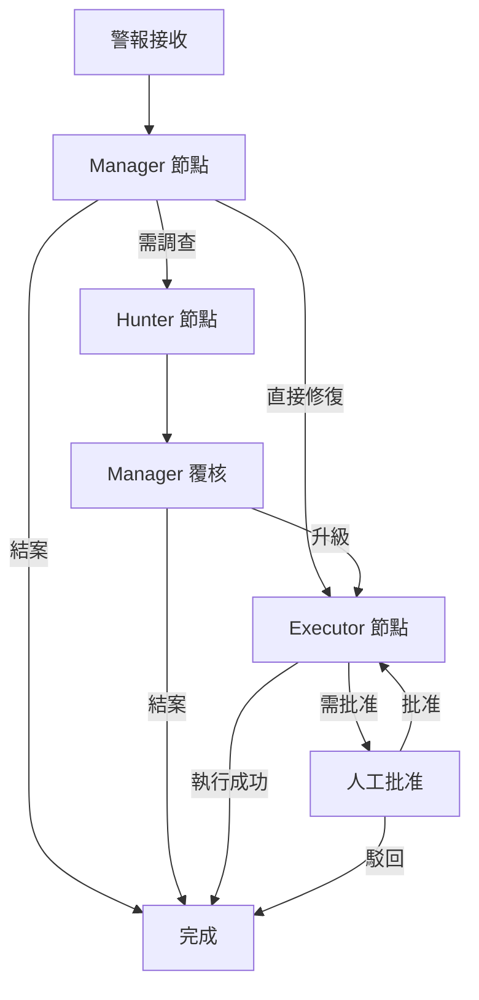

# LangGraph 工作流程解析

本文件說明 `security_agent_system` 內部採用的 LangGraph DAG 結構、狀態模型與三個代理節點的協作方式。內容著重於工程實作細節與最佳實務，協助維運與開發人員快速掌握多代理流程。

---

## 目錄

1. [流程概觀](#流程概觀)
2. [狀態模型](#狀態模型)
3. [節點與邊](#節點與邊)
4. [LCEL 鏈整合](#lcel-鏈整合)
5. [錯誤處理與重試](#錯誤處理與重試)
6. [人機協作節點](#人機協作節點)
7. [擴充範例](#擴充範例)

---

## 流程概觀



`LangGraphOrchestrator` 會根據來源（CLI / LangServe / MCP）包裝告警並投遞到圖上。每個節點皆為可重用的 Runnable，負責讀寫共享的 `AgentState`。

---

## 狀態模型

狀態類型定義於 `workflows.langgraph.state.AgentState`，為 `TypedDict` 結構：

```python
class AgentState(TypedDict, total=False):
    alert_queue: deque[SecurityAlert]
    current_alert: SecurityAlert | None
    investigations: dict[str, Investigation]
    remediation_plans: dict[str, RemediationPlan]
    execution_results: list[ExecutionResult]
    decisions: list[DecisionLog]
    workflow_step: str
    errors: list[ErrorLog]
    human_actions: list[HumanApproval]
    metrics: dict[str, Any]
    config: dict[str, Any]
```

- **alert_queue**：支援批次告警與平行處理。
- **workflow_step**：於 Grafana 與檢查點中追蹤進度。
- **decisions / human_actions**：提供稽核與回溯依據。
- **metrics**：累積單次流程的延遲、LLM Token 等指標。

狀態透過 LangGraph 的 checkpoint API 持久化，預設採 SQLite，亦可替換成 Postgres 或雲端儲存。

---

## 節點與邊

### ManagerNode
- **位置**：`workflows.langgraph.nodes.manager`
- **職責**：解析警報、判斷是否調查/修復/結案、建立 remediation plan。
- **LCEL 鏈**：`decision_chain`、`plan_chain`，輸出結構化 JSON。
- **輸出**：更新 `decisions`、可能新增 `remediation_plans`。

### HunterNode
- **位置**：`workflows.langgraph.nodes.hunter`
- **職責**：呼叫 GraphRAG 取得上下文、計算風險評分、產生攻擊路徑。
- **依賴**：`core.context`、`infrastructure.graph`、`infrastructure.vector`。
- **輸出**：於 `investigations` 填寫發現、建議與相關證據。

### ExecutorNode
- **位置**：`workflows.langgraph.nodes.executor`
- **職責**：選擇 Playbook、執行自動化任務或要求人工批准。
- **機制**：若 `requires_approval=True`，寫入 `human_actions` 並返回待批准狀態。
- **輸出**：更新 `execution_results` 與 `workflow_step`。

### 邊條件
- Manager → Hunter：僅在決策為 `investigate` 或 Hunter 要求二次調查時觸發。
- Manager → Executor：直接修復或覆核後的執行任務。
- Executor → Manager：失敗或需要補充資訊時回退。
- 任意節點 → `Completion`：完成處理或判定為誤報。

---

## LCEL 鏈整合

每個代理節點皆由多個 Runnable 組合而成：

1. **輸入正規化**：將 `AgentState` 轉成提示字串與工具上下文。
2. **LLM 呼叫**：依照設定選擇 OpenAI、Anthropic 或 Google 提供者。
3. **後處理**：驗證 JSON schema，並轉換為資料類型。
4. **狀態回寫**：透過 reducer 函式合併回 `AgentState`。

鏈定義集中於 `workflows.langgraph.chains`，方便共享提示模板與工具函式。

---

## 錯誤處理與重試

- **自動重試**：節點層級支援指數退避與最大重試次數（預設 3 次）。
- **錯誤記錄**：所有例外會寫入 `errors` 陣列並標注節點、錯誤碼與 payload。
- **恢復策略**：
  - 若為可忽略錯誤（例如資料缺漏），Manager 會標記為 `needs_human_review`。
  - 若為系統錯誤，可透過 CLI 指令 `resume-run` 從檢查點復原。

---

## 人機協作節點

LangGraph 內的人工節點以虛擬邊實現：

1. Executor 將需要批准的事項寫入 `human_actions`，並將 `workflow_step` 設為 `awaiting_approval`。
2. MCP 或 CLI 透過工具命令 `approve_execution` / `reject_execution` 寫回結果。
3. Orchestrator 重新啟動圖，依批准結果決定後續流程。

此設計允許跨通道（例如 ChatGPT、VS Code）進行一致的覆核操作。

---

## 擴充範例

### 新增威脅獵捕任務

1. 於 `workflows.langgraph.nodes` 新增 `ThreatHuntingNode`，實作 `__call__` 以處理 state。
2. 在 `graph.py` 中於 Manager → Hunter 之間插入新節點與條件。
3. 將必要的 GraphRAG 工具注入至新節點的 LCEL 鏈。
4. 更新測試與 `docs/operations/TESTING_STRATEGY.md` 的案例描述。

### 自訂檢查點儲存

1. 實作 `BaseCheckpointSaver` 介面（例如連接雲端資料庫）。
2. 於 `LangGraphOrchestrator` 建構時注入自訂 saver。
3. 調整部署設定與密鑰管理，確保跨執行層皆能使用。

---

經由模組化節點與狀態模型，LangGraph 工作流程能在保持嚴謹審計的前提下快速演進，支援複雜的安全事件調查與修復情境。
