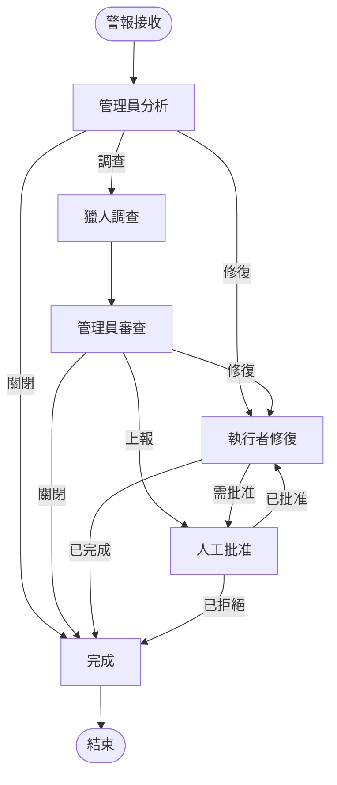

# LangGraph 架構文件

## 總覽

安全代理系統已重構為使用 LangChain 的 LangGraph 進行多代理協調。此次重構將領域模組整合到 `security_agent_system` 套件下，並透過 `apps/cli`、`apps/langserve` 和 `apps/mcp` 公開執行時進入點。本文件描述了該架構、其組件以及它們如何協同工作。

## 目錄

1. [架構總覽](#架構總覽)
2. [核心組件](#核心組件)
3. [代理節點](#代理節點)
4. [狀態管理](#狀態管理)
5. [工作流程執行](#工作流程執行)
6. [LCEL 整合](#lcel-整合)
7. [人在環](#人在環)
8. [錯誤處理](#錯誤處理)
9. [設定](#設定)
10. [使用範例](#使用範例)

## 架構總覽

LangGraph 的實作提供了一個有向無環圖 (DAG) 來協調三個安全代理：



## 核心組件

### 1. SecurityAgentGraph (`security_agent_system/workflows/langgraph/graph.py`)

協調代理工作流程的主圖：

```python
class SecurityAgentGraph:
    """基於 LangGraph 的安全代理協調系統。"""

    def __init__(self, manager_node, hunter_node, executor_node, checkpointer=None):
        # 每個代理的節點
        self.manager_node = manager_node
        self.hunter_node = hunter_node
        self.executor_node = executor_node

        # 狀態持久化
        self.checkpointer = checkpointer

        # 建立並編譯圖
        self.graph = self._build_graph()
        self.app = self.graph.compile(checkpointer=self.checkpointer)
```

### 2. LangGraphOrchestrator (`security_agent_system/workflows/langgraph/orchestrator.py`)

管理 LangGraph 系統的生命週期：

- 初始化基礎設施（資料庫、訊息代理）
- 為每個代理設定 LLM 供應商
- 管理警報的消費和處理
- 處理系統指標和監控

### 3. Agent State (`security_agent_system/workflows/langgraph/state.py`)

定義在圖中流動的共享狀態：

```python
class AgentState(TypedDict):
    """圖中所有代理的共享狀態。"""
    current_alert: Optional[SecurityAlert]
    alert_queue: List[SecurityAlert]
    investigations: Dict[str, Investigation]
    remediation_plans: Dict[str, RemediationPlan]
    execution_results: List[ExecutionResult]
    agent_status: Dict[str, str]
    workflow_step: str
    workflow_history: List[Dict[str, Any]]
    errors: List[Dict[str, Any]]
    metrics: Dict[str, Any]
    config: Dict[str, Any]
    messages: List[Dict[str, Any]]
    decisions: List[Dict[str, Any]]
    external_context: Dict[str, Any]
```

## 代理節點

### 1. ManagerNode

管理代理協調安全應對：

```python
class ManagerNode:
    """協調安全應對的管理代理節點。"""

    def __init__(self, llm_provider):
        self.llm = llm_provider
        # 用於決策的 LCEL 鏈
        self.decision_chain = self._build_decision_chain()
        self.remediation_chain = self._build_remediation_chain()
```

**職責：**
- 分析傳入的警報
- 決定是調查、修復、上報還是關閉
- 建立修復計畫
- 審查調查結果

**LCEL 鏈：**
- 決策鏈：分析警報並做出路由決策
- 修復鏈：建立詳細的修復計畫

### 2. HunterNode

獵人代理執行深入調查：

```python
class HunterNode:
    """執行威脅調查的獵人代理節點。"""

    def __init__(self, llm_provider, graph_db=None, vector_db=None):
        self.llm = llm_provider
        self.graph_db = graph_db
        self.vector_db = vector_db
        # 調查工具和鏈
        self._setup_investigation_tools()
```

**職責：**
- 深入調查安全警報
- 查詢圖形和向量資料庫以獲取上下文
- 識別攻擊模式和指標
- 風險評估和評分
- 提供建議

**LCEL 特性：**
- 使用 RunnableParallel 並行收集上下文
- 用於資料庫查詢的工具整合
- 使用 Pydantic 進行結構化輸出解析

### 3. ExecutorNode

執行者代理執行修復操作：

```python
class ExecutorNode:
    """執行修復操作的執行者代理節點。"""

    def __init__(self, llm_provider, action_executor=None, notification_service=None):
        self.llm = llm_provider
        self.action_executor = action_executor
        self.action_registry = self._setup_action_registry()
```

**職責：**
- 規劃修復操作
- 執行安全操作（封鎖 IP、隔離主機等）
- 驗證執行結果
- 處理回滾程序
- 發送通知

**可用操作：**
- `block_ip`：在防火牆上封鎖 IP 位址
- `isolate_host`：隔離受感染的主機
- `disable_account`：禁用用戶帳戶
- `update_rule`：更新安全規則
- `patch_system`：應用安全補丁
- `revoke_access`：撤銷存取權限
- `quarantine_file`：隔離惡意檔案
- `reset_credentials`：重置受感染的憑證

## 狀態管理

LangGraph 管理圖中的狀態流：

1. **狀態初始化**：警報進入系統
2. **狀態更新**：每個節點修改狀態
3. **狀態持久化**：檢查點保存狀態以供恢復
4. **狀態路由**：條件邊緣根據狀態進行路由

### 檢查點

系統使用 AsyncSqliteSaver 進行狀態持久化：

```python
checkpoint_path = Path("./checkpoints/security_agent.db")
checkpointer = AsyncSqliteSaver.from_conn_string(str(checkpoint_path))
```

這使得：
- 從故障中恢復
- 人在環的工作流程
- 狀態檢查和除錯

## 工作流程執行

### 1. 警報處理流程

```python
async def process_alert(self, alert: SecurityAlert) -> Dict[str, Any]:
    # 初始化狀態
    initial_state = {
        "current_alert": alert,
        "workflow_step": "intake",
        # ... 其他狀態欄位
    }

    # 執行圖
    final_state = await self.app.ainvoke(initial_state)

    # 返回結果
    return extract_results(final_state)
```

### 2. 串流執行

用於處理多個警報：

```python
async def process_alert_stream(self, alerts: List[SecurityAlert]):
    initial_state = {
        "alert_queue": alerts,
        # ... 其他狀態欄位
    }

    async for event in self.app.astream(initial_state):
        # 處理串流事件
        handle_event(event)
```

## LCEL 整合

系統廣泛使用 LangChain 表達式語言 (LCEL)：

### 1. 鏈組合

```python
# 管理員決策鏈
self.decision_chain = (
    RunnablePassthrough.assign(
        format_instructions=lambda x: self.parser.get_format_instructions()
    )
    | self.decision_prompt
    | self.llm
    | self.parser
)
```

### 2. 並行執行

```python
# 獵人並行上下文收集
self.context_gathering_chain = RunnableParallel(
    historical_context=RunnableLambda(self._get_historical_context),
    threat_intel=RunnableLambda(self._get_threat_intelligence),
    graph_analysis=RunnableLambda(self._analyze_graph_relationships)
)
```

### 3. 結構化輸出

使用 Pydantic 模型和 JsonOutputParser：

```python
class ManagerDecision(BaseModel):
    action: str
    priority: int
    reasoning: str
    remediation_required: bool
    escalation_required: bool

parser = JsonOutputParser(pydantic_object=ManagerDecision)
```

## 人在環

系統支援對高風險操作進行人工批准：

1. **批准觸發器**：
   - 高風險的修復操作
   - 需要上報的關鍵警報
   - 具有重大業務影響的操作

2. **實作**：
   ```python
   # 在圖編譯中
   self.app = self.graph.compile(
       checkpointer=self.checkpointer,
       interrupt_before=["human_approval"]
   )
   ```

3. **批准流程**：
   - 系統在 human_approval 節點暫停
   - 狀態被設定檢查點
   - 人工審查並提供決策
   - 系統根據決策繼續執行

## 錯誤處理

系統中全面的錯誤處理：

### 1. 節點級錯誤處理

每個代理節點都包含 try-catch 區塊：

```python
async def __call__(self, state: AgentState) -> AgentState:
    try:
        # 代理邏輯
        pass
    except Exception as e:
        state["errors"].append({
            "agent": "manager",
            "timestamp": datetime.now().isoformat(),
            "error": str(e)
        })
        state["agent_status"]["manager"] = "error"
```

### 2. 圖級錯誤路由

帶有重試邏輯的錯誤處理程序節點：

```python
def _route_from_error(self, state: AgentState):
    error_count = len(state.get("errors", []))

    if error_count < 3:
        return "retry"
    elif error_count < 5:
        return "escalate"
    else:
        return "abort"
```

## 設定

### 1. 環境變數

```bash
# LLM 設定
DEFAULT_LLM_PROVIDER=openai
DEFAULT_LLM_MODEL=gpt-4-turbo-preview

# 特定代理的 LLM 設定
MANAGER_LLM_PROVIDER=openai
HUNTER_LLM_PROVIDER=anthropic
EXECUTOR_LLM_PROVIDER=google

# 基礎設施
NEO4J_URI=bolt://localhost:7687
CHROMADB_PATH=./chroma_db
MESSAGE_BROKER_TYPE=rabbitmq
```

### 2. 代理設定

```python
settings.manager_config = {
    "llm_provider": "openai",
    "temperature": 0.1,
    "max_tokens": 4000
}
```

## 使用範例

### 1. 啟動系統

```bash
# 使用預設設定啟動
python main.py start

# 使用自訂設定啟動
python main.py start --config custom.env
```

### 2. 處理測試警報

```bash
python main.py test-alert \
    --severity high \
    --type malware \
    --source endpoint \
    "在生產伺服器上偵測到可疑進程"
```

### 3. 可視化圖

```bash
# 產生圖形可視化
python main.py visualize --output graph.png
```

### 4. 檢查系統狀態

```bash
python main.py status
```

## 進階功能

### 1. 狀態持久化

- 在每個節點自動設定檢查點
- 從故障中恢復
- 用於除錯的狀態檢查

### 2. 並行處理

- 批次警報處理
- 並行調查查詢
- 並行操作執行

### 3. 可擴展性

- 易於新增新的代理節點
- 可插拔的 LLM 供應商
- 自訂操作實作

### 4. 可觀察性

- 使用 structlog 進行全面日誌記錄
- 工作流程歷史追蹤
- 性能指標收集

## 最佳實踐

1. **狀態管理**：
   - 保持狀態更新的原子性
   - 使用適當的錯誤處理
   - 清理已完成的警報

2. **LLM 使用**：
   - 使用 Pydantic 進行結構化輸出
   - 實作帶有明確說明的適當提示
   - 優雅地處理 LLM 故障

3. **性能**：
   - 盡可能使用並行執行
   - 批次處理警報
   - 實作適當的快取

4. **安全性**：
   - 驗證所有輸入
   - 實作適當的存取控制
   - 審計所有操作

## 從先前架構遷移

與先前架構相比的主要變化：

1. **代理通訊**：直接傳遞狀態，而非使用訊息佇列
2. **工作流程管理**：基於 DAG，而非基於協調器
3. **狀態持久化**：內建檢查點
4. **錯誤處理**：圖級錯誤路由
5. **人機互動**：原生支援人在環

## 疑難排解

### 常見問題

1. **LLM 供應商錯誤**：
   - 檢查環境中的 API 金鑰
   - 驗證模型可用性
   - 檢查速率限制

2. **狀態持久化**：
   - 確保檢查點目錄可寫
   - 檢查磁碟空間
   - 驗證 SQLite 安裝

3. **圖執行**：
   - 檢查節點連接
   - 驗證條件路由邏輯
   - 審查狀態更新

### 除錯模式

啟用除錯日誌記錄：

```python
import logging
logging.basicConfig(level=logging.DEBUG)
```

## 未來增強功能

1. **動態圖建構**：根據警報類型建構圖
2. **多租戶支援**：每個租戶使用單獨的圖
3. **進階檢查點**：基於雲端的狀態儲存
4. **圖優化**：自動路徑優化
5. **增強監控**：即時圖形可視化