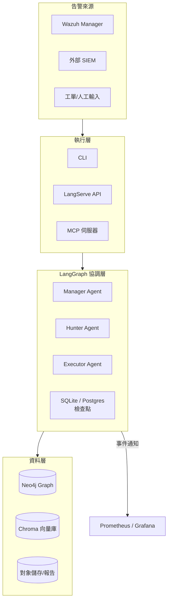

# 平台架構總覽

**文件版本：** 2025.03  
**涵蓋範圍：** `security-agent-system/` 與其附屬服務

---

## 目錄

1. [整體藍圖](#整體藍圖)
2. [邏輯分層](#邏輯分層)
3. [關鍵模組](#關鍵模組)
4. [資料與事件流](#資料與事件流)
5. [可靠性與安全性設計](#可靠性與安全性設計)
6. [效能與擴充策略](#效能與擴充策略)
7. [演進路線](#演進路線)

---

## 整體藍圖

重構後的系統以 LangChain / LangGraph 為核心，圍繞三個安全代理（Manager、Hunter、Executor）提供事件調查與自動化修復能力。原先散落於多個專案的程式碼被整合至單一套件 `security_agent_system`，並透過 `apps/` 目錄暴露三種執行面：CLI、LangServe API 與 MCP 伺服器。

---

## 邏輯分層

| 分層 | 目的 | 代表模組 |
| --- | --- | --- |
| 互動層 | 提供操作與整合介面 | `apps/cli`, `apps/langserve`, `apps/mcp` |
| 協調層 | 使用 LangGraph 協調代理狀態、檢查點與錯誤處理 | `security_agent_system.workflows.langgraph` |
| 代理層 | 定義 Manager / Hunter / Executor 的決策鏈 | `security_agent_system.agents` |
| 基礎設施層 | 封裝資料庫、快取、訊息系統與觀測工具 | `security_agent_system.infrastructure` |
| 核心能力層 | 調查、修復、回報等業務邏輯 | `security_agent_system.core` |

---

## 關鍵模組

### 1. LangGraphOrchestrator
- 動態載入設定與秘密金鑰 (`core.config.settings`)
- 建構 DAG、掛載檢查點並建立生命周期 hook
- 暴露 `start() / dispatch_alert()` 等控制介面給各執行層

### 2. GraphRAG 管線
- `infrastructure.graph.neo4j`：圖形模型、索引與 Cypher 範本
- `infrastructure.vector.chroma`：混合檢索的向量儲存
- `core.context.graph_retriever`：結合圖路徑與語義片段
- `core.analysis.attack_graph`：轉換為可視化報告與補救指引

### 3. 代理節點
- **Manager**：優先順序、任務分派與人工覆核決策
- **Hunter**：呼叫 GraphRAG 取得威脅上下文、評估風險分數
- **Executor**：挑選行動手冊、執行或請求人工批准

---

## 資料與事件流

1. **告警接收**：透過 CLI 任務、LangServe Webhook 或 MCP Tool 進入統一的 `dispatch_alert` 介面。
2. **狀態初始化**：檢查點載入既有上下文，或建立全新 `AgentState`。
3. **圖形檢索**：Hunter 使用 GraphRAG 同時查詢 Neo4j 與 Chroma，產出調查洞見。
4. **決策分支**：Manager 決定是否升級、交由 Executor 執行或結案。
5. **自動化執行**：Executor 操作 Playbook／外部 API，並更新狀態與稽核紀錄。
6. **結果輸出**：所有流程均記錄於檢查點、事件匯流排與報告儲存以供追蹤。

---

## 可靠性與安全性設計

- **檢查點持久化**：預設使用 SQLite，可切換至 Postgres；支援重跑與審計。
- **機密管理**：環境變數透過 `settings` 模組集中管理，必要時可導入 HashiCorp Vault。
- **節流與重試**：對 LLM / Neo4j 呼叫設有限速與指數退避，避免外部服務波動。
- **權限分層**：CLI/LangServe/MCP 各自具備 API Key 或使用者驗證機制。
- **稽核追蹤**：每次代理決策、輸出與手動覆核皆附帶時間戳與操作者資訊。

---

## 效能與擴充策略

- **水平擴充**：
  - LangServe 與 MCP 可經由容器化部署並置於負載平衡器後。
  - Neo4j 可升級為 Aura 或企業叢集，Chroma 支援遠端向量儲存。
- **垂直優化**：
  - Hunter 的 GraphRAG 管線採非同步批次查詢，減少外部呼叫延遲。
  - Executor 行動模組以 Runnable 組合，允許根據任務複雜度彈性調整資源。
- **觀測指標**：Prometheus 匯集告警吞吐量、代理完成率、平均處理時間與失敗率，Grafana 儀表板提供營運可視化。

---

## 演進路線

| 時程 | 里程碑 | 說明 |
| --- | --- | --- |
| 2024 Q4 | Stage 4 GraphRAG 完成 | 圖形 + 向量混合檢索、三代理閉環流程上線 |
| 2025 Q1 | 自動化修復擴充 | Executor 接入更多 Playbook 與 ITSM 回寫流程 |
| 2025 Q2 | 進階威脅獵捕 | 增加持續性狩獵任務與攻擊圖譜學習模型 |
| 2025 Q3 | 多租戶支援 | 針對 MSSP 場景導入租戶隔離與資源配額 |

---

透過模組化架構與統一的協調層，平台得以在保持高可靠性的同時快速擴充安全自動化能力，並為後續的智慧化決策與多代理協作奠定基礎。
