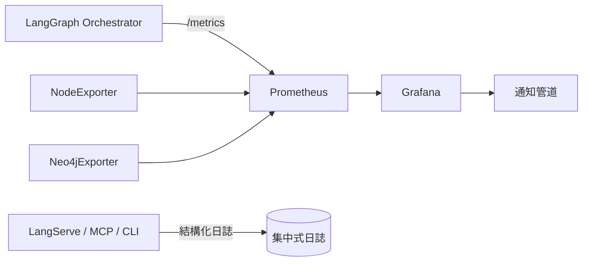

# 監控與告警指引

本指引協助團隊部署並維護針對 LangGraph 安全代理的觀測性堆疊，涵蓋 Prometheus、Grafana 與應用程式內建的指標。

---

## 觀測架構



- **LangGraph 指標**：處理延遲、隊列長度、LLM Token 使用量。
- **系統指標**：Node Exporter、Neo4j Exporter 提供 CPU、記憶體、查詢延遲。
- **日誌串流**：服務產生 JSON 日誌，可送至 Loki/ELK（選用）。

---

## 指標總覽

| 類別 | 指標名稱 | 說明 |
| --- | --- | --- |
| 延遲 | `langgraph_alert_latency_seconds` | 從告警投入到流程完成的直方圖 |
| 吞吐 | `alerts_processed_total`、`pending_alerts` | 成功處理數量與佇列狀態 |
| LLM | `llm_request_tokens_total`、`llm_cost_estimate_total` | 追蹤 Token 與成本估算 |
| 檢索 | `graph_query_duration_seconds`、`vector_query_duration_seconds` | Neo4j / Chroma 呼叫耗時 |
| 錯誤 | `workflow_errors_total`、`llm_retry_total` | 節點失敗與重試統計 |
| 系統 | `node_cpu_seconds_total`、`node_memory_MemAvailable_bytes` | 主機健康度 |

PromQL 範例：
```promql
histogram_quantile(0.95, rate(langgraph_alert_latency_seconds_bucket[5m]))
rate(workflow_errors_total[15m])
max_over_time(pending_alerts[10m])
```

---

## 部署步驟

1. **啟動容器**
   ```bash
   docker compose -f wazuh-docker/single-node/docker-compose.main.yml up -d prometheus grafana node-exporter
   ```
2. **設定抓取**
   - 在 `prometheus.yml` 中新增：
     ```yaml
     - job_name: langgraph
       static_configs:
         - targets: ['ai-agent:8001']
     ```
   - 若使用 Loki，設定 `promtail` 或其他收集器轉送 `logs/*.log`。
3. **載入儀表板**
   - Grafana 預設匯入 `dashboards/langgraph-overview.json`。
   - 推薦建立三張面板：流程效能、LLM 成本、基礎設施。

---

## 告警建議

| 規則 | 條件 | 動作 |
| --- | --- | --- |
| 流程延遲過高 | `histogram_quantile(0.95, rate(langgraph_alert_latency_seconds_bucket[15m])) > 180` | 通知 SOC On-call，檢查 Neo4j / LLM 狀態 |
| 佇列積壓 | `max_over_time(pending_alerts[10m]) > 20` | 觸發自動擴充或通知維運調整工作進程 |
| LLM 錯誤激增 | `increase(llm_retry_total[10m]) > 5` | 切換備援供應商或停用耗費功能 |
| Neo4j 健康異常 | `up{job="neo4j"} == 0` | 自動重啟容器並發送警示 |

---

## 日常維運

- **每日**：查看 Grafana 儀表板，確認延遲、錯誤率維持於目標範圍。
- **每週**：檢查 Prometheus 儲存使用量，調整 `--storage.tsdb.retention.time`。
- **每月**：備份 Grafana 設定與自訂儀表板 JSON，驗證告警通知是否正常。
- **遇到異常**：使用 `curl http://<prometheus>/api/v1/status/runtimeinfo` 檢查 Prometheus 健康；透過 `python -m apps.cli.main resume-run` 復原失敗流程。

---

## 問題排解

| 症狀 | 排查步驟 |
| --- | --- |
| `/metrics` 連線失敗 | 確認 `ai-agent` 容器是否開啟，並檢查網路命名空間是否互通 |
| 指標缺失 | 檢查 Prometheus job 設定與防火牆，查看 `prometheus.log` | 
| 告警過度頻繁 | 調整 PromQL 閾值或增加 `for:` 持續時間 |
| Grafana 無資料 | 驗證資料來源設定、重新載入儀表板 JSON |

透過上述配置即可建立可觀測、可維運的監控環境，確保 LangGraph 安全代理在生產環境中持續提供可靠服務。
