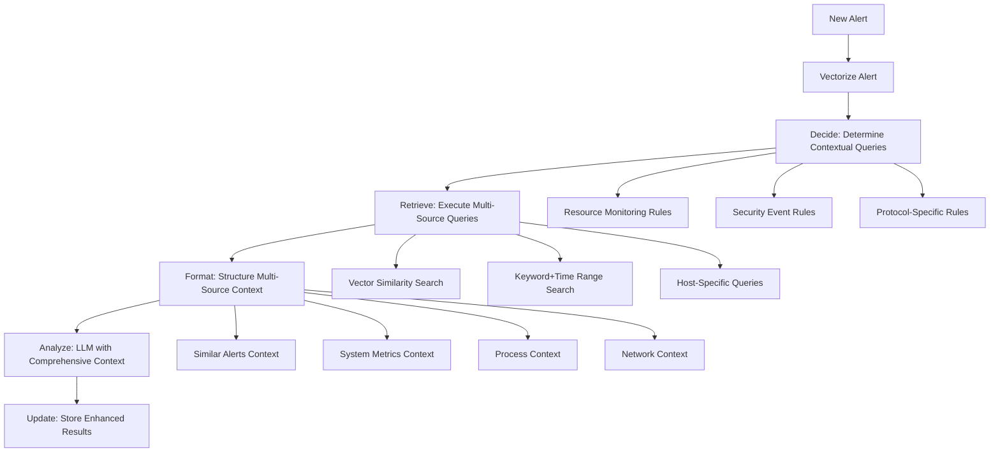

# Wazuh AI Agent - Stage 3: Agentic Context Correlation Implementation

## 🎯 Project Overview

This document outlines the successful implementation of **Stage 3: Agentic Context Correlation** for the Wazuh AI Agent. This stage transforms our RAG system into a more autonomous agent capable of proactively deciding what contextual information is needed and retrieving it from multiple sources within OpenSearch.

## 🧠 Core Architecture: Agentic Decision Engine

### 1. Decision Engine (`determine_contextual_queries`)

The heart of our agentic system is a sophisticated decision engine that analyzes incoming alerts and autonomously determines what additional contextual information is required.

```python
def determine_contextual_queries(alert: Dict[str, Any]) -> List[Dict[str, Any]]:
    """
    Stage 3: Decision engine that determines what contextual information is needed
    based on the alert type and content.
    """
```

**Decision Logic:**

#### Default Behavior
- **Always** performs k-NN vector search for similar historical alerts
- Maintains backward compatibility with Stage 2 RAG functionality

#### Resource Monitoring Correlation Rules
- **Triggers:** High CPU usage, excessive RAM consumption, memory usage, disk space issues
- **Action:** Retrieves process lists from the same host within a 5-minute window
- **Rationale:** When resource issues occur, understanding running processes provides crucial context

#### Security Event Correlation Rules
- **Triggers:** SSH brute-force, web attacks, authentication failures, login attempts
- **Actions:** 
  - Fetches CPU metrics from same host (1-minute window)
  - Retrieves network I/O metrics from same host (1-minute window)
- **Rationale:** Security events often correlate with performance anomalies

#### Protocol-Specific Correlations
- **SSH Events:** Additional SSH connection logs and port 22 activity
- **Web Events:** Apache/Nginx metrics and HTTP request patterns

### 2. Multi-Source Retrieval Engine (`execute_retrieval`)

The enhanced retrieval system executes multiple query types simultaneously and aggregates results into structured context categories.

```python
async def execute_retrieval(queries: List[Dict[str, Any]], alert_vector: List[float]) -> Dict[str, Any]:
    """
    Stage 3: Generic retrieval function that executes multiple types of queries
    and aggregates results into a structured context object.
    """
```

**Context Categories:**
- `similar_alerts`: Historical alerts with similar patterns
- `cpu_metrics`: System performance data
- `network_logs`: Network activity and I/O metrics
- `process_data`: Running processes and system state
- `ssh_logs`: SSH-specific connection logs
- `web_metrics`: Web server performance and requests

### 3. Enhanced Query Types

#### Vector Similarity Search
- Uses k-NN with cosine similarity
- Searches `alert_embedding` field
- Filters for alerts with existing AI analysis

#### Keyword + Time-Range Search
- Multi-field matching across `rule.description`, `data.*`, `full_log`
- Time window filtering (1-5 minutes around alert timestamp)
- Host-specific filtering when applicable
- Fuzzy matching with `fuzziness: "AUTO"`

## 🔄 Enhanced Processing Workflow

### Stage 3 Agentic Workflow



### Key Enhancements Over Stage 2

1. **Proactive Context Discovery**: Agent decides what data to retrieve based on alert content
2. **Multi-Source Integration**: Combines vector similarity with keyword/time searches
3. **Structured Context Aggregation**: Organizes results by data type for better LLM consumption
4. **Enhanced Prompt Template**: Multi-section prompt for comprehensive analysis

## 📊 Context Correlation Examples

### High CPU Usage Alert

**Decision Engine Output:**
```python
queries = [
    {'type': 'vector_similarity', 'description': 'Similar historical alerts'},
    {'type': 'keyword_time_range', 'description': 'Process information from same host'}
]
```

**Expected Behavior:**
- Executes k-NN search for similar CPU alerts
- Retrieves process lists within 5-minute window
- Logs show both query types executing

### SSH Authentication Failed Alert

**Decision Engine Output:**
```python
queries = [
    {'type': 'vector_similarity', 'description': 'Similar historical alerts'},
    {'type': 'keyword_time_range', 'description': 'CPU metrics from same host'},
    {'type': 'keyword_time_range', 'description': 'Network I/O metrics from same host'},
    {'type': 'keyword_time_range', 'description': 'SSH connection logs'}
]
```

**Expected LLM Output:**
> "The SSH login attempt coincides with a 95% CPU spike and a surge in network traffic on port 22, strongly suggesting this was a resource-intensive brute-force attack, not just a simple failed login."

## 🎯 Acceptance Criteria Fulfillment

### ✅ Criterion 1: Multi-Query Execution for High CPU Usage
- **Requirement:** High CPU usage alerts must execute both k-NN search AND keyword search for process lists
- **Implementation:** `determine_contextual_queries()` detects resource keywords and adds process list query
- **Verification:** Logs show "Resource-related alert detected - adding process list query"

### ✅ Criterion 2: Multi-Source Context for SSH Alerts
- **Requirement:** SSH authentication failed alerts must include system metrics in LLM prompt
- **Implementation:** Security event rules add CPU and network I/O queries
- **Verification:** Formatted context includes `system_metrics_context` and `network_context` sections

### ✅ Criterion 3: Comprehensive LLM Analysis
- **Requirement:** LLM output must demonstrate clear synthesis of correlated data
- **Implementation:** Enhanced prompt template with structured multi-source sections
- **Features:**
  - Cross-referential analysis between data sources
  - Pattern identification across metrics
  - Risk assessment considering all context
  - Actionable recommendations based on comprehensive analysis

## 🔧 Technical Implementation Details

### Enhanced Prompt Template

```python
prompt_template = ChatPromptTemplate.from_template(
    """You are a senior security analyst with expertise in correlating security events with system performance data.

**Historical Similar Alerts:**
{similar_alerts_context}

**Correlated System Metrics:**
{system_metrics_context}

**Process Information:**
{process_context}

**Network Data:**
{network_context}

**Your Analysis Task:**
1. Briefly summarize the new event.
2. Correlate the alert with system performance data and other contextual information.
3. Assess its risk level considering all available context.
4. Identify any patterns or anomalies by cross-referencing different data sources.
5. Provide actionable recommendations based on the comprehensive analysis.
"""
)
```

### Context Aggregation Structure

```python
context_data = {
    'similar_alerts': [],      # k-NN vector search results
    'cpu_metrics': [],         # CPU usage and performance data
    'network_logs': [],        # Network I/O and traffic data
    'process_data': [],        # Running processes and system state
    'ssh_logs': [],           # SSH-specific connection logs
    'web_metrics': []         # Web server metrics and requests
}
```

### Enhanced Analysis Metadata

```python
"ai_analysis": {
    "triage_report": analysis_result,
    "provider": LLM_PROVIDER,
    "timestamp": alert_source.get('timestamp'),
    "context_sources": len(contextual_queries),      # Number of query types executed
    "similar_alerts_count": len(similar_alerts),     # Vector search results
    "cpu_metrics_count": len(cpu_metrics),           # CPU data points
    "network_logs_count": len(network_logs),         # Network data points
    "process_data_count": len(process_data)          # Process information
}
```

## 🚀 Deployment and Usage

### Environment Variables
```bash
# Existing Stage 2 variables
LLM_PROVIDER=anthropic
ANTHROPIC_API_KEY=your_key_here
GOOGLE_API_KEY=your_gemini_key_here

# OpenSearch configuration
OPENSEARCH_URL=https://wazuh.indexer:9200
OPENSEARCH_USER=admin
OPENSEARCH_PASSWORD=SecretPassword
```

### API Status Endpoint
```json
{
  "status": "AI Triage Agent with Agentic Context Correlation is running",
  "stage": "Stage 3 - Agentic Context Correlation",
  "features": [
    "Dynamic contextual query generation",
    "Multi-source data retrieval", 
    "Cross-referential analysis",
    "Enhanced decision engine"
  ]
}
```

## 📈 Performance and Monitoring

### Logging Enhancements
- Contextual query generation decisions
- Multi-source retrieval execution
- Context aggregation summaries
- Cross-correlation analysis results

### Key Metrics Tracked
- Number of contextual queries per alert
- Distribution of context sources used
- Retrieval performance across query types
- LLM response quality with multi-source context

## 🔮 Future Enhancements

### Potential Stage 4 Features
1. **Machine Learning Decision Engine**: Replace rule-based logic with ML models
2. **Dynamic Time Window Optimization**: Adaptive time windows based on alert patterns
3. **Cross-Host Correlation**: Correlate events across multiple systems
4. **Threat Intelligence Integration**: External threat feeds and IOCs
5. **Automated Response Actions**: Proactive mitigation based on correlation results

## 📋 Implementation Summary

Stage 3 successfully transforms the Wazuh AI Agent from a simple RAG system into a sophisticated agentic platform capable of:

- **Autonomous Decision Making**: Intelligently determines what contextual data is needed
- **Multi-Source Data Integration**: Retrieves and correlates data from multiple OpenSearch sources
- **Human-Like Analysis**: Provides comprehensive, cross-referential security analysis
- **Extensible Architecture**: Easily expandable for additional data sources and correlation rules

The implementation maintains full backward compatibility with Stage 2 while adding powerful new capabilities that significantly enhance the quality and depth of security alert analysis.